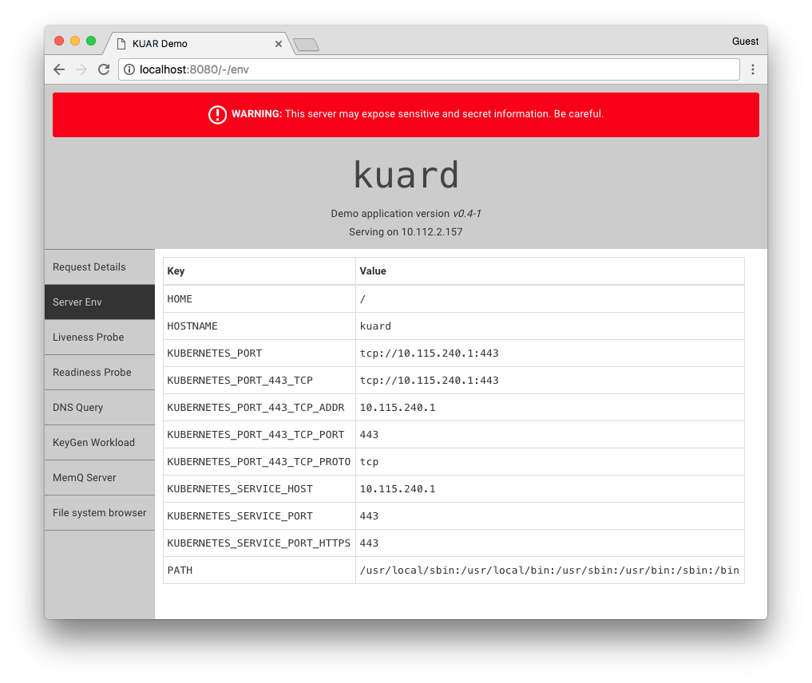

## Construir

En primer lugar construimos la aplicación react que se enveverá en la aplicación go: 

```ps
cd client 

npm install

npm run build

cd..
```

verificamos que tenemos todos los imports y que no hay cosas raras:

```ps
go mod tidy

go mod vet
```

podemos construir la aplicación:

```ps
go build -o kuard.exe
```

si ejecutamos el ejecutable, podremos acceder a `http://localhost:8080/` para ver kuard:

podemos construir la imagen:

```ps
docker build -t egsmartin/kuard:latest .
```

publicamos la imagen

```ps
docker push egsmartin/kuard:latest
```

## Demo application for "Kubernetes Up and Running"



## Running

```
kubectl run --restart=Never --image=gcr.io/kuar-demo/kuard-amd64:blue kuard
kubectl port-forward kuard 8080:8080
```

Open your browser to [http://localhost:8080](http://localhost:8080).

## KeyGen Workload

To help simulate batch workers, we have a synthetic workload of generating 4096 bit RSA keys.  This can be configured through the UI or the command line.

```
--keygen-enable               Enable KeyGen workload
--keygen-exit-code int        Exit code when workload complete
--keygen-exit-on-complete     Exit after workload is complete
--keygen-memq-queue string    The MemQ server queue to use. If MemQ is used, other limits are ignored.
--keygen-memq-server string   The MemQ server to draw work items from.  If MemQ is used, other limits are ignored.
--keygen-num-to-gen int       The number of keys to generate. Set to 0 for infinite
--keygen-time-to-run int      The target run time in seconds. Set to 0 for infinite
```

## MemQ server

We also have a simple in memory queue with REST API.  This is based heavily on https://github.com/kelseyhightower/memq.

The API is as follows with URLs being relative to `<server addr>/memq/server`.  See `pkg/memq/types.go` for the data structures returned.

| Method | Url | Desc
| --- | --- | ---
| `GET` | `/stats` | Get stats on all queues
| `PUT` | `/queues/:queue` | Create a queue
| `DELETE` | `/queues/:queue` | Delete a queue
| `POST` | `/queues/:queue/drain` | Discard all items in queue
| `POST` | `/queues/:queue/enqueue` | Add item to queue.  Body is plain text. Response is message object.
| `POST` | `/queues/:queue/dequeue` | Grab an item off the queue and return it. Returns a 204 "No Content" if queue is empty.