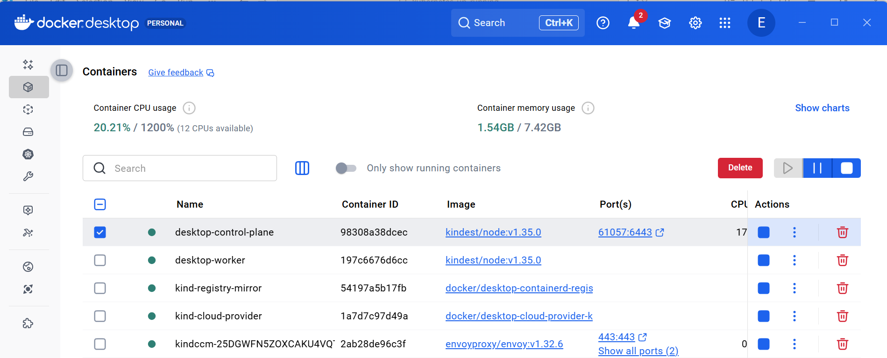

## Rutas

Para ver todas las rutas disponibles podemos hacer:

```ps
route print

```

la forma en que se utilizan estas tablas es la siguiente. Partimos de una *ip_destino* a la que queremos contactar, y veamos que ruta se elige en base a los definido en la tabla:

|destino|mascara|link|metric|
|-------|-------|-------|-------|

- para cada entrada, tomamos la *ip_destino* y hacemos un AND con la `mascara`. Si el resultado es igual al `destino`, entonces la entrada es *válida*. Aplicamos este procedimiento para todas las entradas de la tabla

- Al menos siempre habrá una entrada que sea valida porque esta entrada siempre se cumple:

|destino|mascara|link|metric|
|-------|-------|-------|-------|
|0.0.0.0|0.0.0.0|-------|-------|

- Entre todas las entradas elegimos aquella en la que haya una mayor coincidencia entre *ip_destino* y *destino*. En caso de que haya empate entre varias entradas se elige aquella con una prioridad más baja, la que tenga *metric* más baja.

### Ejemplos

```ps
route print -4


IPv4 Route Table
===========================================================================
Active Routes:
Network Destination        Netmask          Gateway       Interface  Metric
          0.0.0.0          0.0.0.0      192.168.1.1    192.168.1.137     30
        127.0.0.0        255.0.0.0         On-link         127.0.0.1    331
        127.0.0.1  255.255.255.255         On-link         127.0.0.1    331
  127.255.255.255  255.255.255.255         On-link         127.0.0.1    331
      172.26.96.0    255.255.240.0         On-link       172.26.96.1   5256
      172.26.96.1  255.255.255.255         On-link       172.26.96.1   5256
   172.26.111.255  255.255.255.255         On-link       172.26.96.1   5256
      192.168.1.0    255.255.255.0         On-link     192.168.1.137    286
    192.168.1.137  255.255.255.255         On-link     192.168.1.137    286
    192.168.1.255  255.255.255.255         On-link     192.168.1.137    286
        224.0.0.0        240.0.0.0         On-link         127.0.0.1    331
        224.0.0.0        240.0.0.0         On-link     192.168.1.137    286
        224.0.0.0        240.0.0.0         On-link       172.26.96.1   5256
  255.255.255.255  255.255.255.255         On-link         127.0.0.1    331
  255.255.255.255  255.255.255.255         On-link     192.168.1.137    286
  255.255.255.255  255.255.255.255         On-link       172.26.96.1   5256
===========================================================================
```

**IP 1: `192.23.4.4`**

```
Probando ruta: 0.0.0.0 / 0.0.0.0
192.23.4.4 AND 0.0.0.0 = 0.0.0.0 ✅ coincide con 0.0.0.0

Probando ruta: 192.168.1.0 / 255.255.255.0
192.23.4.4 AND 255.255.255.0 = 192.23.4.0 ❌ no coincide con 192.168.1.0

Probando ruta: 172.26.96.0 / 255.255.240.0
192.23.4.4 AND 255.255.240.0 = 192.23.0.0 ❌ no coincide con 172.26.96.0

Ganador: ruta por defecto (0.0.0.0)
Acción: enviar a gateway 192.168.1.1 (tu router)
```

**IP 2: `192.168.1.44`**

```
Probando ruta: 192.168.1.0 / 255.255.255.0
192.168.1.44 AND 255.255.255.0 = 192.168.1.0 ✅ coincide

Probando ruta: 0.0.0.0 / 0.0.0.0
192.168.1.44 AND 0.0.0.0 = 0.0.0.0 ✅ también coincide

Ganador: 192.168.1.0/24 (más específica: 24 bits vs 0 bits)
Acción: enviar directamente (On-link) vía interfaz 192.168.1.137
```

**IP 3: `172.26.96.3`**

```
Probando ruta: 172.26.96.0 / 255.255.240.0
172.26.96.3 AND 255.255.240.0 = 172.26.96.0 ✅ coincide

Probando ruta: 0.0.0.0 / 0.0.0.0
172.26.96.3 AND 0.0.0.0 = 0.0.0.0 ✅ también coincide

Ganador: 172.26.96.0/20 (más específica: 20 bits vs 0 bits)
Acción: enviar directamente (On-link) vía interfaz 172.26.96.1
```

**IP 4: `172.18.0.6`**

```
Probando ruta: 192.168.1.0 / 255.255.255.0
172.18.0.6 AND 255.255.255.0 = 172.18.0.0 ❌ no coincide

Probando ruta: 172.26.96.0 / 255.255.240.0
172.18.0.6 AND 255.255.240.0 = 172.18.0.0 ❌ no coincide con 172.26.96.0

Probando ruta: 0.0.0.0 / 0.0.0.0
172.18.0.6 AND 0.0.0.0 = 0.0.0.0 ✅ coincide

Ganador: ruta por defecto (0.0.0.0)
Acción: enviar a gateway 192.168.1.1 (tu router)
Resultado: tu router no sabe qué hacer con 172.18.x.x → timeout ❌
```

podemos añadir y eliminar rutas. Cuando añadimos una ruta podemos hacerlo de forma permanente (`-p`) de modo que se mantenga entre reboots:

```ps
route -p ADD 172.18.0.0 MASK 255.255.0.0 172.26.96.1 METRIC 1 IF 41
```

aquí hemos hecho que cuando se trate de alcanzar una IP del tipo 172.18.*.* se enrute por el gateway 172.26.96.1 con prioridad 1, y que vaya por la interface 41 - que en mi caso es la wifi:

```ps
Get-NetIPInterface -AddressFamily IPv4 | Format-Table ifIndex,InterfaceAlias,InterfaceDescription -AutoSize

ifIndex InterfaceAlias                     InterfaceDescription
------- --------------                     --------------------
     41 vEthernet (WSL (Hyper-V firewall))
      8 Local Area Connection* 2
     12 Bluetooth Network Connection
      4 Local Area Connection* 1
      9 Wi-Fi
      1 Loopback Pseudo-Interface 1
```

La ruta la hemos creado persistente, para eliminarla:

```ps
route delete 172.18.0.0
```

### Multicast y Broadcast

Añadir algunas notas relativas al *multicast* y al *broadcast*. Frente al *unicast*:
- **muticast** permite enviar un paquete simultaneamente a varios clientes, varios clientes que previamente se han tenido que subscribir. El router mantiene una tabla con todos los clientes, y en el cliente se guarda una relación de todos los grupos de multicast a los que estamos subscritos. Este protocolo se usa por ejemplo en televisión en vívo (varios clientes ven el mismo programa; No se puede detener, rebobinar, etc.). Algunos proveedores usan un mecanismo hibrido para emitir (multicast cuando el cliente esta viendo el programa que se está emitiendo; Cuando el cliente para, rebobina, etc. la emisión, se pasa a unicast; De este modo se usan multicast y unicast al mismo tiempo. Por ejemplo Orange o Movistar+ usan esta técnica. Netflix siempre usa unicast incluso cuando la emisión es en directo. Chromecast/DLNS usan multicast). Para usar multicast hay que utilizar un rango de IPs especial, que esta comprendido entre 224.0.0.0 y 239.255.255.255, con mascara 240.0.0.0

    si hacemos `netsh interface ipv4 show joins` podemos ver los grupos multicast a los que nos hemos unido.

- **Broadcast**. Igual que el caso anterior un mensaje es consumido por varios clientes, pero estos clientes no tienen que subscribirse previamente ni el emisor tiene conocimiento de cuales son los clientes. Hay dos tipos de broadcast:
    
    - Broadcast global (limited broadcast). Se identifica por una entrada con destination `255.255.255.255` y mascara `255.255.255.255`. Se envia el paquete a todos en mi red local (no cruza routers). Usado cuando un dispositivo no sabe su propia IP todavía (ej: DHCP inicial).
    
    - Broadcast dirigido (directed broadcast). Se envia a todos en una subnet específica. El paquete tendrá como destino una IP - la IP de bradcast. 
    
        Para calcular cual es esta IP, la IP de broadcast para una determinada subred, se toma la mascara, se invierte (NOT bit a bit) y luego se hace OR con la dirección. Por ejemplo si la red es `192.168.1.0` y la mascara `255.255.255.0`, la direccion de broadcast sería `192.168.1.255`. Otro ejemplo, si la red es `172.26.96.0/20`, la IP de broadcast sería `172.26.111.255`

## Networking con Docker

En un equipo en el que hemos instalado docker tendremos una interface nueva, un vSwitch. Por ejemplo, en mi portatil pasaría a tener dos interfaces - links -, el asociado a la wifi, y el vSwitch de docker.

Docker implementa un proxyNat (no es un bridge; Un bridge une dos conjuntos de clientes que comparten una misma subred; Un bridge no modifica ni reescribe nada en los paquetes, simplemente los retrasmite de modo que los dos conjuntos de clientes actuan como si fueran uno solo; El Nat Proxy une tambien dos conjuntos de clientes, pero los dos conjuntos perteneces a subredes diferentes, de modo que se debe hacer Nating, y reescribir los origenes y destinos de los paquetes, y mantener una tabla de traducción de IP), de modo que cuando ejecutamos un contenedor mapeando puertos (con la opción `-p`), docker se apropia de ese puerto (bind) en el host, de modo que cuando un mensaje se envie a ese puerto desde el host, docker recibe el mensajes y lo envia al proxyNat. En el proxyNat se hace el nateo de la ip a una ip del rango de ips de docker. Esto hace que el tráfico pueda fluir del host al contenedor

Además de este Nat Proxy que construye docker para realizar la comunicacion entre la subred del host y la subred de los contenedores, se crea también un Bridge para gestionar la comunicacion inter contenedores dentro del propio Docker

```ps
┌────────────────────────────────────────────────────────┐
│  Windows Host (tu PC)                                  │
│  - WiFi: 192.168.1.137                                 │
│  - Docker vSwitch: 172.26.96.1 (en route table)        │
│                                                        │
│  ┌──────────────────────────────────────────────────┐  │
│  │  Docker Desktop VM/WSL2                          │  │
│  │                                                  │  │
│  │  ┌────────────────────────────────────────────┐  │  │
│  │  │ Red "kind" (172.18.0.0/16)                 │  │  │
│  │  │                                            │  │  │
│  │  │  - 172.18.0.1 (gateway Docker)             │  │  │
│  │  │  - 172.18.0.2 (kind-control-plane)         │  │  │
│  │  │  - 172.18.0.3 (kind-worker)                │  │  │ 
│  │  │  - 172.18.0.4 (kind-worker2)               │  │  │
│  │  │  - 172.18.0.6 (IP virtual MetalLB/Envoy)   │  │  │
│  │  │                                            │  │  │
│  │  └────────────────────────────────────────────┘  │  │
│  │                                                  │  │
│  │  ┌────────────────────────────────────────────┐  │  │
│  │  │ Red "bridge" (172.17.0.0/16)               │  │  │
│  │  │ - Contenedores normales Docker             │  │  │
│  │  └────────────────────────────────────────────┘  │  │
│  │                                                  │  │
│  └──────────────────────────────────────────────────┘  │
│                                                        │
└────────────────────────────────────────────────────────┘
```

En el diagrama anterior nos referimos a "contenedores normales" a aquellos contenedores que se crean a partir de imagenes en docker. Cuando creamos un cluster kubernetes en Docker usando kind, se crean una seria de contenedores que representan los nodos (el control panel, y tantos workers como hayamos configurado al crear el cluster):



En la imagen anterior podemos ver `desktop-control-plane` y `desktop-worker` como contenedores que representan los dos nodos de nuestro cluster. Ademas tenemos otro contenedor a partir de la imagen `envoyproxy/envoy:v1.32.6` que se corresponde con el ingress Contour/Envoy que hemos creado en nuestro cluster (lo hemos creado explicitamente lanzando `kubectl apply -f https://projectcontour.io/quickstart/contour.yaml`). Los otros dos contenedores que vemos se crean automáticamente al crear el cluster y se encargan de gestionar el acceso al registry de imagenes (`kind-registry-mirror`) y emular funciones "cloud‑provider" (`docker/desktop-cloud-provider-kind:v0.3.0-desktop.3`), como _load balancers_.

Al crear el cluster docker crea automáticamente una subred y asigna esa subred a todos estos contenedores, de modo que el espacio de direcciones que usan estos contenedores y los contenedores normales es diferente. Si vemos las redes disponibles en Docker:

```ps
docker network ls
NETWORK ID     NAME      DRIVER    SCOPE
da9238b976fe   bridge    bridge    local
f97df6df68d4   host      host      local
d2aac1f8de74   kind      bridge    local
f4e7513d7cd0   none      null      local
```

inspeccionemos el _bridge_:

```ps
network inspect bridge |select-string ('Subnet":')

"Subnet": "172.17.0.0/16",
```

y ahora veamos la subred creada para _kind_:

```ps
kubernetes_up_running> docker network inspect kind |select-string ('Subnet":')

"Subnet": "172.18.0.0/16",
```

### Resolucion de nombres

Docker proporciona un servidor DNS interno (por defecto el DNS se presenta en la dirección 127.0.0.11 en `/etc/resolv.conf`; En el archivo de configuración habrá una entrada `nameserver 127.0.0.11`) que resuelve nombres de contenedores y aliases cuando los contenedores están en una red de usuario (user‑defined bridge network).

Cuando usamos la red por defecto de Docker, las entradas en el DNS serán muy limitadas, lo que hayamos configurado con la opción `--add-host` (es decir, por defecto no habrá una entrada para cada contenedor en el DNS; la opción `--add-host` se indica al hacer run, por ejemplo, `docker run --rm --add-host [record]:[value] [imagen]` ). Si hemos creado una red:

```ps
docker network create mynet
```

Docker entonces registra automáticamente en el DNS los nombres/alias de cada contenedor, de modo que desde un contenedor podremos referenciar otro por su `container-name`.

En Windows/Mac, entre las entradas que se crean en el DNS, incluso cuando la red que usamos es el bridge creado automáticamente por Docker, esta la que resuelve el host local. Si hacemos referencia a `host.docker.internal`. En Linux hay que crear la entrada con `--add-host`:

```ps
docker run --rm --add-host host.docker.internal:host-gateway busybox ping host.docker.internal
```

El DNS que tenemos en Docker hace _DNS forwarding_ cuando tiene que resolver algun nombre que no tenga registrado.

### Mapear un puerto

si hacemos

```ps
run --rm -p aaaa:bbbb imagen
```

cuando hacemos `localhost:aaaa`, la peticion a `localhost` se enruta al *loop_link*, donde tenemos a docker escuchando en el puerto `aaaa`. Docker recibe esa peticion y sabe que la tiene que mapear al puerto `bbbb` del contenedor que hemos creado con `run`. Hará un Nateo de la dirección `192.168.1.137` a `172.26.96.1`, y el paquete se enviará a `172.18.0.x` puerto `bbbb`. Cuando `172.18.0.x` responda a `172.26.96.1` se deshace el Nateo, y la petición se envia al origen.


```
192.168.1.137:aaaa
    ↓
Docker Desktop (172.26.96.1)
    ↓ NAT / Port Forwarding
Docker VM/WSL2
    ↓
Red "kind" (172.18.0.x)
    ↓
Contenedores (nodos kind)
```

## Acceso al cluster kubernetes creado con Docker/kind

Cuando creamos un Ingress, por ejemplo con Contour/Envoy, esto es lo que sucederá:

- Se crearán pods para tratar las peticiones que lleguen por el ingress
- Se crea un servicio de tipo `LoadBalancer`, que por lo tanto expone una `EXTERNAL-IP`

```ps
kubectl get services -o wide -A

NAMESPACE        NAME         TYPE           CLUSTER-IP      EXTERNAL-IP   PORT(S)                      AGE     SELECTOR
default          kubernetes   ClusterIP      10.96.0.1       <none>        443/TCP                      2d21h   <none>
default          multiplica   ClusterIP      10.96.185.191   <none>        8080/TCP                     40h     app=multiplica
default          primos       ClusterIP      10.96.219.93    <none>        8080/TCP                     40h     app=primos
kube-system      kube-dns     ClusterIP      10.96.0.10      <none>        53/UDP,53/TCP,9153/TCP       2d21h   k8s-app=kube-dns
projectcontour   contour      ClusterIP      10.96.222.28    <none>        8001/TCP                     2d6h    app=contour
projectcontour   envoy        LoadBalancer   10.96.177.192   172.18.0.6    80:30796/TCP,443:32096/TCP   2d6h    app=envoy
```

La `EXTERNAL-IP` esta en una subred que no es accesible desde el host de Docker. Para subsanar este problema tenemos varias opciones:


### Mecanismo 1. Port forwarding

Usar Port-forward al servicio de Envoy

```ps
kubectl -n projectcontour port-forward svc/envoy 8080:80
curl -H "Host: gz.com" http://localhost:8080/multiplica/21

{"input":21,"result":42,"operation":"multiplica por 2","host":"multiplica-57fcd5c67c-qzsxp"}
```

podemos ver como a) hacemos un binding con el puerto 8080, así que cuando hacemos localhost:8080 estamos conectando con uno de los Pods que tiene como backend el servicio `svc/envoy`. Como en este pod tenemos el ingress, y queremos utilizar Ingress con un host "real", tenemos que fijar la cabecerar en _curl_.

### Mecanismo 2. Usar el _mapeo_ al contenedor Contour/Envoy

Automáticamente, cuando se instaló Contour/Envoy se creo un mapeo de 0.0.0.0:80 y 0.0.0.0:443 a Contour/Envoy. Podemos verlo:

```ps
docker ps --format "table {{.Names}}\t{{.Image}}\t{{.Ports}}"

NAMES                                              IMAGE                                                 PORTS
kindccm-25DGWFN5ZOXCAKU4VQT4NT3JXRLG6PYN3V7XM5DH   envoyproxy/envoy:v1.32.6                              0.0.0.0:80->80/tcp, 0.0.0.0:443->443/tcp
kind-cloud-provider                                docker/desktop-cloud-provider-kind:v0.3.0-desktop.3   2375-2376/tcp
kind-registry-mirror                               docker/desktop-containerd-registry-mirror:v0.0.2
desktop-control-plane                              kindest/node:v1.35.0                                  127.0.0.1:61057->6443/tcp
desktop-worker                                     kindest/node:v1.35.0
```

Por lo tanto, podemos alcanzar el Ingress con curl:

```ps
curl.exe -H "Host: gz.com" http://127.0.0.1/multiplica/21

{"input":21,"result":42,"operation":"multiplica por 2","host":"multiplica-57fcd5c67c-shfwg"}
```

### Mecanismo 3. Usar un contenedor en Docker que haga de Proxy

Crear un contenedor que haga de proxy, de modo que por un lado este mapeado con el host local y por otro lado tenga acceso a la subred de Kubernetes, de modo que pueda reenviar paquetes desde el host local a cualquier cliente de la subred. 

Podemos usar `alpine/socat` para crear un contenedor, que expondremos al host y que, al estar ejecutandose en la subred donde reside el cluster kubernetes, puede redirigir la petición hacia el Ingress:

    ```ps
    docker run --rm -d --name host-proxy --network kind -p 127.0.0.1:80:80 alpine/socat TCP-LISTEN:80,fork TCP:172.18.0.6:80
    docker run --rm -d --name host-proxy-https --network kind -p 127.0.0.1:443:443 alpine/socat TCP-LISTEN:443,fork TCP:172.18.0.6:443
    ```

    - alpine/socat — imagen que contiene socat (herramienta de proxy de puertos).
    - `TCP-LISTEN:80,fork TCP:172.18.0.6:80` — instrucción a socat: **escuchar TCP** en el **127.0.0.1 puerto 80** del contenedor, **aceptar conexiones (fork)** y **reenviarlas a 172.18.0.6:80**.

    `-p 80:80` expone el puerto en todas las interfaces; si quieres limitar a localhost usa `-p 127.0.0.1:80:80`.

    Para poder hacer esta configuracion tienen que estar los puertos 80 y 443 libres, sino habría que elegir otros

### Mecanismo 4. Alterar las rutas

Este mecanismo no va a funcionar, porque para poder llegar a una ruta en la red local el protocolo ARP tiene que tener éxito. **El protocolo ARP se encarga de traducir una dirección IP a una dirección MAC**. La IP que vamos a configurar a continuación como gateway no podemos resolverla a una MAC, por este motivo la ruta _fallará_, aunque cualifique y tenga máyor prioridad que otras entradas. Indicamos como configurarla a efectos ilustrativos.

ARP/L2 primero: para enviar un paquete IPv4 a una IP en tu tabla de rutas Windows necesita resolver la dirección L2 (MAC) del siguiente salto (o del host destino si está *on‑link*) mediante ARP. Si no hay respuesta ARP, no hay cómo encaminar la trama L2 y el paquete se pierde.

Si usamos `Get-NetNeighbor` para ver que resolucion hace ARP, vemos que `172.18.0.6` y `172.26.96.1` no son alcanzables:

```ps
Get-NetNeighbor 172.18.0.6

ifIndex IPAddress                                          LinkLayerAddress      State       PolicyStore
------- ---------                                          ----------------      -----       -----------
41      172.18.0.6                                         00-00-00-00-00-00     Unreachable ActiveStore

Get-NetNeighbor 172.26.96.1

ifIndex IPAddress                                          LinkLayerAddress      State       PolicyStore
------- ---------                                          ----------------      -----       -----------
41      172.26.96.1                                        00-00-00-00-00-00     Unreachable ActiveStore

Get-NetNeighbor 192.168.1.1

ifIndex IPAddress                                          LinkLayerAddress      State       PolicyStore
------- ---------                                          ----------------      -----       -----------
9       192.168.1.1                                        F4-FC-49-1C-C5-0C     Reachable   ActiveStore
```

Por este motivo aunque haya una ruta que dirija los paquetes hacia 172.18.0.6 no se pueden entregar, y tracert/ping terminan fallando o tomando la ruta por defecto (la `0.0.0.0` que sale a internet). Dicho esto, procedamos a configurar la ruta.

La idea es configurar una ruta de modo que cuando queramos acceder a la EXTERNAL-IP los paquetes utilicen esta ruta. En primer lugar tenemos que identificar cual es el gateway y la interface - de red - a la que corresponde. Veamos el gateway asociado a la subred _kind_ de Docker (que es la que corresponde a nuestro cluster kubernetes):

```ps
docker network inspect kind | select-string '"Gateway"'

"Gateway": "fc00:f853:ccd:e793::1"
"Gateway": "172.18.0.1"
```

veamos las interfaces de red:

```ps
Get-NetIPInterface -AddressFamily IPv4 | Format-Table ifIndex,InterfaceAlias,InterfaceDescription -AutoSize

ifIndex InterfaceAlias                     InterfaceDescription
------- --------------                     --------------------
     41 vEthernet (WSL (Hyper-V firewall))
      8 Local Area Connection* 2
     12 Bluetooth Network Connection
      4 Local Area Connection* 1
      9 Wi-Fi
      1 Loopback Pseudo-Interface 1
```

con esto ya podemos configurar nuestra ruta:

```ps
New-NetRoute -DestinationPrefix 172.18.0.0/16 -NextHop 172.26.96.1 -InterfaceIndex 41 -PolicyStore PersistentStore
```

que equivale a:

```ps
route -p ADD 172.18.0.0 MASK 255.255.0.0 172.26.96.1 METRIC 1 IF 41
```

podemos comprobar que se ha creado:

```ps
route print | findstr 172.18.0.0
```

para eliminar la ruta:

```ps
route delete 172.18.0.0
```

### Port-forward

Cuando hacemos `kubectl port-forward [servicio/pod] [puerto:puerto']` lo que sucede es lo siguiente:

- kubectl en tu máquina (escucha en `localhost:puerto`)
- kubectl abre una conexión HTTPS autenticada al API server y solicita el portforward subresource.
- El API server hace upgrade a un canal multiplexado (SPDY/HTTP2) y relaya el stream hacia el kubelet del nodo que ejecuta el Pod
- El kubelet recibe los bytes y los escribe al socket del Pod (por ejemplo 127.0.0.1:REMOTEPORT dentro del nodo/namespace del Pod)
- La respuesta viaja en sentido inverso por el mismo túnel: kubelet → API server → kubectl → tu cliente.

Todo el tráfico pasa por el API server (actúa de relay) y luego por el kubelet hasta el Pod. No se utiliza ni `NodePort`, `kube-proxy` ni balanceo: si apuntas a un Service, kubectl elige un Pod backend y el túnel va solo a ese Pod, y irá a ese Pod para todas las peticiones que se hagan por el tunel.

El túnel es TCP (no UDP), suele usar SPDY/HTTP2 y requiere permisos RBAC pods/portforward.

Es temporal (vive mientras kubectl corra), tiene overhead (no para producción alta carga) y por defecto solo escucha 127.0.0.1 (puedes usar --address si necesitas otra interfaz, con cuidado de seguridad).

## Anexo. Ver que puertos están ocupados

Podemos ver los puertos que están ocupados y el proceso que los ocupa (`netstat` es el equivalente a `Get-NetTCPConnection`):

```pa
Get-NetTCPConnection -State Listen | Sort-Object -Property LocalPort | Format-Table -AutoSize


LocalAddress  LocalPort RemoteAddress RemotePort State  AppliedSetting OwningProcess
------------  --------- ------------- ---------- -----  -------------- -------------
127.0.0.1     80        0.0.0.0       0          Listen                1564
0.0.0.0       80        0.0.0.0       0          Listen                10000
::            135       ::            0          Listen                1644
0.0.0.0       135       0.0.0.0       0          Listen                1644
192.168.1.137 139       0.0.0.0       0          Listen                4
172.26.96.1   139       0.0.0.0       0          Listen                4


[...]
```

recupera información del proceso:

```ps
Get-NetTCPConnection -State Listen |
  Select-Object LocalAddress,LocalPort,OwningProcess |
  Sort-Object LocalPort |
  ForEach-Object {
    $p = Get-Process -Id $_.OwningProcess -ErrorAction SilentlyContinue
    $path = (Get-CimInstance Win32_Process -Filter "ProcessId=$($_.OwningProcess)" | Select-Object -ExpandProperty ExecutablePath -ErrorAction SilentlyContinue)
    [PSCustomObject]@{ Address=$_.LocalAddress; Port=$_.LocalPort; PID=$_.OwningProcess; Process=$p.ProcessName; Path=$path }
  } | Format-Table -AutoSize


Address        Port   PID Process            Path
-------        ----   --- -------            ----
127.0.0.1        80  1564 wslrelay           C:\Program Files\WSL\wslrelay.exe
0.0.0.0          80 10000 com.docker.backend C:\Program Files\Docker\Docker\resources\com.docker.backend.exe


[...]
```

podemos ver los procesos que están escuchando en UDP:

```ps
Get-NetUDPEndpoint | Sort-Object LocalPort | Format-Table LocalAddress,LocalPort,OwningProcess -AutoSize

LocalAddress                 LocalPort OwningProcess
------------                 --------- -------------
0.0.0.0                             53          5032
192.168.1.137                      137             4
172.26.96.1                        137             4
192.168.1.137                      138             4
172.26.96.1                        138             4

[...]
```

muestra los PID que usan el puerto 80

```ps
Get-NetTCPConnection -LocalPort 80 -State Listen | Select-Object LocalAddress,LocalPort,OwningProcess

LocalAddress                 LocalPort OwningProcess
------------                 --------- -------------
0.0.0.0                             53          5032
192.168.1.137                      137             4
172.26.96.1                        137             4
192.168.1.137                      138             4
172.26.96.1                        138             4
0.0.0.0                            500          5104

[...]
```

elegimos un proceso que utiliza el puerto 80, lo revisamos:

```ps
Get-Process -Id 10000

Handles  NPM(K)    PM(K)      WS(K)     CPU(s)     Id  SI ProcessName
-------  ------    -----      -----     ------     --  -- -----------
   2067     232   201452     161752   6,455.69  10000   1 com.docker.backend
```

```ps
Get-CimInstance Win32_Process -Filter "ProcessId=10000" | Select-Object ExecutablePath,CommandLine

ExecutablePath                                                  CommandLine
--------------                                                  -----------
C:\Program Files\Docker\Docker\resources\com.docker.backend.exe "C:\Program Files\Docker\Docker\resources\com.docker.backend.exe"...
```

