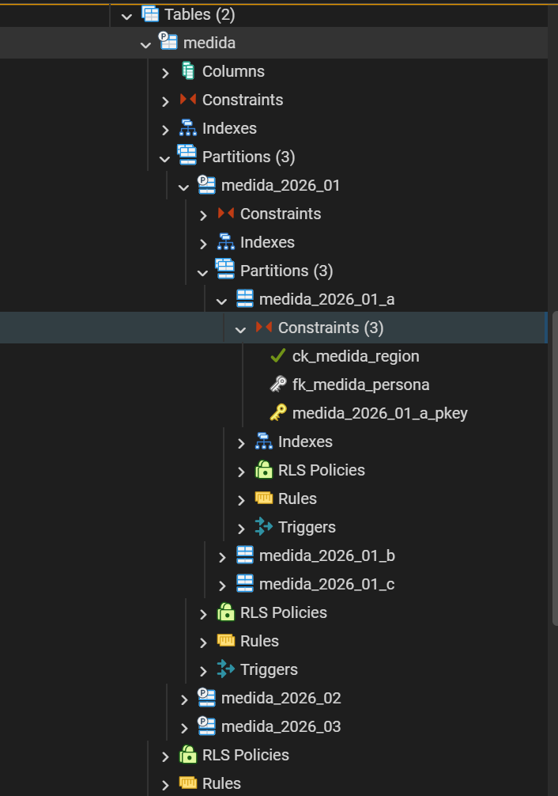

## Introduction

En PostgreSQL, la **Alta Disponibilidad (HA - High Availability)** se basa principalmente en una arquitectura de **Replicación**.

### El Rol de las Réplicas: ¿RW (Read-Write) o RO (Read-Only)?

PostgreSQL utiliza un modelo de **Único Primario (Single-Master)** de forma nativa. Esto significa que los roles están muy bien definidos:

* **Nodo Primario (Master / Leader) $\rightarrow$ ¡Es RW (Read-Write)!**
* Es el único nodo que puede recibir escrituras (`INSERT`, `UPDATE`, `DELETE`, creación de tablas, etc.).
* También puede procesar lecturas.
* Solo hay **uno activo** a la vez en el clúster de HA.

* **Nodos Réplica (Standby) $\rightarrow$ ¡Son RO (Read-Only)!**
* **Sí, cada réplica tiene una copia idéntica y completa de la base de datos.**
* No pueden modificar datos. Si intentas hacer un `INSERT` en una réplica, PostgreSQL te devolverá un error.
* Se utilizan para dos cosas: absorber el tráfico de lectura (consultas `SELECT`) y estar listas para tomar el control si el Primario falla.

### ¿Cómo se copian los datos? (El mecanismo)

PostgreSQL no copia fila por fila; utiliza algo llamado **WAL (Write-Ahead Logging)**.

1. Cuando haces un cambio en el nodo Primario, este se guarda primero en unos archivos binarios llamados WAL (que registran exactamente qué bits cambian en el disco).
2. El Primario transmite esos bytes del WAL a las réplicas a través de la red (Replicación por Streaming).
3. Las réplicas leen el WAL y "repiten" los cambios en sus propios discos. Por eso tienen la copia exacta.

Existen dos formas de enviar estos datos:

* **Replicación Asíncrona (Por defecto):** El Primario confirma la escritura al cliente sin esperar a que la réplica responda. Es súper rápido, pero si el Primario explota de golpe, la réplica podría perder unos milisegundos de datos que no llegaron a viajar por la red.
* **Replicación Síncrona:** El Primario espera a que al menos una réplica confirme que recibió el WAL antes de decirle al cliente "Listo". Es ultra seguro (cero pérdida de datos), pero añade latencia a tus escrituras.

### ¿Cómo se logra la Alta Disponibilidad (HA)?

PostgreSQL por sí solo **no sabe** cuándo automocionarse o cambiarse el rol de Réplica a Primario. Necesita un "árbitro" externo. Los estándares de la industria son herramientas como **Patroni**, **repmgr** o **Pglookout**.

El flujo de HA con una herramienta como Patroni funciona así:

```
[Cliente / Aplicación]
          │
          ▼
   [Balanceador / Proxy (PgBouncer/HAProxy)]
     │                               │
     ▼ (Escrituras y Lecturas)       ▼ (Solo Lecturas)
┌────────────────────────┐       ┌────────────────────────┐
│  Nodo Primario (RW)    │──────►│  Nodo Réplica 1 (RO)   │
└────────────────────────┘  WAL  └────────────────────────┘
            │                                 ▲
            └─────────────────────────────────┘
                            WAL

```

1. **Monitoreo constante:** Patroni (usando un sistema como Etcd o Consul) vigila la salud del nodo Primario.
2. **Conmutación por error (Failover):** Si el nodo Primario se apaga o pierde conexión, el sistema de HA lo detecta en pocos segundos.
3. **Promoción:** El sistema elige a la réplica más actualizada y la **promueve** (cambia su rol de RO a RW). Ahora esa réplica es el nuevo Primario.
4. **Redirección:** El balanceador de carga redirige el tráfico de la aplicación hacia el nuevo Primario para que tu app siga funcionando sin enterarse del caos interno.

¡Exacto! Lo has clavado. Ese es precisamente el "techo" arquitectónico de la replicación física tradicional en PostgreSQL.

Si lo desglosamos desde la perspectiva de escalabilidad, funciona tal cual lo describes:

### Escalado Horizontal en Lecturas (Read Scalability)

Es **lineal y flexible**. Si tu aplicación empieza a recibir millones de consultas de lectura (`SELECT`), la solución es sencilla:

* Añades más nodos réplica (Standby).
* Pones un balanceador de carga o un pooler de conexiones (como **PgBouncer** o **HAProxy**) que distribuya esas lecturas entre todas las réplicas disponibles.
* **Resultado:** Puedes crecer horizontalmente tanto como tu infraestructura o tu presupuesto te lo permitan.

### Escalado Vertical en Escrituras (Write Scalability)

Aquí está el verdadero cuello de botella. Como solo hay un único nodo Primario que acepta escrituras (`INSERT`, `UPDATE`, `DELETE`), la única forma nativa de soportar más carga de escritura es hacer ese nodo más grande:

* Más CPU, más memoria RAM y discos con mejores IOPS (NVMe).
* **El límite:** Llega un punto en el que el hardware tiene un límite físico o económico (escalado vertical).

Además, hay un factor crítico: **a más escrituras en el Primario, más tráfico de WAL se genera**. Las réplicas tienen que procesar ese WAL para mantenerse al día. Si el Primario escribe más rápido de lo que las réplicas pueden procesar (un problema conocido como *Replica Lag* o retraso de réplica), tus lecturas en los nodos RO empezarán a ver datos obsoletos.

### ¿Y si el escalado vertical de escrituras ya no es suficiente?

Si tu aplicación crece tanto que un solo servidor no puede absorber el volumen de escrituras, tienes que salirte del esquema clásico de HA y buscar alternativas de **escalado horizontal de escritura (Shoring / Multi-Master)**:

* **Sharding Manual o Lógico:** Divides tus datos de forma que, por ejemplo, los usuarios del 1 al 10000 vayan a una base de datos, y del 10001 al 20000 a otra. La lógica de saber a dónde escribir la gestiona tu propia aplicación.
* **Citus (Extensión de Postgres):** Transforma PostgreSQL en una base de datos distribuida. Distribuye las tablas a través de múltiples nodos (workers). Cuando escribes, Citus fragmenta los datos y los reparte, permitiendo escalar tanto lecturas como escrituras horizontalmente. En pocas palabra hace el sharding comentado en el punto anterior de forma automática
* **Replicación Multi-Master (como BDR - Bi-Directional Replication):** Permite que varios nodos sean RW a la vez y se sincronicen entre sí. Es extremadamente complejo porque tienes que gestionar los conflictos (por ejemplo, si dos usuarios modifican el mismo registro al mismo tiempo en dos nodos distintos).

### Cantidad de almacenamiento de un solo nodo

En la replicación física tradicional de PostgreSQL, **el almacenamiento no se distribuye, se duplica**. Si tu base de datos pesa 5 TB, el nodo primario necesita 5 TB de disco, la réplica A necesita 5 TB y la réplica B necesita otros 5 TB.

Esto introduce dos problemas críticos cuando el volumen de datos no para de crecer

#### 1. El límite del hardware ("El techo del disco")

Por mucho que escales verticalmente un nodo, llegará un momento en que el proveedor de nube (AWS, Azure, GCP) o tu infraestructura On-Premise te pongan un límite físico al tamaño del volumen que puedes adjuntar a una sola máquina (o el rendimiento de IOPS se degradará drásticamente al manejar discos gigantescos).

#### 2. El dolor del *Provisionamiento* y los *Failovers*

Cuando tienes nodos con discos masivos (por ejemplo, más de 4-5 TB):

* **Crear una nueva réplica es lento:** Si una réplica se corrompe o quieres añadir una nueva para aguantar más lecturas, tienes que transferir esos 5 TB a través de la red desde el primario (usando `pg_basebackup` o clonando el volumen). Esto puede tardar horas e impactar el rendimiento del primario.
* **Tiempos de recuperación (RTO):** Aunque herramientas como Patroni hacen el *failover* (cambio de rol) en pocos segundos, si el nodo que falló tiene que recuperarse y reengancharse como réplica, validar la consistencia de tantos terabytes de datos en disco lleva tiempo.

#### ¿Cómo se gestiona el límite de almacenamiento en Postgres?

Cuando el almacenamiento de un solo nodo empieza a ser un problema, los arquitectos de datos suelen aplicar tres estrategias (de menos compleja a más compleja):

##### A. Estrategia de Retención y Purga (La más sana)

Muchas veces el disco se llena con datos históricos que la aplicación ya no consulta en el día a día (por ejemplo, logs de auditoría de hace 3 años o mediciones antiguas).

* Se implementa un proceso que mueve esos datos históricos a un almacenamiento más barato (un *Data Lake* en S3/Azure Blob Storage, o tablas comprimidas en herramientas analíticas) y los borra de la base de datos transaccional.

##### B. Particionado de Tablas (Table Partitioning)

PostgreSQL permite dividir una tabla gigante (por ejemplo, `mediciones`) en "sub-tablas" más pequeñas de forma lógica (por ejemplo, una partición por cada mes del año).

* **Ojo:** Esto por sí solo **no soluciona** el límite de almacenamiento del nodo (porque todas las particiones siguen viviendo en el mismo servidor), pero te permite algo muy potente: mover las particiones viejas a *Tablespaces* que apunten a discos más lentos y baratos, o borrar un mes entero de golpe de forma instantánea (`DROP PARTITION`) sin penalizar el rendimiento del disco.

##### C. Arquitecturas Distribuidas (Sharding / Citus)

Si necesitas mantener obligatoriamente decenas de terabytes de datos activos y listos para ser consultados y modificados en milisegundos, no te queda otra que **romper el modelo transaccional clásico** e irte a un clúster distribuido.

Como mencionamos antes, una extensión como **Citus** rompe este límite dividiendo tus tablas en fragmentos (*shards*) y repartiéndolos de manera que el nodo A guarda el 33% de los datos, el nodo B el 33% y el nodo C el 33% restante.

Con este enfoque distribuido:

* **Escalas en almacenamiento:** Si te quedas sin espacio, añades el Nodo D y el sistema redistribuye los fragmentos.
* **Escalas en escrituras:** Cada nodo procesa las escrituras de sus propios fragmentos de forma independiente.

### Resumen

| Característica | Nodo Primario | Nodo Réplica (Hot Standby) |
| --- | --- | --- |
| **¿Tiene toda la BD?** | Sí | Sí (Copia idéntica) |
| **¿Permite Escritura? (RW)** | **Sí** | No |
| **¿Permite Lectura? (RO)** | Sí | **Sí** |
| **Cantidad en el clúster** | Estrictamente 1 | 1 o varias |

> **Nota avanzada:** Existe algo llamado *Replicación Lógica* en Postgres donde puedes replicar solo una tabla o bases de datos específicas (no todo el servidor), y ahí la réplica sí puede ser RW para otras tablas locales. Sin embargo, para **Alta Disponibilidad (HA)** pura, siempre se usa la *Replicación Física* (copia completa de todo el clúster, RO).

## Tablespace y tablas

En PostgreSQL, un **Tablespace** es simplemente un alias o un puntero a un **directorio del sistema operativo**. Una tabla estándar (no particionada) o un índice tradicional **solo pueden pertenecer a un único Tablespace** a la vez. Cuando se crea una tabla normal, todos sus datos se guardan en el tablespace asignado (o en el por defecto si no especificas ninguno). Si ese tablespace se queda sin espacio físico en el disco al que apunta, la tabla no puede seguir creciendo, a menos que expandas el disco por debajo a nivel de infraestructura.

Cuando particionamos una tabla (por ejemplo, la tabla `medida`), esa tabla se convierte en una **entidad lógica**, pero físicamente deja de existir como un único archivo. En su lugar, se crean "sub-tablas" físicas (las particiones). **Cada partición es, a efectos internos de Postgres, una tabla independiente.**. Como cada partición es independiente, **se puede asignar un Tablespace diferente a cada una.**

Por ejemplo, en un **escenario de "Datos Calientes" y "Datos Fríos"**:

```
                  [ Tabla Lógica: mediciones ]
                               │
       ┌───────────────────────┼───────────────────────┐
       ▼                       ▼                       ▼
[ Partición: Enero ]   [ Partición: Febrero ]  [ Partición: Marzo ]
       │                       │                       │
       ▼                       ▼                       ▼
 ┌───────────┐           ┌───────────┐           ┌───────────┐
 │Tablespace │           │Tablespace │           │Tablespace │
 │  "HISTO"  │           │  "HISTO"  │           │ "ACTUAL"  │
 └─────┬─────┘           └─────┬─────┘           └─────┬─────┘
       │                       │                       │
       ▼                       ▼                       ▼
┌─────────────────────────┐             ┌─────────────────────────┐
│  Disco HDD (SATA)       │             │  Disco SSD (NVMe)       │
│  Lento, barato, enorme  │             │  Ultra rápido, caro     │
│  (Datos Fríos)          │             │  (Datos Calientes)      │
└─────────────────────────┘             └─────────────────────────┘

```

1. **Partición del mes en curso (Marzo):** Apunta al `Tablespace_Rapido`, el cual está mapeado a un disco **SSD/NVMe** ultra rápido. Como ahí es donde caen todas las escrituras (`INSERT`) y las consultas del día a día, necesitas el máximo rendimiento.
2. **Particiones de meses pasados (Enero, Febrero):** Mediante un proceso automatizado, mueves esas particiones al `Tablespace_Viejo`, que está mapeado a un disco **HDD mecánico o almacenamiento en red (NAS)**, mucho más lento pero infinitamente más barato. Ya no se escribe en ellos y rara vez se consultan.

### Demostración. Tabla normal

Creamos una tabla:

```sql
CREATE TABLE personas (
    id BIGSERIAL PRIMARY KEY,
    nombre   VARCHAR(100) NOT NULL,
    apellido VARCHAR(100) NOT NULL,
    dni      VARCHAR(10)  NOT NULL UNIQUE
);

INSERT INTO personas (nombre, apellido, dni)
VALUES ('Eugenio', 'García San Martin', '09781214G');

INSERT INTO personas (nombre, apellido, dni)
VALUES ('Lionel', 'Messi', '0123456T');

select * from personas;
```

Si no indicas nada al crear la tabla, PostgreSQL la guarda en el tablespace por defecto, que suele ser `pg_default`.

Para ver qué tablespace usa esa tabla (un solo tablespace por tabla) y dónde está físicamente almacenada, puedes consultar esto:

```sql
-- Tablespace usado por la tabla
SELECT
  c.relname AS tabla,
  COALESCE(t.spcname, 'pg_default') AS tablespace
FROM pg_class c
LEFT JOIN pg_tablespace t ON t.oid = c.reltablespace
WHERE c.relname = 'personas';

-- Ruta física del archivo de la tabla dentro del cluster
SELECT pg_relation_filepath('personas');

-- Información del tablespace por defecto
SELECT *
FROM pg_tablespace
WHERE spcname = 'pg_default';
```

En un cluster PostgreSQL normal, los datos de la tabla se almacenan dentro del directorio de datos del servidor, normalmente en una ruta parecida a `.../base/<OID_de_la_base>/<archivo_físico>`. Los índices y la tabla no necesariamente comparten el mismo archivo: cada objeto tiene su propio almacenamiento.

Si quieres forzar un tablespace concreto, primero debes crearlo apuntando a una ruta del sistema de archivos y luego usarlo al crear la tabla:

```sql
CREATE TABLESPACE mi_tablespace
LOCATION 'C:/postgres/tablespaces/mi_tablespace';
```

La carpeta indicada debe existir en el servidor donde corre PostgreSQL, debe estar vacía y el usuario del servicio de PostgreSQL debe tener permisos de lectura/escritura sobre ella. Si la carpeta no existe o no está vacía, PostgreSQL rechazará la creación.

```sql
CREATE TABLE personas (
  id BIGSERIAL PRIMARY KEY,
  nombre   VARCHAR(100) NOT NULL,
  apellido VARCHAR(100) NOT NULL,
  dni      VARCHAR(10)  NOT NULL UNIQUE
) TABLESPACE mi_tablespace;
```

para cada tabla se crea un juego de archivos diferente. A medida que el contenido de la tabla crece llegará un momento que se creen varios archivos (la tabla se irá dividiendo en segmentos de 1GB, y cada segmento será un archivo).

### Demostración. Tabla particionada

Podemos particionar una tabla de modo que físicamente utilice más un tablespace y por lo tanto que físicamente guarde los datos por separado. Esto nos permitirá:
- el optimizador puede optimizar el acceso porque sabe que los datos están separados físicamente en particiones
- mover datos de una particion completa a un almacenamiento más barato, a la nube, borrarlo...

Podemos particionar por más de un campo, pero esto luego hace que tengamos que manejar duplas a la hora de crear particiones y es más confuso y propenso a errores. Lo que habitualmente se hace en estos casos es crear una jerarquía de particiones. Por ejemplo, si quieremos particionar una tabla por mes y, dentro de cada mes, por región, en PostgreSQL lo normal es hacerlo en dos niveles:

1. Partición primaria por rango de `fecha`.
2. Subpartición por lista de `region`.

Hay un detalle importante: en PostgreSQL **una clave primaria de una tabla particionada debe incluir todas las columnas que participan en la clave de particionado**. Como aquí tienes una partición por `fecha` y una subpartición por `region`, la PK debe incluir también `region`. Por eso no puedes tener `id` como única PK global.

Para este ejemplo, queremos definir una tabla `medida` que tenga una relacion de integridad con la tabla personas. Tenemos una columna región que podrá tomar tres valores, `A`, `B` o `C`. Las fechas queremos guardarlas como `dd-mm-aaaa`. Nuestra intención es particionar por `fecha` y `región`. La partición por fecha serán un rango de valores, `RANGE` mientras que para la región indicaremos valores concretos, `LIST`. Creamos la tabla `medida`:

```sql
CREATE TABLE medida (
  persona BIGINT NOT NULL,
  fecha DATE NOT NULL,
  region CHAR(1) NOT NULL,
  consumo INTEGER NOT NULL,
  importe DOUBLE PRECISION NOT NULL,
  PRIMARY KEY (persona, fecha, region),
  CONSTRAINT fk_medida_persona
    FOREIGN KEY (persona)
    REFERENCES personas (id),
  CONSTRAINT ck_medida_region
    CHECK (region IN ('A', 'B', 'C'))
) PARTITION BY RANGE (fecha);
```

La columna `fecha` conviene guardarla como tipo `DATE`; el formato `dd-mm-aaaa` es solo una forma de mostrarla, no de almacenarla.

Luego creas las particiones mensuales para enero, febrero y marzo de 2026, y dentro de cada una las subparticiones por región:

```sql
CREATE TABLE medida_2026_01
PARTITION OF medida
FOR VALUES FROM ('2026-01-01') TO ('2026-02-01')
PARTITION BY LIST (region);

CREATE TABLE medida_2026_01_a
PARTITION OF medida_2026_01
FOR VALUES IN ('A');

CREATE TABLE medida_2026_01_b
PARTITION OF medida_2026_01
FOR VALUES IN ('B');

CREATE TABLE medida_2026_01_c
PARTITION OF medida_2026_01
FOR VALUES IN ('C');

CREATE TABLE medida_2026_02
PARTITION OF medida
FOR VALUES FROM ('2026-02-01') TO ('2026-03-01')
PARTITION BY LIST (region);

CREATE TABLE medida_2026_02_a
PARTITION OF medida_2026_02
FOR VALUES IN ('A');

CREATE TABLE medida_2026_02_b
PARTITION OF medida_2026_02
FOR VALUES IN ('B');

CREATE TABLE medida_2026_02_c
PARTITION OF medida_2026_02
FOR VALUES IN ('C');

CREATE TABLE medida_2026_03
PARTITION OF medida
FOR VALUES FROM ('2026-03-01') TO ('2026-04-01')
PARTITION BY LIST (region);

CREATE TABLE medida_2026_03_a
PARTITION OF medida_2026_03
FOR VALUES IN ('A');

CREATE TABLE medida_2026_03_b
PARTITION OF medida_2026_03
FOR VALUES IN ('B');

CREATE TABLE medida_2026_03_c
PARTITION OF medida_2026_03
FOR VALUES IN ('C');
```

Vamos a crear unos datos de ejemplo. Con esto, cada fila se irá a la partición correcta según el mes de `fecha` y, dentro de ese mes, según la `region`. Si insertas una fecha de abril de 2026 o una región distinta de A/B/C, PostgreSQL devolverá error porque no existe partición destino.

Si quieres cargar datos de ejemplo en todas las particiones creadas, puedes insertar dos registros por región y por día para los tres primeros días de enero, febrero y marzo de 2026. En el ejemplo, el `importe` se calcula como `consumo * 2.4`:

```sql
WITH fechas AS (
  SELECT DATE '2026-01-01' + gs AS fecha
  FROM generate_series(0, 2) AS gs
  UNION ALL
  SELECT DATE '2026-02-01' + gs AS fecha
  FROM generate_series(0, 2) AS gs
  UNION ALL
  SELECT DATE '2026-03-01' + gs AS fecha
  FROM generate_series(0, 2) AS gs
),
regiones AS (
  SELECT unnest(ARRAY['A', 'B', 'C']) AS region
)
INSERT INTO medida (persona, fecha, region, consumo, importe)
SELECT
  p.id,
  f.fecha,
  r.region,
  (extract(day FROM f.fecha)::int * 10) + (ascii(r.region) - ascii('A') + 1) * 3  AS consumo,
  ((extract(day FROM f.fecha)::int * 10) + (ascii(r.region) - ascii('A') + 1) * 3 ) * 2.4 AS importe
FROM personas p
CROSS JOIN fechas f
CROSS JOIN regiones r
ORDER BY p.id, f.fecha, r.region;
```

Podemos ver que la tabla medida esta particionada (se muesta un icono diferente), en el nodo _Partitions_ nos muestra las particiones que tenemos, que a su vez tienen también un nodo _Partitions_ con sus particiones:



Podemos ver como con cada particione tenemos su _Constrains_, _Indexes_, _Triggers_, y _Rules_. Los valores que tenemos ahora mismo creado se han heredado de la tabla padre, pero nada nos impide, por ejemplo, quitar índices en una partición donde ya no necesitemos alguno de los índices (esto redundará en menor espacio en disco, y menor espacio en memoria). El planificador es consciente de la presencia de particiones y de los índices que tiene cada partición, de modo que podría estar usando unos índices para acceder unas particiones, y otros en otroas, incluso cuando hacemos un `SELECT` que toca varias particiones (se paralelizará el acceso a las diferentes particiones, en cada particion usaremos unos índices determinados, y finalmente se fusionarán los resultados para devolver un solo juego de datos).

Estas tres consultas darán los mismos resultados:

```sql
SELECT * FROM medida WHERE fecha = DATE '2026-01-01' AND region = 'A';
SELECT * FROM medida_2026_01 WHERE fecha = DATE '2026-01-01' AND region = 'A';
SELECT * FROM medida_2026_01_a WHERE fecha = DATE '2026-01-01' AND region = 'A';
SELECT * FROM medida WHERE fecha BETWEEN DATE '2026-01-01' AND DATE '2026-02-28' AND region IN ('A','C');
```

Si quieres comprobar que PostgreSQL usa realmente las particiones, la consulta más útil es `EXPLAIN` sobre la tabla padre:

```sql
EXPLAIN (ANALYZE, VERBOSE, COSTS OFF)
SELECT *
FROM medida
WHERE fecha BETWEEN DATE '2026-01-01' AND DATE '2026-02-28'
  AND region IN ('A', 'C');

EXPLAIN (ANALYZE, VERBOSE, COSTS OFF)
SELECT *
FROM medida
WHERE fecha BETWEEN DATE '2026-01-01' AND DATE '2026-02-28'
  AND region IN ('A', 'C')
  AND persona=1;
```

En ese caso, el plan debería mostrar que PostgreSQL solo recorre las particiones de enero y febrero, y dentro de ellas solo las subparticiones de `A` y `C`. No debería tocar marzo, porque `2026-03-01` queda fuera del rango del `BETWEEN`.

las siguientes queries funcionarán:

```sql
-- inserta un dato que corresponde a una particion ya creada
INSERT INTO medida (persona, fecha, region, consumo, importe) 
VALUES (1,'01-04-2026','A',10,30);

-- inserta un dato que corresponde a esta partición
INSERT INTO medida_2026_01_a (persona, fecha, region, consumo, importe)
VALUES (1,'01-05-2026','A',10,55);
```

estas fallarán:

```sql
-- id de persona no existe
INSERT INTO medida (persona, fecha, region, consumo, importe)
VALUES (3,'01-04-2026','A',10,30);

-- region no válida
INSERT INTO medida (persona, fecha, region, consumo, importe)
VALUES (1,'01-05-2026','D',10,30);

-- no existe una particion creada
INSERT INTO medida (persona, fecha, region, consumo, importe)
VALUES (1,'04-05-2026','A',10,30);

-- no existe una particion creada
INSERT INTO medida_2026_02 (persona, fecha, region, consumo, importe)
VALUES (1,'01-05-2026','A',10,55);

-- no existe una partición creada
INSERT INTO medida_2026_01_c (persona, fecha, region, consumo, importe)
VALUES (1,'01-05-2026','A',10,55);
```

**Tenemos que crear las particiones de forma anticipada para evitar que falle la inserción**. Podemos crear una partición por defecto donde _caerán_ todos los datos que _no tienen una partición_:

```sql
CREATE TABLE medida_default
  PARTITION OF medida
  DEFAULT;
```

con esto tendremos una partición mas en la tabla medida (que por cierto no estará particionada por región). Ahora esto ya no fallará:

```sql
INSERT INTO medida (persona, fecha, region, consumo, importe)
VALUES (1,'04-05-2026','A',10,30);
```

si consultamos la partición por defecto se mostrarán los datos:

```sql
select * from medida_default
```

Cuando queramos crear la partición que incluye el mes de abril, nos fallará porque los datos nos se mueven por defecto y tenemos datos en `medida_default` que corresponderían a la nueva partiión. Entonces, tendriamos que crear la nueva tabla con la misma estructura de `medida`, pero no como una partición de `medida` (estará _detacheada_ de medida):


```sql
-- creamos la tabla separada de medida...
CREATE TABLE medida_2026_04 (LIKE medida INCLUDING ALL)
PARTITION BY LIST (region);
-- ... pero particionada ya por region
CREATE TABLE medida_2026_04_a
PARTITION OF medida_2026_04
FOR VALUES IN ('A');

CREATE TABLE medida_2026_04_b
PARTITION OF medida_2026_04
FOR VALUES IN ('B');

CREATE TABLE medida_2026_04_c
PARTITION OF medida_2026_04
FOR VALUES IN ('C');
```

movemos los datos a la nueva particion:

```sql
INSERT INTO medida_2026_04
SELECT * FROM medida_default
```

hay que borrarlos de la default, porque sino al querer attachear la nueva partición, nos daría duplicados:

```sql
delete from medida_default;
```

y **ya podemos attachear la tabla que creamos a la tabla `medida`**:

```sql
ALTER TABLE medida ATTACH PARTITION medida_2026_04
  FOR VALUES FROM ('2026-04-01') TO ('2026-05-01');
```

podemos hacer:

```sql
SELECT * FROM medida WHERE fecha between '2026-04-01' and '2026-05-01' AND region = 'A';
```

### Demostración. Cambiar el Tablespace

Si queremos aplicar un escenario de **cold storage**, al cambiar de mes, la base de datos no mueve los datos de disco por arte de magia; hay que ejecutar una acción para cambiar la partición de un tablespace a otro. Afortunadamente, PostgreSQL hace que este proceso sea increíblemente limpio y eficiente. No tienes que mover fila por fila (lo cual bloquearía la base de datos y tardaría horas); se hace a nivel de **metadatos** con una sola instrucción.

El comando clave: `ALTER TABLE ... SET TABLESPACE`. Cuando termina el mes de marzo y quieres pasar su partición al disco lento (el tablespace de datos fríos), ejecutas una instrucción como esta:

```sql
ALTER TABLE mediciones_y2026m03 SET TABLESPACE tablespace_histo;
```

¿Qué hace Postgres por debajo cuando ejecutas esto?

1. **Bloqueo exclusivo corto:** Bloquea temporalmente esa partición específica (el resto de las particiones, como la de abril, siguen funcionando y recibiendo escrituras con total normalidad).
2. **Copia a nivel de sistema operativo:** Postgres va al directorio del disco rápido, toma el archivo físico de esa partición, lo copia en el directorio del disco lento (`tablespace_histo`) y, una vez verificado, borra el archivo del disco rápido.
3. **Actualiza los metadatos:** Cambia el puntero interno para que, a partir de ese momento, cualquier consulta que busque datos de marzo sepa que tiene que ir a leer al disco lento.

Nadie quiere estar despierto a las 12:00 AM del primer día del mes para ejecutar scripts de mantenimiento. En entornos de producción con grandes volúmenes de datos (como sistemas de telemedida o sensorización), esto se automatiza por completo usando dos estrategias comunes:

* 1. Programadores de tareas (Cron / `pg_cron`)

Se utiliza una extensión muy popular llamada **`pg_cron`** (que te permite programar tareas de SQL dentro del propio Postgres) o un script externo en Python/Bash mapeado en el Cron del sistema operativo.

El script hace dos tareas automáticamente el día 1 de cada mes:

* **Crea la partición del mes siguiente** en el disco rápido (`tablespace_actual`).
* **Mueve la partición del mes anterior** al disco lento (`tablespace_histo`).

* 2. Extensiones de automatización (como `pg_partman`)

Si el particionado se vuelve complejo (por ejemplo, si en lugar de particionar por mes necesitas particionar por día debido al volumen), gestionar los scripts manuales puede ser tedioso.

Para eso existe **`pg_partman`** (Partition Manager), una extensión estándar en la industria para PostgreSQL. Tú solo le dices: *"Quiero que la tabla `mediciones` se particione por meses, que mantenga siempre 2 meses hacia adelante creados en el disco rápido, y que las particiones de más de 2 meses de antigüedad las mueva automáticamente al tablespace secundario"*. La extensión se encarga de todo el ciclo de vida por debajo.

#### Un matiz importante sobre los Índices

Cuando mueves una partición de un tablespace a otro con `SET TABLESPACE`, estás moviendo **los datos de la tabla**. Pero recuerda que los **índices** (que se usan para que las búsquedas sean rápidas) también ocupan mucho espacio en disco. Si queremos liberar por completo el disco rápido, el script de automatización también debe mover los índices de esa partición:

```sql
ALTER INDEX idx_mediciones_y2026m03 SET TABLESPACE tablespace_histo;
```

Con este enfoque, el almacenamiento de nuestro nodo se mantiene en un equilibrio perfecto: el disco NVMe/SSD se mantiene siempre limpio y con espacio libre constante (porque solo aloja el mes actual y quizás el anterior), mientras que el almacenamiento barato va creciendo indefinidamente alojando el histórico.

### Índices

Las particiones pueden usar índices completamente diferentes para cada partición en la misma consulta.** Postgres es lo suficientemente inteligente como para trazar un plan de ejecución dividido (un *Append* o *Merge Append*), donde trata a cada partición de forma individual antes de juntar los resultados.

Si ejecutas una consulta que cruza la frontera del mes (por ejemplo, del 25 de marzo al 5 de abril), esto es lo que ocurre bajo el capó. Tienes tu tabla particionada por meses:

* **Partición de Marzo (en disco lento `histo`):** Decidiste dejarle **solo un índice** por `contador_id` para ahorrar espacio. Borraste el índice de `zona_geografica`.
* **Partición de Abril (en disco rápido `actual`):** Como es el mes activo, tiene **ambos índices** (`contador_id` y `zona_geografica`).

Lanzas esta consulta que toca ambos meses:

```sql
SELECT * FROM mediciones 
WHERE fecha BETWEEN '2026-03-25' AND '2026-04-05' 
  AND contador_id = 1234;
```

El optimizador de Postgres descompone tu consulta en sub-consultas independientes para cada partición afectada y aplica el mejor índice disponible en cada una:

```
                  [ Tu Consulta: Datos de Marzo y Abril ]
                                     │
                  ┌──────────────────┴──────────────────┐
                  ▼ (Fase de Poda / Pruning)            ▼
       [ Evalúa Partición: Marzo ]           [ Evalúa Partición: Abril ]
                  │                                     │
                  ▼                                     ▼
        ¿Qué índices tiene?                   ¿Qué índices tiene?
       Tiene [idx_contador_marzo]             Tiene [idx_contador_abril]
                                                    [idx_zona_abril]
                  │                                     │
                  ▼ (Usa el disponible)                 ▼ (Elige el mejor)
       Usa: idx_contador_marzo               Usa: idx_contador_abril
                  │                                     │
                  └──────────────────┬──────────────────┘
                                     ▼
                        [ Operación APPEND / MERGE ]
                        (Junta los datos y te los devuelve)

```

1. **Poda de particiones:** Postgres descarta mayo, junio, febrero, etc. Sabe que solo debe mirar en Marzo y Abril.
2. **Estrategia para Marzo:** Va a la partición de marzo. Ve que el filtro incluye `contador_id` y que hay un índice llamado `idx_contador_marzo`. Lo usa para escanear esa partición en el disco lento.
3. **Estrategia para Abril:** En paralelo (o secuencialmente según el plan), va a la partición de abril. Ve que tiene el índice `idx_contador_abril`. Lo usa para escanear el disco rápido.
4. **Unión de resultados (Append):** Postgres junta los registros encontrados en marzo y los encontrados en abril, y te devuelve el resultado final unificado como si hubieran salido de un único sitio.

¿Y qué pasa si en una partición NO hay un índice útil?. Imagina que cambias el filtro y buscas por `zona_geografica`:

```sql
SELECT * FROM mediciones 
WHERE fecha BETWEEN '2026-03-25' AND '2026-04-05' 
  AND zona_geografica = 'Norte';
```

Aquí es donde verías la diferencia de rendimiento viva en la misma consulta:

* **En la partición de Abril:** Postgres verá que existe el índice `idx_zona_abril`, lo usará y obtendrá los datos de inmediato en el disco rápido.
* **En la partición de Marzo:** Como borraste ese índice para ahorrar espacio en el disco lento, Postgres no tendrá más remedio que hacer un **Sequential Scan (SecScan)**, es decir, leerá la partición de marzo entera fila por fila en el disco lento para buscar la zona 'Norte'.

La consulta funcionará y te dará los datos correctos, pero la parte de marzo tardará más. Por eso, la estrategia de borrar índices en el histórico es brillante para ahorrar espacio, pero **solo debes hacerlo con índices de columnas por las que estés seguro de que nadie va a filtrar en el histórico**, o si asumes el coste de que esa consulta histórica tardará unos segundos más.

## Mitigar el crecimiento

Para evitar que el nodo colapse cuando el almacenamiento histórico se llene, los arquitectos de datos aplican tres niveles de contención:

### Nivel 1: Compresión de Datos Fríos (Ahorrar espacio)

Los datos del mes pasado que ya moviste a `histo` normalmente **ya no se van a modificar** (son de solo lectura para auditorías o reportes). En PostgreSQL tradicional las tablas no se comprimen solas, pero puedes usar dos estrategias para reducir drásticamente el tamaño que ocupan en el disco `histo`:

* **Reindexación optimizada:** Los índices ocupan muchísimo espacio. Para las particiones históricas, puedes **borrar índices** que solo usabas para la ingesta rápida y dejar únicamente los esenciales.
* **Extensiones de compresión columnar:** Puedes usar extensiones como `pg_analytics` o herramientas que transforman esas particiones viejas a formatos columnares comprimidos. Esto puede reducir el espacio en disco hasta en un 70% o 80%.

### Nivel 2: "Cold Data Tiering" (Mover fuera de Postgres)

1. **Exportación:** Mediante un proceso automatizado, las particiones de más de, por ejemplo, 1 o 2 años de antigüedad se exportan a archivos planos ultra-comprimidos (como formato **Parquet**).
2. **Almacenamiento Cloud Barato:** Esos archivos se suben a un almacenamiento de objetos en la nube (como AWS S3 o Azure Blob Storage). Este almacenamiento es infinitamente escalable y ridículamente barato.
3. **Consulta desde Postgres (FDW):** Borras la partición física del disco de Postgres, pero creas una **tabla foránea** apuntando a ese archivo en S3. Si alguien llega a lanzar una consulta de hace 3 años, Postgres irá a buscarla directamente al almacenamiento Cloud. La consulta será más lenta, pero el espacio en tu disco local ahora es **cero**.

### Nivel 3: Política de Retención Absoluta (Purgado)

Con el particionado, aplicar una política de retención (por ejemplo, *"solo estamos obligados a guardar datos durante 5 años"*) es asombrosamente fácil y rápido. En lugar de hacer un `DELETE` masivo (que destruiría el rendimiento del disco y generaría gigabytes de WAL), simplemente destruyes la partición del mes más antiguo:

```sql
DROP TABLE mediciones_y2021m05;
```

Este comando tarda **milisegundos**, no genera sobrecarga y libera gigabytes (o terabytes) de espacio en el disco `histo` de forma instantánea para que pueda ser reutilizado por los meses venideros.

## Citus

**Citus es una extensión que "transforma" PostgreSQL** para permitir el sharding automático y consguir una escalabilidad horizontal. El enfoque, no obstante, es diferente al utilizado por motores como `CockroachDB`

### Citus (PostgreSQL Distribuido)

Citus se asienta sobre instancias reales de PostgreSQL. Mantiene el motor de almacenamiento de Postgres, sus índices B-Tree tradicionales y su sistema de WAL.

* Para escalar, fragmenta las tablas en **shards** (que técnicamente son tablas normales de Postgres viviendo en diferentes nodos workers).
* Depende de un nodo **Coordinador** que actúa como cerebro, recibe las consultas de la aplicación, las divide y las envía a los nodos workers.

### CockroachDB (Arquitectura NewSQL Nativa)

CockroachDB no usa Postgres por debajo (aunque es compatible con su protocolo de red, por lo que puedes usar tus mismos drivers de código).

* Por debajo, funciona como un gigantesco motor de almacenamiento de clave-valor (**Key-Value store** basado en una variante de Pebble/RocksDB).
* Toda tu base de datos se ordena como un único mapa de claves-valores monolítico que luego se corta en bloques de 64 MB llamados **Ranges**.
* **No hay nodo coordinador:** Todos los nodos son exactamente iguales (arquitectura *Peer-to-Peer*). Puedes conectarte a cualquier nodo del clúster y este sabrá cómo resolver la consulta.

### Consenso y Consistencia (ACID)

La forma en que garantizan que los datos no se pierdan si un nodo explota es el punto de mayor divergencia técnica:

* **Citus:** Delega la consistencia y la replicación a los mecanismos de Postgres (ya sea replicación física por streaming o herramientas como Patroni). Si usas su replicación nativa de shards, hace escrituras en red en dos fases, lo que puede añadir latencia.
* **CockroachDB:** Utiliza el algoritmo de consenso **Raft**. Cada bloque de datos (Range) se replica por defecto 3 veces en 3 nodos diferentes. Para que una escritura se dé por buena, al menos 2 de los 3 nodos tienen que ponerse de acuerdo mediante Raft. Es increíblemente tolerante a fallos: de ahí su nombre (*Cucaracha*), está diseñada para sobrevivir a caídas de nodos enteros sin perder un solo milisegundo de consistencia (cumple estrictamente con el aislamiento *Serializable*, el más alto en bases de datos).

### Compatibilidad con el ecosistema PostgreSQL

* **Citus: Compatibilidad 100%.** Al ser Postgres puro, cualquier extensión de Postgres (`pg_cron`, `PostGIS` para datos geográficos, `TimescaleDB` para series temporales) funciona perfectamente dentro de los nodos. Tienes acceso completo a todas las funciones nativas avanzadas de SQL de Postgres.
* **CockroachDB: Compatibilidad parcial (a nivel de sintaxis).** Habla el "dialecto" de Postgres (su cliente SQL), pero no es Postgres. No puedes instalar extensiones de Postgres, y hay ciertas características avanzadas o tipos de datos muy específicos de Postgres que no están soportados o se comportan de forma ligeramente diferente.

### Comparativa

| Característica | Citus | CockroachDB |
| --- | --- | --- |
| **Base Tecnológica** | PostgreSQL nativo (vía extensión) | Escrita desde cero en Go/C++ |
| **Arquitectura** | Coordinador + Workers | Peer-to-Peer (Todos los nodos iguales) |
| **Escalado de Escritura** | Horizontal (Por hash/sharding) | Horizontal (Automático por rangos) |
| **Mecanismo de Consenso** | Replicación clásica / Dos fases | Algoritmo **Raft** integrado |
| **Extensiones Postgres** | **Sí** (Soporte total) | No |
| **Facilidad de Operación** | Media-Alta (Requiere gestionar el coordinador) | Muy fácil (El clúster se auto-balancea solo) |

### Más sobre Citus

Cuando creaamos una tabla en Citus, primero la creas como una tabla normal de Postgres en el nodo **Coordinador**. En ese momento, el esquema (las columnas, los tipos de datos) solo existe ahí.

El truco ocurre cuando ejecutas la función propia de Citus para distribuirla:

```sql
SELECT create_distributed_table('mediciones', 'contador_id');

```

Al hacer esto, Citus realiza lo siguiente:

1. **Conecta con los Workers:** Va a cada uno de los nodos workers y replica exactamente el mismo esquema (la misma estructura de tabla).
2. **Crea los Shards:** Divide el espacio lógico en fragmentos (shards). Por defecto, Citus crea 32 shards.
3. **Aplica la función Hash:** Cuando tu aplicación hace un `INSERT` con un `contador_id = 1234`, Citus aplica un algoritmo de Hash al número `1234`. El resultado de ese hash da un número (por ejemplo, `A5`). Citus mira su mapa interno, ve que los hashes que dan `A5` pertenecen al **Shard 12**, y sabe que el Shard 12 vive físicamente en el **Nodo Worker 2**. La fila viaja directa a ese nodo.

La Consulta (`SELECT`): ¿Siempre se consulta en todos los nodos?. Aquí es donde el optimizador de Citus demuestra su inteligencia. **Depende de cómo hagas el `SELECT**`:

Si lanzas una consulta genérica o analítica, como por ejemplo:

```sql
SELECT SUM(lectura) FROM mediciones WHERE fecha = '2026-03-14';

```

Como no has incluido el campo `contador_id` en el filtro `WHERE`, Citus **no tiene ni idea** de en qué nodos están los datos que buscas. Por lo tanto, hace exactamente lo que tú has dicho:

1. El Coordinador lanza la consulta a **todos los nodos workers a la vez** en paralelo.
2. Cada nodo worker calcula la suma de los fragmentos que él tiene guardados en su disco.
3. Cada worker le devuelve su subtotal al Coordinador.
4. El Coordinador **agrega** (suma los subtotales) y te da el resultado final.

Si haces una consulta transaccional (del día a día de la aplicación) filtrando por la columna de Hash:

```sql
SELECT * FROM mediciones WHERE contador_id = 1234;

```

Aquí Citus es ultra eficiente. Antes de tocar la red, el Coordinador le aplica el Hash a `1234`, ve que ese dato vive **únicamente en el Nodo Worker 2**, y le envía la consulta **solo a ese nodo**. Los nodos 1 and 3 ni se enteran. Esto permite que Citus soporte miles de consultas por segundo, porque no satura el clúster entero para buscar un solo dato.


#### Un matiz clave sobre las Tablas de Referencia

Citus sabe que en una base de datos real no todo son tablas gigantes de miles de millones de filas (como `mediciones`). También tienes tablas pequeñas de diccionarios o catálogos (por ejemplo, la tabla `tipos_de_contador`, que solo tiene 5 filas).

Si distribuyeras la tabla de `tipos_de_contador` por Hash, hacer un `JOIN` con las mediciones obligaría a los nodos a pasarse datos por red constantemente, destruyendo el rendimiento.

Para resolver esto, Citus te permite crear **Tablas de Referencia**:

```sql
SELECT create_reference_table('tipos_de_contador');

```

¿Qué hace Citus aquí? **Copia la tabla entera con todas sus filas en TODOS los nodos workers.** Así, cuando un worker tiene que procesar un `SELECT` con un `JOIN` entre las mediciones de su nodo y los tipos de contador, puede hacer el `JOIN` de forma 100% local en su propio disco y memoria, sin hablar con nadie más.

### Resumen


- Acto 1: El Plano (La tabla local). Cuando te conectas al coordinador y ejecutas el `CREATE TABLE`, esa tabla se comporta inicialmente como una tabla normal y corriente de Postgres. Si hicieras un `INSERT` en ese momento, los datos se quedarían guardados en el disco del coordinador. * En este punto, los nodos *workers* no tienen ni idea de que esa tabla existe.

- Acto 2: La Expansión (La función mágica). En cuanto ejecutas la función `create_distributed_table(...)`, ocurre la magia por detrás:

1. **El Coordinador vacía su disco (si tenía datos):** Si habías metido datos de prueba en el coordinador, Citus los agarra, los trocea y los manda a los workers. El coordinador se queda "vacío" de datos reales de esa tabla.
2. **Copia del Esquema:** El coordinador conecta por red con cada uno de los *workers* y les dice: *"Ey, cread una tabla exactamente con estas columnas e índices"*.
3. **Creación de los Shards:** El coordinador decide cuántos fragmentos (*shards*) va a tener esa tabla (por ejemplo, 32 shards) y los reparte equitativamente entre los discos de los *workers*.

- Acto 3: El Día a Día (El Coordinador como Policía de Tráfico). A partir de ese momento, la tabla en el coordinador se convierte en una **Tabla Distribuida** (un cascarón lógico). Físicamente no tiene filas, pero tiene algo más importante: **el mapa de carreteras**. Cuando tu aplicación se conecta al coordinador para trabajar:

* **Si haces un `INSERT`:** El coordinador no guarda nada en su propio disco. Aplica el Hash al campo que elegiste, mira su mapa, ve a qué *worker* le toca ese fragmento y le envía los datos por red para que el *worker* los guarde en su disco duro.
* **Si haces un `SELECT`:** El coordinador actúa como el director de orquesta. Decide si la consulta se puede resolver enviándola a un solo *worker* (si filtraste por el campo de hash) o si tiene que mandar a todos los *workers* a trabajar en paralelo y luego juntar él los resultados.

Por eso, el coordinador es vital: es el único que sabe dónde está cada pedacito de información. Los *workers* son "tontos" en ese aspecto; ellos solo saben guardar y buscar los datos que tienen en su propio disco local, pero no saben qué tienen los demás *workers*.

### Citus MX

En la configuración por defecto y más común, **el Coordinador es la única puerta de entrada**: se traga todo el tráfico de lectura (Read) y de escritura (Write) de la aplicación, actuando como un cuello de botella centralizado para las conexiones. Sin embargo, como los creadores de Citus sabían que esto podía saturar al Coordinador en sistemas de escala extrema, inventaron una característica brillante para saltarse este límite.

Para romper el límite del Coordinador, Citus incluye una funcionalidad llamada **Citus MX (Matrix)**. Esta opción cambia las reglas del juego por completo.

Mediante una función especial, puedes decirle al Coordinador que **copie el mapa de enrutamiento (el catálogo de los shards) en todos los nodos workers**.

Al hacer esto, ocurre lo siguiente:

1. **Los Workers se vuelven "inteligentes":** Ahora cada nodo *worker* contiene el esquema de las tablas distribuidas y sabe exactamente dónde vive cada hash.
2. **Tu aplicación se conecta a cualquiera:** Puedes configurar tu balanceador de carga para que la aplicación envíe las consultas a **cualquiera de los nodos** del clúster (Coordinador o Workers indistintamente).
3. **Enrutamiento directo:** * Si tu aplicación le manda un `INSERT` al **Nodo Worker 1**, este nodo calcula el hash.
* Si el dato pertenece a un shard que vive en el propio **Nodo Worker 1**, lo escribe directamente en su disco local. ¡La consulta ni tocó al Coordinador!
* Si el dato pertenecía al **Nodo Worker 2**, el *Worker 1* se lo reenvía internamente por red al *Worker 2*.

### Cosmos DB

Como **Azure Cosmos DB for PostgreSQL** está construido sobre **Citus**, **no utiliza el algoritmo Raft ni el almacenamiento basado en rangos Key-Value** que usa CockroachDB.

En su lugar, Azure Cosmos for PostgreSQL resuelve la distribución y la réplica combinando dos capas totalmente diferentes: la **coordinación por software (Citus)** y la **infraestructura física de Azure**.

- 1. La Distribución: Sigue siendo Citus Puro

A nivel de software, Azure no ha cambiado el motor. Cuando tú creas una tabla distribuida en Cosmos DB for PostgreSQL:

* Sigue usando un nodo **Coordinador** y varios nodos **Workers**.
* Sigue fragmentando las tablas en **Shards mediante una función Hash** en base a la columna que tú elijas.
* El enrutamiento de las consultas lo gestiona el Coordinador de Citus exactamente igual que hemos visto antes.

- 2. La Réplica: Aquí está el truco de Azure (No hay Shard Replication)

En Azure Cosmos for PostgreSQL, el factor de réplica de Citus es siempre **1**. Cada Shard lógico existe una sola vez en el clúster de Citus. La alta disponibilidad y la réplica no se hacen a nivel de Shard por software, sino a **nivel de nodo completo por hardware/infraestructura**: Alta Disponibilidad Física (ZRS - Zone Redundant Storage). Microsoft no deja que Citus gestione la réplica. Lo que hace es clonar los nodos enteros usando la infraestructura de Azure:

1. **Tu Nodo Worker** está corriendo en una máquina virtual en la Zona de Disponibilidad 1 (por ejemplo, en el datacenter de Madrid).
2. **Azure escribe los datos en espejo:** El disco duro de ese Worker está respaldado por almacenamiento gestionado de Azure que replica cada bit de forma síncrona en otra Zona de Disponibilidad (Zona 2).
3. **Nodo en la sombra (Standby):** Azure mantiene una máquina virtual "apagada" o en modo espejo en la Zona 2. Si el servidor físico de tu Worker en la Zona 1 muere (se quema el rack, se cae el nodo), la infraestructura de Azure redirige el tráfico al nodo de la Zona 2 en segundos.
