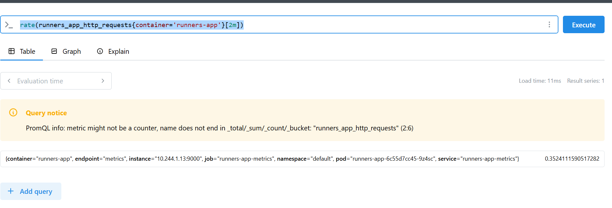
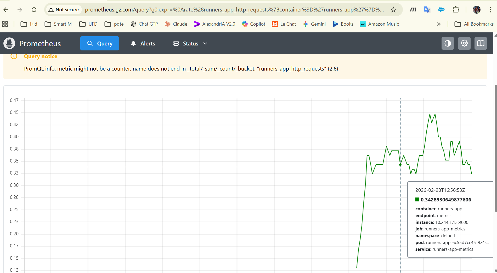
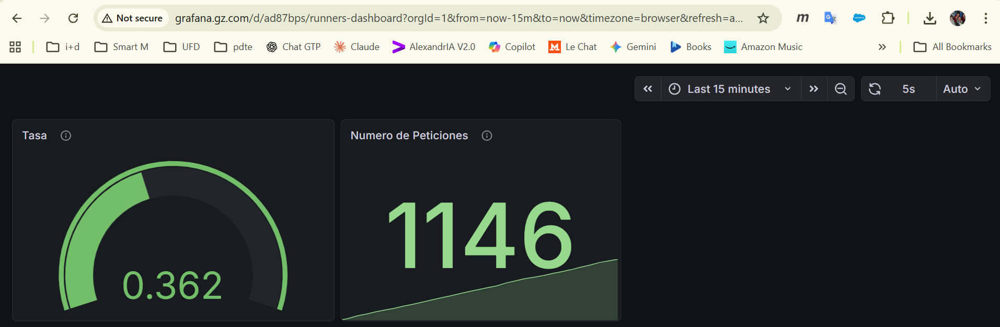

Usamos un chart de Helm para instalar Prometheus y Grafana en el cluster: [prometheus-community/kube-prometheus-stack](https://github.com/prometheus-operator/kube-prometheus). Este char instala diferentes componentes: Prometheus y Alert Manager, Grafana, Metrics.

La gestion de Prometheus se hace con un [operador](https://prometheus-operator.dev/).

Al [instalar](./instala-promethus.ps1) se crean los siguientes objetos kubernetes en el namespace `monitoring`:

- `Daemon Sets`. Se crea un damenonset que tiene como misión crear un Pod que capture las métricas de cada nodo del cluster
- `Stateful Sets`. Con el stateful set se crean los pods de la aplicaión _Prometheus_: Alert Manager y el colector de métricas 
- `Deployments`. Se crean tres deployments que a su vez crean cada uno una `Replica Sets`
    - Operador de prometheus, el que gestiona el CRD
    - Metricas. Gestiona las métricas recibidas
    - Grafana. Implementa el dashboard de Grafana

## Prometheus

La información de metricas capturada por Prometheus se guarda en cada instancia de Prometheus en una base de datos de series temporales. Podemos controlar la forma en que se gestiona el almacenamiento indicando una cantidad máxima a retener (`retentionSize` superada este umbral se borran datos) y una antiguedad máxima (`retention` superado este umbral se borran datos).

```yaml
prometheus:
  prometheusSpec:
    retention: 7d          # guarda solo 7 días de datos. Esto es suficiente para la mayoría de los casos, pero puedes ajustarlo según tus necesidades. Ten en cuenta que cuanto más tiempo guardes los datos, más espacio en disco necesitarás.
    retentionSize: "200MB" # no ocupa más de esto en disco. Si supera este tamaño se empiezan a borrar datos antiguos, aunque no hayan pasado los 7 días
    replicas: 1 #numero de pods de prometheus, con 1 es suficiente para este ejemplo, pero en producción podrías querer más para alta disponibilidad
    podAntiAffinity: "hard" #evita que los pods de prometheus se programen en el mismo nodo, para mejorar la disponibilidad
    serviceMonitorSelector:
      matchLabels:
        release: kube-prom-stack
    serviceMonitorNamespaceSelector: {}
    storageSpec:
      volumeClaimTemplate:
        spec:
          accessModes: ["ReadWriteOnce"]
          resources:
            requests:
              storage: 250Mi
          storageClassName: "local-path" #usamos un PVC usando esta clase, la misma que he usado con Postgres, pero con un tamaño menor
```

Si tenemos varias instancias de Prometheus, habitualmente lo que se hace es que cada instancia de Prometheus scrapeando exactamente los mismos targets. Los datos están duplicados a propósito. Si una instancia cae, la otra sigue funcionando y Grafana puede apuntar a cualquiera de las dos.
El problema es que cada instancia tiene su propia visión del tiempo y pequeñas diferencias en los timestamps, lo que puede causar inconsistencias en las queries. Para resolver esto existe `Thanos` o `Cortex`, que añaden una capa por encima que deduplica y unifica los datos de ambas instancias de forma transparente.

Otra opción es usar la Federación (cada uno scrapeea cosas distintas). Cada Prometheus es responsable de un ámbito diferente:

- Un Prometheus por cluster de Kubernetes
- Un Prometheus para infraestructura y otro para aplicaciones
- Un Prometheus por región geográfica

En este caso los datos no están duplicados, cada instancia tiene métricas distintas. Luego existe un Prometheus global que hace federation, es decir, scrapeea a los Prometheus locales y agrega solo las métricas más importantes para tener una vista global.

## Grafana

Por defecto Grfana guarda la información en un `sqllite`:
- dashaboards
- Usuarios, roles y permisos
- Datasources configurados desde la UI
- Alertas y sus estados
- Plugins instalados
- Tokens de sesión y API keys

```yaml
grafana:
  enabled: true
  #adminUser: admin
  #adminPassword: "prueba"
  admin: # tomamos las credenciales del usuario administrador de grafana desde un secret, para no tenerlas hardcodeadas en el values.yaml
    existingSecret: grafana-admin
    userKey: usuario-admin       
    passwordKey: contrasena-admin
  persistence:
    enabled: true
    storageClassName: "local-path" #usamos un PVC usando esta clase, la misma que he usado con Postgres, pero con un tamaño menor
    accessModes: ["ReadWriteOnce"]
    size: 250Mi
```

```sql
CREATE USER grafana WITH PASSWORD 'grafana_password';
CREATE DATABASE grafana OWNER grafana;
```

y luego:

```yaml
grafana:
  enabled: true
  admin:
    existingSecret: grafana-admin
    userKey: admin-user
    passwordKey: admin-password
  # Ya no necesitas persistencia local si usas Postgres
  persistence:
    enabled: false

  grafana.ini:
    database:
      type: postgres
      host: postgres-service:5432   # nombre del servicio de postgres en k8s
      name: grafana
      user: grafana
      password: grafana_password    # mejor usar un secret, ver abajo
      ssl_mode: disable
```

en `prometheus.gz.com` podemos ver la consola de Prometheus donde podemos lanzar queries contra las metrícas. Por ejemplo, aquí lanzamos `rate(runners_app_http_requests{container='runners-app'}[2m])`, esto es, vamos a evaluar la métrica `runners_app_http_requests` filtrando los valores con la etiqueta `container='runners-app'`, y evaluando los datos en una ventana de `2m`. Usamos la función rate para obtener el total





podemos crear dashboards en `grafana.gz.com`:



También podemos crear alertas en `alertas.gz.comp`. 

