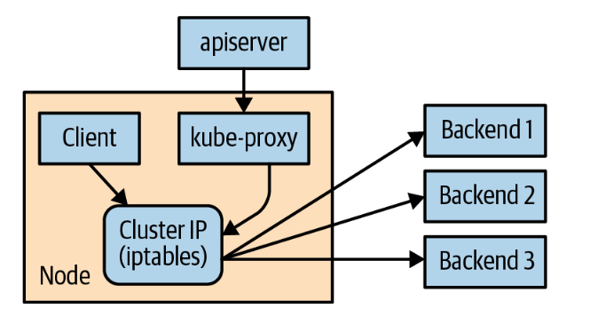
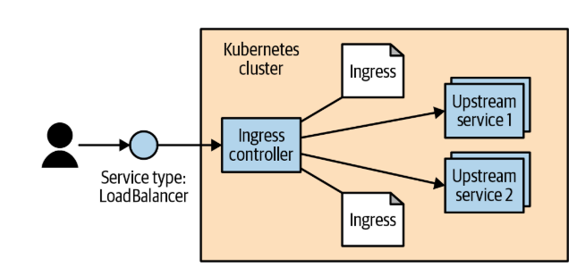

## Instalación

En primer lugar comprobamos que el cluster este ok:

```ps
kubectl cluster-info
```

### Contour/Envoy

```ps
kubectl apply -f https://projectcontour.io/quickstart/contour.yaml
```

### Metrics Server

Descargamos los componentes del metrics server:

```ps
kubectl apply -f https://github.com/kubernetes-sigs/metrics-server/releases/latest/download/components.yaml
```

Kind utiliza certificados autofirmados así que es necesario configurar el metrics server. Podemos hacerlo manualmente o con un comando. Manualmente sería así. Editamos la configuración del deployment:

```ps
kubectl edit deployment metrics-server -n kube-system
```

En el editor que se abre, busca la sección `spec.template.spec.containers[0].args` (bajo el contenedor metrics-server) hay que agregar el siguiente argumento `--kubelet-insecure-tls`. La configuración quedaría así:

```ps
spec:
  containers:
  - args:
    - --cert-dir=/tmp
    - --secure-port=10250
    - --kubelet-preferred-address-types=InternalIP,ExternalIP,Hostname
    - --kubelet-use-node-status-port
    - --metric-resolution=15s
    - --kubelet-insecure-tls
```

esto mismo lo podemos hacer con esta instrucción

```ps
kubectl patch deployment metrics-server -n kube-system --type='json' -p='[{"op": "add", "path": "/spec/template/spec/containers/0/args/-", "value": "--kubelet-insecure-tls"}]'
```

con esto quedaría configurado em servidor de métricas. Podemos confirmar que el pod esta operativo:

```ps
kubectl get pods -n kube-system | findstr metrics-server

metrics-server-5f54fb74d9-z7tl5                 1/1     Running   2 (16m ago)   14h
```

Ahora ya podemos ver el consumo de recursos de los pods, por ejemplo:

```ps
kubectl top nodes

NAME                    CPU(cores)   CPU(%)   MEMORY(bytes)   MEMORY(%)
desktop-control-plane   157m         1%       588Mi           7%
desktop-worker          28m          0%       264Mi           3%
```

nos muestra el consumo de cpu, y de memoria.

### K6

K6 es una herramienta open source de Grafana que nos permite ejecutar pruebas de rendimiento. K6 puede ejecutarse en la nube de Grafana (coste), en local, o de forma distribuida en un cluster kubernetes. Para ejecutar en un clister kubernetes necesitamos instalar el operador:

```ps
curl.exe https://raw.githubusercontent.com/grafana/k6-operator/main/bundle.yaml | kubectl apply -f -
```

para desinstalar:

```ps
curl https://raw.githubusercontent.com/grafana/k6-operator/main/bundle.yaml | kubectl delete -f -
```

## dockerfile

Antes de comentar el dockerfile, refrescar algunos comandos de go que pueden ser interesantes:

```ps
go install 
```

compila el programa y lo _instala_ en carpeta donde se guardan los ejecutables de go (`go build` tambien hace la compilación, pero el ejecutable se guarda en el propio directorio desde el que se ejecuta el _build_). La carpeta en la que se guarda el binario se determina con la variable de entorno `GOBIN`. Si esta variable no existiera, entonces el ejecutable se guarda en `$GOPATH/bin`, y sino tuvieramos variable _GOPATH_ se guardará en `$HOME/go/bin`.

Con `go vet` comprobamos si hay algun problema, o algun paquete deprecado. Con `go tidy` lo que se hace es revisar todos los paquetes que se usan y asegurar que esten presentes en `go.mod` y al tiempo se eliminan aquellas referencias que no se usen. Típicamente ejecutamos `go tidy` cuando actualizamos los paquetes que usamos.

Para construir la utilidad `kuard` usaremos un dockerfile multistage. Comentar algunas cosillas:

- Usamos como imagen base Alpine, que es una imagen mínima que ya contiene _golang_. Esta ditribucuión no incluye _apt_, es necesario usar _apk_. Con _apk_ tenemos acceso a menos paquetes de terceros, lo que puede ser una limitación para usar _alpine_. Esta primera imagen la usamos para construir la aplicación (nótese el `AS build`)

```dockerfile
FROM golang:alpine AS build
```

- Al hacer `RUN en una sola linea, creamos una sola capa en la imagen, en lugar de crear dos. En este script se realiza la compilación e instalación de _kuard_

```dockerfile
RUN dos2unix build/build.sh && \
    VERBOSE=0 PKG=kuard ARCH=amd64 VERSION=test bash build/build.sh
```

- Se copia el resultado de la compilación a partir de la imagen `build`. Nos aseguramos que el ejecutable no tenga permisos con el `chown`

```dockerfile
COPY --from=build --chown=nobody:nobody /go/bin/kuard /kuard
```

- se instala el paquete  `ca-certificates` npm (e indirectamente nodejs para instalar npm), pero lo hacemos ya en la imagen final

```dockerfile
RUN apk add --no-cache ca-certificates
```

- Ejecutamos con un usuario sin privilegios

```dockerfile
USER nobody:nobody
```

- Cuando la imagen se ejecuta en docker podemos crear un health check que es _análogo_ a los probes que podemos definir en un Pod de Kubernetes:

```dockerfile
HEALTHCHECK --interval=30s --timeout=3s --start-period=5s --retries=3 \
    CMD ["/kuard", "-v"] || exit 1
```

### Construcción

Construimos la imagen:

```ps
docker build -t kuard .
```

podemos ver las imagenes:

```ps
docker images
```

vamos a taggearla y a publicarla en Docker Hub:

```ps
docker login

docker tag kuard:latest egsmartin/kuarg:latest

docker push egsmartin/kuarg:latest
```

podemos ejecutar en docker:

```ps
docker run --rm -p 8080:8080 egsmartin/kuard:latest
```

```ps
docker run -d --name kuard \
  --publish 8080:8080 \
  --memory 200m \
  --memory-swap 1G \
  --cpu-shares 1024 \
  egsmartin/kuard:latest
```

finalmente liberamos recursos que ya no necesitamos:

```ps
docker system prune
```

## kubectl

```ps
kubectl version
```

### Estado del cluster

- Estado del control plane (API server, scheduler, controller-manager). Esto te da un diagnóstico real del API server y sus dependencias:

```ps
kubectl get --raw='/readyz?verbose'
```

- Estado de los nodos

```ps
kubectl get nodes
```

podemos a continuación ver la información detallada de un nodo:

```ps
kubectl describe node desktop-control-plane
```
Veremos: nombre, `Labels`, `Annotations`, `Taints`, `unschedulable` (true|false), `Conditions` (lista de mensajes con estados del nodo y su timestamp), IP, `Capacity` (cpu, almacenamiento, memoria, número de pods), `Allocatable` (que recursos estan libres para ser usados), `System Info` (información del sistema), `Memory Limits` de los pods asignados al nodo, `Allocated resources` (muestra los recursos asignados como `requests` y como `limits`; Es un agregado de los valores de los pods asignados al nodo), `Events`

- Estados de los pods del plano de control:

```ps
kubectl get pods -n kube-system

NAME                                            READY   STATUS    RESTARTS   AGE
coredns-7d764666f9-bqjm6                        1/1     Running   0          16m
coredns-7d764666f9-rjbtx                        1/1     Running   0          16m
etcd-desktop-control-plane                      1/1     Running   0          16m
kindnet-rft97                                   1/1     Running   0          16m
kindnet-ttnnw                                   1/1     Running   0          16m
kube-apiserver-desktop-control-plane            1/1     Running   0          16m
kube-controller-manager-desktop-control-plane   1/1     Running   0          16m
kube-proxy-4k9tv                                1/1     Running   0          16m
kube-proxy-qmxvq                                1/1     Running   0          16m
kube-scheduler-desktop-control-plane            1/1     Running   0          16m
```

podemos ver los siguientes elementos:
    - `dns`. En cada nodo corre un pod que proporciona los servcios DNS del cluster
    - `proxy`. En cada nodo corre un pod que proporciona un proxy que intercepta todas las comunicaciones del pod. Por ejemplo cuando accedemos a un servicio el proxy contiene información del los _endpoints_ de ese servicio y distribuye las llamadas hacia ellos
    - `apiserver`. Expones las apis de kubernetes
    - `etcd`. Capa en la que se almacena el estado
    - `controller`. Controlador de kubernetes que identifica los recursos que deben crearse
    - `scheduler`. Se encarga de identificar y solicitad de gestionar los recursos en los nodos del cluster

```ps
kubectl exec -n kube-system etcd-desktop-control-plane -- etcdctl endpoint health
```

Muchos de estos comandos admiten el flag `--watch` para monitorizar de forma continua cambios de valor/estado.

### Namespaces

Con kubectl hacemos referencia a un namespace con el tag `--namespace` o el abreviado `-n`.

Podemos fijar el namespace por defecto usando un contexto. Creamos un contexto:

```ps
kubectl config set-context my-context --namespace=mystuff
```

y lo usamos:

```ps
kubectl config use-context my-context
```

### Gestion de recursos

Podemos obtner información de los recursos creados. Por ejemplo para recuperar los pods y servicios:

```ps
kubectl get pods,services
```

podemos ver que opciones nos da la api de kubernetes con cada recurso. Por ejemplo, los atributos disponibles en los pods:

```ps
kubectl explain pods
```

por defecto se muestra el primer nivel de propiedades. Si queremos recuperar todas las propiedades:

```ps
kubectl explain pod --recursive=true
```

creamos y borramos recursos:

```ps
kubectl apply -f kuard-pod-full.yaml

kubectl delete -f kuard-pod-full.yaml
```

podemos también referirnos a los objetos por su nombre:

```ps
kubectl delete <resource-name> <obj-name>
```

podemos etiquetar los objetos:

```ps
kubectl label pods bar color=red
```

si queremos quitar la etiqueta usamos el `-`. Por ejemplo para eliminar la etiqueta `color` del pod `bar` haríamos:

```ps
kubectl label pods bar color-
```

### Depurar contenedores

Para ver los logs de un pod, por ejemplo del pod `kuard`:

```ps
kubectl logs kuard
```

podemos ver todos los eventos con:

```ps
kubectl describe pod kuard
``` 

nos podemos conectar en el contenedor ejecutando bash (siempre y cuando este presente en la imagen, que NO es el caso de _alpine_):

```ps
kubectl exec -it kuard -- bash
```

en el caso de _alpine_ tenemos el shell `ash`:

```ps
kubectl exec -it kuard -- ash
```

podemos ejecutar cualquier comando, no solo el shell:

```ps
kubectl exec -it kuard -- date
```

Si no tenemos bash disponible en la imagen nos podemos _enganchar_ a ella, y veremos la salida por consola - que veríamos si estuvieramos corriendo el programa en forma local:

```ps
kubectl attach -it kuard
```

podemos copiar archivos - subirlos - a un pod:

```ps
kubectl cp <pod-name>:</path/to/remote/file> </path/to/local/file>
```

Otra opción __muy interesante es el port forwarding__. Por ejemplo para que nuestro _localhost:9000_ se mapee con el puerto 8080 del pod:

```ps
kubectl port-forward kuard 9000:8080
```

**NOTA**: tambien podemos hacer un port forward a un servicio. Si hubieramos hecho `kubectl expose kuard`, podríamos hacer un port-forward al servicio con `kubectl port-forward svc\kuard 9000:8080`

Cuando tenemos Pods creados con deployments el nombre del pod se asigna automáticamente con un guid, pero podemos gestionar esto de forma automática, por ejemplo como sigue:

```ps
$MIPOD=kubectl get pods -l app=alpaca-prod -o jsonpath='{.items[0].metadata.name}'
kubectl port-forward $MIPOD 9000:8080
```

podemos ver los eventos del cluster:

```ps
kubectl get events
```

si queremos ver que recursos consumen más recursos (siempre y cuando el cluster tenga habilitadas las métricas):

```ps
kubectl top nodes

kubectl top pods
```

### Gestión del Cluster

Si queremos que el scheduler deje de programar recursos en un determinado nodo:

```ps
kubectl cordon desktop-worker
```

Para extraer los recursos que ya están corriendo en un nodo:

```ps
kubectl drain desktop-worker
```

para volver a permitir que un nodo que fue acordonado vuelva a recibir encargos por parte del scheduler:

```ps
kubectl uncordon desktop-worker
```

## Pods

Vamos a describir las características principales de un Pod. Vamos a tratar el pod kuard. Lo creamos:

```ps
kubectl apply -f .\kuard-pod-full.yaml
```

podemos ver información de detalle

```ps
kubectl describe pods kuard
```

podemos hacer port forwarding al contenedor:

```ps
kubectl port-forward kuard 8080:8080
```

```yaml
apiVersion: v1
kind: Pod
metadata:
  name: kuard
spec:
  volumes: # podemos definir volumenes que estarán disponibles para todos los contenedores del pod
    - name: "kuard-data" # nombre del volumen
      emptyDir: {} # en este caso vamos  crear un volumen temporal en memoria. Podriamos haber creato un ntfs, hostPath, persistentVolumeClaim, etc.
  containers:
    - image: docker.io/egsmartin/kuard:latest # tomamos una imagen en este caso de docker hub
      imagePullPolicy: IfNotPresent # política de pull de la imagen
      name: kuard
      ports:
        - containerPort: 8080 # puerto que expone el contenedor. Lo llamamos http
          name: http
          protocol: TCP
      resources:
        requests: # recursos que solicita el contenedor. El scheduler usará esta información para asignar el pod a un nodo que tenga estos recursos disponibles. El pod podria usar más cantidad de recursos si estuvieran disponibles en el nodo, pero nunca menos de lo solicitado, ni más de lo permitido por los límites
          cpu: "500m" # 0.5 cores
          memory: "128Mi" # 128 megabytes (las i significa que utilizamos potencias de 2, es decir 1Mi = 1024 * 1024 bytes)
        limits: # recursos máximos que puede usar el contenedor. Si llegara a superar este límite, el contenedor sería terminado
          cpu: "1000m"
          memory: "256Mi"
      volumeMounts: # vamos a montar en esta imagen uno de los volumnes que hemos definido en el pod, el que tiene nombre kuard-data. Lo montamos en la ruta /data del contenedor
        - mountPath: "/data"
          name: "kuard-data"
      livenessProbe: # esta probe se usa para comprobar si el contenedor está vivo. Si falla, el contenedor se reiniciará. Se hace una llamada a la ruta /healthy del contenedor en el puerto 8080, cada 10 segundos, con un timeout de 1 segundo. Si falla 3 veces consecutivas, se considera que el contenedor no está vivo y se reinicia. La primera comprobación se hace 5 segundos después de iniciar el contenedor
        httpGet:
          path: /healthy
          port: 8080
        initialDelaySeconds: 5
        timeoutSeconds: 1
        periodSeconds: 10
        failureThreshold: 3
      readinessProbe: # esta probe se usa para comprobar si el contenedor está listo para recibir tráfico. Si falla, el contenedor no recibirá tráfico (pero no se reinicia). Se hace una llamada a la ruta /ready del contenedor en el puerto 8080, cada 10 segundos, con un timeout de 1 segundo. Si falla 3 veces consecutivas, se considera que el contenedor no está listo y no recibirá tráfico. La primera comprobación se hace 30 segundos después de iniciar el contenedor
        httpGet:
          path: /ready
          port: 8080
        initialDelaySeconds: 30
        timeoutSeconds: 1
        periodSeconds: 10
        failureThreshold: 3
```

## Etiquetas

Las etiquetas son una forma de metadata que puede asociarse a diferentes objetos y que puede utilizarse para seleccionar objetos. Las etiquetas son un par key valor. La key debe ser un valor _valido DNS_. Podemos ver varios ejemplos de etiquetas:

|Key|Value|
|-----|-----|
|acme.com/app-version|1.0.0|
|appVersion|1.0.0|
|app.version|1.0.0|
|kubernetes.io/cluster-service|true|

Al recuperar los objetos podemos incluir etiquetas en la salida (`-L` es un shortcut de `--show-labels`):

```ps
kubectl get deployments -L canary
```

para actualizar el valor de una etiqueta usamos el comando `label`:

```ps
kubectl label deployments alpaca-test "canary=true"
```

para eliminar una etiqueta ponemos el sufijo `-` en el nombre de la etiqueta:

```ps
kubectl label deployments alpaca-test canary-
```

Podemos usar las etiquetas para _interrogar_ a Kubernetes a la hora de recuperar objetos. Por ejemplo aquí vamos a obtener deployments con la etiqueta _canary_

```ps
kubectl get pods --selector="ver=2"
```

si indicamos dos selectores separados por una coma se interpreta como un AND:

```ps
kubectl get pods --selector="ver=2,app=bandicoot"
```

podemos usar varios operadores:

|Operator|Description|
|--------|--------|
|key=value|key is set to value|
|key!=value|key is not set to value|
|key in (value1, value2)|key is one of value1 or value2|
|key notin (value1, value2)|key is not one of value1 or value2|
|key|key is set|
|!key|key is not set|

## Anotaciones

Son tambien metadata pero una metadata que no se utiliza para clasificar sino para registrar información con el contenedor que no tiene cabida en la api estandar de Kubernetes.

## Service Discovery

Con Service Discovery se resuelve la direccion de cada proceso. Típicamente se usa DNS para resolver este problema, pero en casos en los que un proceso cambia o puede cambiar de dirección con cierta frecuencia, el DNS no es un mecanismos adecuado, incluso cuando bajamos el _TTL_ para asegurar que los clientes _repitan_ la resolución de direcciones con cierta frecuencia. En un entorno como Kubernetes la frecuencia con la que la direccion de los procesos cambia (porque se destruye el proceso, se reubica, o se incrementa el número de instancias del servicio).

Para exponer un servicio se usa `kubectl expose`. Para entenderlo mejor vamos a crear un _deployment_

```ps
kubectl create deployment alpaca-prod --image=docker.io/egsmartin/kuard:latest --port=8080
```

aumentamos el número de replicas:

```ps
kubectl scale deployment alpaca-prod --replicas 3
```

exponemos el deployment como un servicio:

```ps
kubectl expose deployment alpaca-prod
```

Con este comando __Kubernetes intentará crear un Service, pero como no has especificado los puertos, fallará o usará valores por defecto (usara el mismo puero que hayamos elegido exponer en el pod o en el deployment)__ que probablemente no funcionen como esperamos. Al menos debemos indicar:

- __port__: el puerto por el que se accederá al servicio.
- __target-port__: el puerto interno del contenedor al que se redirige el tráfico (si es diferente).
- __type__: opcional, para definir si el servicio es `ClusterIP`, `NodePort`, `LoadBalancer`, etc.

__Si queremos exponer más de un puerto, con expose no se puede hacer, se necesitaria usar el objeto `Service` directamente__. Si exponemos directamente el servicio con `Service` directamente, en la especificacion __podemos incluir varias tuplas port `targetPort` name__, En caso de que el tipo de servicio fuerta `NodePort` se crearán automáticamente tantos puertos en los nodos como tuplas tengamos.

Recordar que cuando llamamos al servicio con el LoadBalancer los puertos que usaremos seran los mismos que si llamasemos al servicio usando la IP que le asigno Kubernetes para el cluster.

Creamos otro deployment, aumentamos las replicas y exponemos el servicio:

```ps
kubectl create deployment bandicoot-prod --image=docker.io/egsmartin/kuard:latest --port=8080

kubectl scale deployment bandicoot-prod --replicas 2

kubectl expose deployment bandicoot-prod
```

podemos ver los servicios que acabamos de crear:

```ps
kubectl get services -o wide

NAME             TYPE        CLUSTER-IP      EXTERNAL-IP   PORT(S)    AGE   SELECTOR
alpaca-prod      ClusterIP   10.96.107.253   <none>        8080/TCP   19m   app=alpaca-prod
bandicoot-prod   ClusterIP   10.96.37.174    <none>        8080/TCP   18m   app=bandicoot-prod
kubernetes       ClusterIP   10.96.0.1       <none>        443/TCP    63m   <none>
```

Kubernetes asigna a cada servicio una `Cluster IP`, que es una direccion virtual que representa el servicio. Si hay varias réplicas en el deployment al que apunta el servicio, cuando llamemos al servicio la petición puede dirigirse a cualquiera de esas réplicas. Tenemos tres tipos de servicio:

- `ClusterIP` (defecto)
- `NodePort`
- `LoadBalancer`

NodePort y LoadBalancer incluyen la funcionalidad de ClusterIP. Cuando defines un Service como LoadBalancer, Kubernetes:

- Crea un ClusterIP para comunicación interna.
- Crea un NodePort automáticamente (aunque no lo veas explícitamente).
- Solicita al proveedor cloud que cree un balanceador de carga externo que apunte al NodePort.

Cuando usas un Service de tipo LoadBalancer en Kubernetes, se crea un artefacto externo al clúster, que es un balanceador de carga proporcionado por el proveedor de infraestructura (como AWS ELB, Azure Load Balancer, GCP Load Balancer, etc.). 

Kubernetes crea un Service de tipo LoadBalancer, el proveedor cloud detecta esta solicitud y crea un balanceador de carga externo. Ese balanceador tiene como backends:

- Las IP de los nodos del clúster.
- Los puertos NodePort que Kubernetes asigna automáticamente.

El tráfico que llega al balanceador se enruta a los nodos, y de ahí al Service, que lo redirige a los Pods correspondientes.

### DNS

Kubernetes proporciona un servicio de DNS en cada nodo del cluster. Cuando creamos un servicio automáticamente se crea un _A record_ en el DNS:

`alpaca-prod.default.svc.cluster.local.`

tenemos el nombre del servicio, seguido del namespace, la etiqueta `svc`, y el dominio del cluster. Podemos referirnos desde cualquier pod a este servicio y el DNS resolverá este nombre a la `Cluster IP`. Si estamos en el mismo namespace que el servicio podremos referirnos al servicio simplemente como `alpaca-prod`.

En la aplicación `kuard` tenemos una opción para poder consultar el DNS.

El `Service` reconoce el readiness probe y de modo que solo se enviará tráfico a un determinado Pod cuando es listo. Podemos ver los endpoints de un servicio:

```ps
kubectl get endpoints alpaca-prod --watch

NAME          ENDPOINTS                                         AGE
alpaca-prod   10.244.1.3:8080,10.244.1.5:8080,10.244.1.6:8080   27m
```

las IPs que se muestran son las IPs de los Pods. Figuran tres porque el servicio está apuntando a un deployment que tiene tres IPs. Si hacemos con kuard que un pod falle su readiness probe, será sustituido por otro, que tendrá una IP diferente.

Nótese que asociado a cada servicio se crea un objeto `Endpoint` que dinámicamente se ajusta a las direcciones de los Pods que están detrás del servicio.

### Service discovery manual

Lo que viene a hacer Kubernetes para hacer el discovery es lo siguiente. En primer lugar identifica cuales son los Pods que se corresponden con un servicio/deployment, utilizando la etiqueta `app` (los pods que se crean con un deployment se etiquetan añadiendo con la key `app` y el valor con el nombre del deployment). Las IPs de los Pod serán las IPs de los endpoints del servicio:

```ps
kubectl get pods -o wide --show-labels

kubectl get pods -o wide --selector=app=alpaca-prod
```

### Kube-proxy y Cluster IPs

Las IP Virtuales funcionan porque en cada nodo tenemos un proxy - `kube-proxy` - que intercepta todas las peticiones y las resuelve, en el caso de una IP Virtual, a uno de los endpoints asociados al servicio.



El kube-proxy monitoriza el API server para detectar cuando se están creando nuevos servicios. Cuando se crea un nuevo servicio el Kube-proxy actualiza las reglas definidas en las `iptables` que gestiona el `kernel` de cada nodo, de modo que se re-escriban los destinos de los paquetes generados en el nodo y se redirijan a los endpoints del servicio. Cuando los endpoints de un servicio cambian (Pods que se añaden, Pods que se retiran, por ejemplo, por no superar el readiness check), las reglas en las iptables se actualizan. La cluster IP como que asigna el API server cuando se crea el servicio no cambia (habría que borrar y recrear el servicio).

El rango de IPs que se asignan a los servicios se configuran con el parámetro `--service-cluster-ip-range` en el binario del `kube-apiserver`. Este rango de IP no se tiene que solapar con las subredes y rangos asignados a los Pods/Nodos.

### Variables de Entorno

Además de actualizar el DNS y el Kube-proxy, despues que se crea un servicio, cuando se cree un Pod Kubernetes definirá una serie de variables de entorno para cada servicio creado (los Pods que ya estaban creado no tendrán estas variables de entorno). Por ejemplo para el servicio `alpaca-prod` que hemos creado, si lanzamos un Pod veremos en él las siguientes variables de entorno:

```ps
ALPACA_PROD_SERVICE_HOST	10.96.107.253
ALPACA_PROD_SERVICE_PORT	8080
ALPACA_PROD_PORT_8080_TCP_PROTO	tcp
ALPACA_PROD_PORT_8080_TCP_ADDR	10.96.107.253
ALPACA_PROD_PORT_8080_TCP_PORT	8080
ALPACA_PROD_PORT	tcp://10.96.107.253:8080
ALPACA_PROD_PORT_8080_TCP	tcp://10.96.107.253:8080
```

### Limpiamos

```ps
kubectl delete services,deployments -l app
```

## Ingress

El controlador de Ingress esta compuesto por dos partes. 

- __Proxy de Ingress__: se expone fuera del clúster utilizando un servicio de tipo: LoadBalancer. Este proxy envía solicitudes a servidores "upstream"

- __Reconciliador de Ingress u operador__. El operador de Ingress es responsable de leer y monitorizar objetos de Ingress en la API de Kubernetes y reconfigurar el proxy de Ingress para enrutar el tráfico como se especifica en el recurso de Ingress



No existe un controlador de Ingress "estándar" integrado en Kubernetes, por lo que el usuario debe instalar uno de entre las muchas implementaciones disponibles. Vamos a utilizar __Contour__.

Para instalarlo:

```ps
kubectl apply -f https://projectcontour.io/quickstart/contour.yaml
```

comprobamos 

```ps
kubectl get svc envoy -n projectcontour -o wide
```

Los recursos se crean en el namespace `projectcontour`. Podemos ver un deployment (con dos replicas) y un servicio de tipo `LoadBalancer`

```ps
kubectl get svc,deployments,pods -n projectcontour

NAME              TYPE           CLUSTER-IP      EXTERNAL-IP   PORT(S)                      AGE
service/contour   ClusterIP      10.96.222.28    <none>        8001/TCP                     3m41s
service/envoy     LoadBalancer   10.96.177.192   172.18.0.6    80:30796/TCP,443:32096/TCP   3m41s

NAME                      READY   UP-TO-DATE   AVAILABLE   AGE
deployment.apps/contour   2/2     2            2           3m41s

NAME                                READY   STATUS      RESTARTS   AGE
pod/contour-5cb8d455bc-pnrt5        1/1     Running     0          3m41s
pod/contour-5cb8d455bc-v5f9g        1/1     Running     0          3m41s
pod/contour-certgen-v1-33-1-dgqkw   0/1     Completed   0          3m41s
pod/envoy-2fj22                     2/2     Running     0          3m41s
```

Se crea tambien una `CustomResourceDefinition`. 

Al tratarse de una instalación global en el cluster, para poder crear este recurso tenemos que tener permisos de administrador para el cluster.

Para que Ingress funcione correctamente es necesario actualizar el DNS incluyendo la dirección externa del balanceador de carga. Si por ejemplo nuestro dominio fuera `example.com`. Tendremos que configurar dos entradas en el DNS: alpaca.example.com y bandicoot.example.com. 

Si tienes una dirección IP para tu balanceador de carga externo, querrás crear registros A (esto es, asignar la `EXTERNAL-IP` el dominio del balanceador - A record -, y crear alias que apunten al balanceador - CNAME records). Con esto las peticiones al balanceador, o a los alias se enrutaran hacia ingress (en local podemos actualizar el archivo _hosts_).

```ps
kubectl apply -f ejemplos.yaml

kubectl get deployment -o wide

kubectl get services -o wide
```

### Ingress

Al hacer `ejemplos.yaml` hemos creado tambien un objeto Ingress:

```ps
kubectl get ingress -o wide
```

la definición de Ingress es la siguiente:

```yaml
apiVersion: networking.k8s.io/v1
kind: Ingress
metadata:
  name: simple-ingress
  annotations:
    kubernetes.io/ingress.class: contour
spec:

[...]
```

que define varias reglas. Cada regla se activa cuando la petición se recibe de un determinado `host`. En la regla especificamos diferentes backends en función del `path` utilizado. Para indicar el backend se informa el nombre del servicio y el puerto que hay que utilizar. Por ejemplo para `gz.com` definimos tres rutas:

```yaml
  ingressClassName: contour
  rules:
    - host: gz.com
      http:
        paths:
          - path: /
            pathType: Prefix
            backend:
              service:
                name: mult3
                port:
                  number: 80
          - path: /multiplica
            pathType: Prefix
            backend:
              service:
                name: mult2
                port:
                  number: 80 # puerto donde se expone el servicio
          - path: /primos
            pathType: Prefix
            backend:
              service:
                name: primos
                port:
                  number: 80 # puerto donde se expone el servicio

[...]
```

### HTTPProxy

El objeto Ingress se incorporo en Kubernetes en la versión 1.1 para describir un reverse proxy de forma global dentro de un cluster. Desde entoces el objeto Ingress no ha evolucionado lo que ha hecho que profileferen anotaciones por medio de las cueles extender la funcionalidad de enrutado de Ingress (que es muy limitada). Con el objeto **HTTPProxy** Contour proporciona una *Custom Resource Definition (CRD)* que .

Hemos creado en `ejemplos.yaml` tambien algún ejemplo de HTTProxy. A continuación describimos las funcionalidades principales del HTTProxy.

A diferencia de Ingress, **HTTPProxy solo permite un root domain por objeto** - HTTPProxy. En Ingress podíamos hacer:

```yaml
apiVersion: extensions/v1beta1
kind: Ingress
metadata:
  name: name-example
spec:
  rules:
  - host: foo1.bar.com
    http:
      paths:
      - backend:
          serviceName: s1
          servicePort: 80
  - host: bar1.bar.com
    http:
      paths:
      - backend:
          serviceName: s2
          servicePort: 80
```

con HTTProxy hay que partirlo en dos:

```yaml
apiVersion: projectcontour.io/v1
kind: HTTPProxy
metadata:
  name: name-example-foo
  namespace: default
spec:
  virtualhost:
    fqdn: foo1.bar.com
  routes:
    - services:
      - name: s1
        port: 80
---
apiVersion: projectcontour.io/v1
kind: HTTPProxy
metadata:
  name: name-example-bar
  namespace: default
spec:
  virtualhost:
    fqdn: bar1.bar.com
  routes:
    - services:
        - name: s2
          port: 80
```

**Cada ruta en el HTTPProxy puede tener una o varias condiciones**. Las condiciones se combinan con `AND`. Las condiciones pueden ser un `prefix` o una `header`. Cuando se utilizan condiciones `prefix` tienen que empezar con `\`. Las condiciones `header` incluyen un nombre y un operador. Los operadores pueden ser `present`, `contains`, `notcontains`, `exact` o `notexact`. Por ejemplo, aqui definimos para el dominio tres posibles rutas a backends. Dos están condicionadas a la presencia de un header, la tercera actua por defecto (la rutas se procesan en orden de arriba a abajo, y cuando una cualifica se sale por esa ruta):

```yaml
apiVersion: projectcontour.io/v1
kind: HTTPProxy
metadata:
  name: multiple-paths
  namespace: default
spec:
  virtualhost:
    fqdn: multi-path.bar.com
  routes:
    - conditions:
      - header:
          name: x-os
          contains: ios
      services:
        - name: s1
          port: 80
    - conditions:
      - header:
          name: x-os
          contains: android
      services:
        - name: s2
          port: 80
    - services:
        - name: s3
          port: 80
```

**en una ruta podemos tener uno o varios servicios**:

```yaml
apiVersion: projectcontour.io/v1
kind: HTTPProxy
metadata:
  name: multiple-upstreams
  namespace: default
spec:
  virtualhost:
    fqdn: multi.bar.com
  routes:
    - services:
        - name: s1
          port: 80
        - name: s2
          port: 80
```

en este ejemplo cuando llamemos a `multi.bar.com` HTTProxy hará balanceo de carga distribuyendo las peticiones entre los dos servicios asociados a la ruta, s1 y s2. Podemos **aplicar un peso a cada servicio**:

```yaml
apiVersion: projectcontour.io/v1
kind: HTTPProxy
metadata:
  name: weight-shifting
  namespace: default
spec:
  virtualhost:
    fqdn: weights.bar.com
  routes:
    - services:
        - name: s1
          port: 80
          weight: 10
        - name: s2
          port: 80
          weight: 90
```

los pesos no tienen porque sumar 100, se tratan de forma relativa. Si unas rutas tienen peso y otras no, las rutas sin peso se asume que tienen un peso 0. Si ninguna ruta tiene pesos se distribuyen las peticiones de forma equitativa entre los servicios.

También es posible **manipular las cabeceras**, específicamente en cada servicio como hacemos en este ejemplo para añadir y quitar cabeceras:

```yaml
apiVersion: projectcontour.io/v1
kind: HTTPProxy
metadata:
  name: header-manipulation
  namespace: default
spec:
  virtualhost:
    fqdn: headers.bar.com
  routes:
    - services:
        - name: s1
          port: 80
          requestHeadersPolicy:
            set:
              - name: X-Foo
                value: bar
            remove:
              - X-Baz
          responseHeadersPolicy:
            set:
              - name: X-Service-Name
                value: s1
            remove:
              - X-Internal-Secret
```

o por ruta:

```yaml
apiVersion: projectcontour.io/v1
kind: HTTPProxy
metadata:
  name: header-manipulation
  namespace: default
spec:
  virtualhost:
    fqdn: headers.bar.com
  routes:
    - services:
        - name: s1
          port: 80
      requestHeadersPolicy:
        set:
          - name: X-Foo
            value: bar
        remove:
          - X-Baz
      responseHeadersPolicy:
        set:
          - name: X-Service-Name
            value: s1
        remove:
          - X-Internal-Secret
```

Una funcionalidad muy interesante es el **traffic mirroring**. A cada ruta se le puede asociar un espejo de modo que todo el tráfico que fluya por la ruta también fluya por el espejo:

```yaml
apiVersion: projectcontour.io/v1
kind: HTTPProxy
metadata:
  name: traffic-mirror
  namespace: default
spec:
  virtualhost:
    fqdn: www.example.com
  routes:
    - conditions:
      - prefix: /
      services:
        - name: www
          port: 80
        - name: www-mirror
          port: 80
          mirror: true
```

También se puede configurar un **timeout y reintentos**. En este ejemplo configuramos un timeout de 1 segundo

```yaml
apiVersion: projectcontour.io/v1
kind: HTTPProxy
metadata:
  name: response-timeout
  namespace: default
spec:
  virtualhost:
    fqdn: timeout.bar.com
  routes:
  - timeoutPolicy:
      response: 1s
      idle: 10s
    retryPolicy:
      count: 3
      perTryTimeout: 150ms
    services:
    - name: s1
      port: 80
```

- timeoutPolicy
  - **response**: The maximum time (1s) that the upstream service has to send a complete response back to the client. This includes the time to receive all response headers and body. If the response is not fully received within this time, the connection is terminated.
  - **idle**: The maximum time (10s) of inactivity on a connection before it is closed. This is useful for keeping long-lived connections alive by detecting stalled or hung connections.

  response timeout measures the total time for a complete response, idle timeout measures periods of inactivity/no data flow

- retryPolicy
  - **count**: The maximum number of retries (3) to attempt if the request fails
  - **perTryTimeout**: The timeout (150ms) for each individual retry attempt. This timeout applies to each retry independently.

  The **perTryTimeout** does NOT override the overall **response** timeout. Instead: **perTryTimeout** (150ms) = timeout for EACH single attempt/retry. **response** timeout (1s) = timeout for the ENTIRE request lifecycle (all retries combined must complete within 1s). Both timeouts work together: each retry attempt has 150ms, but all retries collectively cannot exceed 1 second total.

Tambien se soporta hacer **health checks** que Envoy ejecuta períodicamente. Estos checks son independientes de los que hayamos configurado en kubernetes:

```yaml
apiVersion: projectcontour.io/v1
kind: HTTPProxy
metadata:
  name: health-check
  namespace: default
spec:
  virtualhost:
    fqdn: health.bar.com
  routes:
  - conditions:
    - prefix: /
    healthCheckPolicy:
      path: /healthy
      intervalSeconds: 5
      timeoutSeconds: 2
      unhealthyThresholdCount: 3
      healthyThresholdCount: 5
    services:
      - name: s1-health
        port: 80
      - name: s2-health
        port: 80
```

HTTPProxy permite hacer **rewriting de la petición http ANTES de enviar al servicio en el backend**. El rewrintting se hace una vez se ha elegido una ruta, no influye por lo tanto en la elección de la ruta a seguir.

The pathRewritePolicy field specifies how the path prefix should be rewritten. The replacePrefix rewrite policy specifies a replacement string for a HTTP request path prefix match. When this field is present, the path prefix that the request matched is replaced by the text specified in the replacement field. If the HTTP request path is longer than the matched prefix, the remainder of the path is unchanged.

```yaml
apiVersion: projectcontour.io/v1
kind: HTTPProxy
metadata:
  name: rewrite-example
  namespace: default
spec:
  virtualhost:
    fqdn: rewrite.bar.com
  routes:
  - services:
    - name: s1
      port: 80
    pathRewritePolicy:
      replacePrefix:
      - replacement: /new/prefix
```

## Replicaset

Creamos el replicaset `kubectl apply -f kuard-rs.yaml`, y vemos que e ha creado: 

```ps
kubectl describe rs kuard
```

los pods esta relacionados con el replicaset indirectamente, a traves de la etiqueta. El control loop se encarga de que haya creadas el número de réplicas especificado. Podemos ver inspeccionando el Pod que esta vinculado al rs:

```ps
kubectl get pod kuard-grxxh -o=jsonpath='{.metadata.ownerReferences[0].name}'
```

podemos recuperar los pods usando las etiquetas:

```ps
kubectl get pods -l app=kuard,version=2
```

escalamos el rs:

```ps
kubectl scale replicasets kuard --replicas=4
```

### Autoscaling

- Escalado horizontal (HPA). Añadir o quitar replicas
- Escalado vertical. Aumentar o reducir los recursos asignados a un pod

para utilizar autoscaling necesitamos tener instalado el `metrics-server` (ver al apartado _instalación_). Hace un seguimiento de las métricas y las hace accesibles con una api que hace posible la función de autoescalado. Podemos ver si tenemos el pod de metrics mirando el namespace _kube-system_:

```ps
kubectl get pods --namespace=kube-system

kubectrl top nodes
```

ya podemos crear un autoescalar. Por ejemplo en para este replicaset vamos a fijar el umbral en 80% de cpu, contemplando entre 2 y 5 pods:

```ps
kubectl autoscale rs kuard --min=2 --max=5 --cpu-percent=80
```

```ps
get hpa

NAME    REFERENCE          TARGETS       MINPODS   MAXPODS   REPLICAS   AGE
kuard   ReplicaSet/kuard   cpu: 0%/80%   2         5         3          99s
```

para eliminar el replica set:

```ps
kubectl delete rs kuard

kubectl delete rs kuard --cascade=false
```

el segundo comando no elimina los pods

### Caso Práctico

Vamos a hacer un experimento con el balanceador utilizando un par de endpoints que he creado en los servicios multiplica y primos, y usando ****, un generador de carga de Grafana.

He creado un deployment, servicio y un hpa en `primos*.yaml`.

#### Script base

Creamos una plantilla con el script que vamos a usar para ejecutar la prueba:

```ps
docker run --rm -i -v ${PWD}:/app -w /app grafana/k6 new
```

podemos usar también _k6_ instalado en local para crear el archivo

```ps
# crea un script base
k6 run script.js

# crea/sobreescribe el script base
k6.exe new -f test.js
```

En la documentación podemos información [sobre como construir peticiones http](https://grafana.com/docs/k6/latest/using-k6/http-requests/).


#### Ejecutar el script

Podemos ejecutar el script con _k6_:

```ps
cat script.js | docker run --rm -i grafana/k6 run -
```

también podemos crear **usuarios virtuales (VUs)**, por ejemplo aquí ejecutamos el mismo test con diez usuarios virtuales, y ejecutamos el tets durante 30 segundos:

```ps
cat script.js | docker run --rm -i grafana/k6 run --vus 10 --duration 30s -
```

podemos indicar estas opciones en el objeto options, así no es necesario pasarlas como argumentos en cada ejecución:

```js
export const options = {
  vus: 10, // numero de usuarios virtuales
  duration: '30s', // duracion de la prueba
  iterations: 10, // número de iteraciones
};
```

Hay tres modos de ejecución:

- **Local**

```ps
k6 run script.js
```

- [**distribuido** en un cluster de kubernetes](https://grafana.com/docs/k6/latest/set-up/set-up-distributed-k6/). Tenemos que instalar primero el operador K6 (ver apartado instalación).

##### Ejecución distribuida (en un cluster de kubernetes)

Este es un manifiesto completo para hacer un test run.

```yaml
apiVersion: k6.io/v1alpha1
kind: TestRun # lanzamos un test
metadata:
  name: k6-sample
spec:
  parallelism: 4 # se ejecuta de forma concurrente desde cuatro pods
  script:
    configMap:
      name: k6-test
      file: test.js # se ejecuta este script (el contenido del script esta definido en el propio config map)
  separate: false # Si falso cada runner opera de forma independiente a los demas (por ejemplo si en la configiuraciín tuvieramos usar 10 VU, y tenemos false, se crerían un total de 40 VU, 10 en cada worker; Si ponemos true se coordinan los cuatro workers, y en total habrá 10 VU; Resultado de la prueba en el caso de false habrá cuatro, en el caso de true uno)

  runner: # obligatorio. Es necesario usar una imagen que conenga K6, y las options que deban usarse para definir la prueba. Opcionalmente podemos usar también la imagen para incluir el script en lugar de usar un ConfigMap
    image: <custom-image> # imagen en la que reside el script
    metadata:
      labels:
        cool-label: foo
      annotations:
        cool-annotation: bar
    securityContext: # restricciones de seguridad para ejecutar esta imagen (usuario, grupo y no como no root)
      runAsUser: 1000
      runAsGroup: 1000
      runAsNonRoot: true
    resources: # recursos que podrá consumir esta imagen
      limits:
        cpu: 200m
        memory: 1000Mi
      requests:
        cpu: 100m
        memory: 500Mi
  starter: # opcional. Esta imagen de indicarla se ejecuta al principio para prepara el test (preparación de datos, etc.)
    image: <custom-image>
    metadata:
      labels:
        cool-label: foo
      annotations:
        cool-annotation: bar
    securityContext:
      runAsUser: 2000
      runAsGroup: 2000
      runAsNonRoot: true
```

por defecto K6 monitoriza los recursos custom `TestRun` y `PrivateLoadZone` en todos los namespaces, pero podemos acotar a que namespaces vigilar con una variable de entorno **en el operador asociado a k6**:

`WATCH_NAMESPACE`: un solo namespace.
`WATCH_NAMESPACES`: una lista de namespaces separadospor coma.

hay que especificar una de las dos variables:

```yaml
apiVersion: apps/v1
kind: Deployment
metadata:
  name: k6-operator-controller-manager
  namespace: k6-operator-system
spec:
  template:
    spec:
      containers:
        - name: manager
          image: ghcr.io/grafana/k6-operator:controller-v0.0.22
          env:
            - name: WATCH_NAMESPACE
              value: "some-ns"
            # Only use one option, WATCH_NAMESPACE or WATCH_NAMESPACES
            # - name: WATCH_NAMESPACES
            #   value: "some-ns,some-other-namespace"
# ...
```

Para indicar el script que se tiene que ejecutar en la prueba con  `TestRun` se pueden utilizar varios mecanismos:

- `configMap`. Se crea un config map indicando el script a utilizar (el ConfigMap tendrá como contenido el propio script):

```ps
kubectl create configmap my-test --from-file /path/to/my/test.js
```

y ya podemos usar el script en el test:

```yaml
---
apiVersion: k6.io/v1alpha1
kind: TestRun
metadata:
  name: k6-sample
spec:
  parallelism: 4
  script:
    configMap:
      name: 'k6-test'
      file: 'script.js'
```

El tamaño del script que podemos injectar con un ConfigMap no puede superar los 1048576 bytes. Si necesitamos más espacio se puede utilizar un volumeClaim o un localFile.

- `volumeClaim`

```yaml
spec:
  script:
    volumeClaim:
      name: 'stress-test-volumeClaim'
      # test.js should exist inside /test/ folder.
      # All the js files and directories test.js is importing
      # should be inside the same directory as well.
      file: 'test.js'
```

- `localFile`. Si tenemos una imagen con el script podemos lanzar el script desde la imagen:

```yaml
spec:
  parallelism: 4
  script:
    localFile: /test/test.js
  runner:
    image: <custom-image>
```

#### Resultados

```ps
k6 run .\script.js

         /\      Grafana   /‾‾/
    /\  /  \     |\  __   /  /
   /  \/    \    | |/ /  /   ‾‾\
  /          \   |   (  |  (‾)  |
 / __________ \  |_|\_\  \_____/

     execution: local
        script: .\script.js
        output: -

     scenarios: (100.00%) 1 scenario, 20 max VUs, 2m50s max duration (incl. graceful stop):
              * default: Up to 20 looping VUs for 2m20s over 3 stages (gracefulRampDown: 30s, gracefulStop: 30s)


  █ TOTAL RESULTS

    checks_total.......: 1536    10.892462/s
    checks_succeeded...: 100.00% 1536 out of 1536
    checks_failed......: 0.00%   0 out of 1536

    ✓ status is 200

    HTTP
    http_req_duration..............: avg=178.97ms min=116.14ms med=188.18ms max=307.84ms p(90)=228.46ms p(95)=233.35ms
      { expected_response:true }...: avg=178.97ms min=116.14ms med=188.18ms max=307.84ms p(90)=228.46ms p(95)=233.35ms
    http_req_failed................: 0.00%  0 out of 1536
    http_reqs......................: 1536   10.892462/s

    EXECUTION
    iteration_duration.............: avg=1.18s    min=1.11s    med=1.19s    max=1.66s    p(90)=1.23s    p(95)=1.23s
    iterations.....................: 1536   10.892462/s
    vus............................: 1      min=1         max=20
    vus_max........................: 20     min=20        max=20

    NETWORK
    data_received..................: 5.1 MB 36 kB/s
    data_sent......................: 117 kB 830 B/s


running (2m21.0s), 00/20 VUs, 1536 complete and 0 interrupted iterations
default ✓ [======================================] 00/20 VUs  2m20s
```

- `http_req_duration`: mide el tiepo end-to-end de todas las peticiones. Se muestra el máximo, mínimo, la medida, medianda y los percentiles 90% y 95%
- `http_req_failed: núm de casos que han fallado
- `iterations`: número total de iteraciones
- `vus`: número de clientes virtuales (máximo y mínimo)

podemos configurar las métricas a calcular con el argumento `--summary-trend-stats`. Por ejemplo para calcular la mediana, y los percentiles 95% y 99.9%:

```ps
k6 run --iterations=100 --vus=10 --summary-trend-stats="med,p(95),p(99.9)" script.js
```

En la documentación podemos [ver más información acerca de las métricas](https://grafana.com/docs/k6/latest/using-k6/metrics/).

#### Checks y Assertions

Podemos usar diferentes [checks](https://grafana.com/docs/k6/latest/using-k6/checks/) y [assertions](https://grafana.com/docs/k6/latest/using-k6/assertions/) para comprobar que el test se está ejecutando dentro de los parámetros previstos.

#### Thresholds

Los [thresholds](https://grafana.com/docs/k6/latest/using-k6/thresholds/) definen los resultados esperados según los _NFRs_ definidos.

Entre las options del test indicamos los _thresholds_:

```js
import http from 'k6/http';

export const options = {
  thresholds: {
    http_req_failed: ['rate<0.01'], // http errors deben ser menores al 1% del total
    http_req_duration: ['p(95)<200'], // el percentil 95% debe estar por debajo de los 200ms
  },
};

export default function () {
  http.get('https://quickpizza.grafana.com');
}
```

#### Ejemplo

Vamos a crear un test `test-primos.js` en el que cada usuario virtual hace una llamda a `http.get('http://gz.com/load/1/10');` con una pausa de 0.5 segundos entre llamadas. El experimento dura seis minutos, con un perfil de usuarios virtuales que sube hasta un pico de ocho usuarios:

```js
// configuramos una rampa de usuarios virtuales
export const options = {
  stages: [
    { duration: '1m30s', target: 8 }, // ramp-up a 8 usuarios en 2 minutos 
    { duration: '30s', target: 8 }, 
    { duration: '2m', target: 2 }, 
    { duration: '1m', target: 2 }, 
    { duration: '40s', target: 1 }, 
    { duration: '20s', target: 0 }, 
  ],
};

export default function() {
  let res = http.get('http://gz.com/load/1/10'); // 1M interaciones CPU, 10M memoria
  check(res, { "status is 200": (res) => res.status === 200 });
  sleep(0.5);
}

// customiza el informe generado por k6
export function handleSummary(data) {
  return {
    'resultados/k6/reports/replicasets_report.html': htmlReport(data), // crea el informe indicado en la key a partir del resultado (que se pasa en data)
    'resultados/k6/reports/replicasets_report.json': JSON.stringify(data),
  };
}
```

Hemos introducido una pequeña modificación al recurso `hpa` para que el experimento sea más _visual_, hemos introducido el **tag opcional `behavior`**, para definir como se hará el rampdown, y especificamente cambiar el comportamiento por defecto. Por defecto el rampdown es más conservador, de modo que antes de reducir el número de pods se espera cinco minutos (el comportamiento por defecto de hpa añade con más facilidad pods que los reduce; Para reducir se espera cinco minutos para asegurar que la metrica se mantenga por debajo del umbral de forma estable): 

```yaml
apiVersion: autoscaling/v2
kind: HorizontalPodAutoscaler
metadata:
  name: primos-hpa
spec:
  scaleTargetRef:
    apiVersion: apps/v1
    kind: Deployment # Vamos a escalar un deployment (podria haber sido una replicaset)
    name: primos-deployment
  minReplicas: 1 # número mínimo de réplicas
  maxReplicas: 10 # número máximo de réplicas
  metrics:
  - type: Resource
    resource:
      name: cpu #vigilamos la cpu
      target:
        type: Utilization
        averageUtilization: 50 # no puede superar el 50% de uso de cpu
  behavior:
    scaleDown:
      stabilizationWindowSeconds: 10  # Ventana de estabilización (5 minutos)
      policies:
      - type: Percent
        value: 50  # Reduce hasta un 50% de las réplicas actuales por minuto
        periodSeconds: 60
      - type: Pods
        value: 1  # O reduce 1 réplica por minuto, lo que sea mayor
        periodSeconds: 60
      selectPolicy: Max  # Usa la política que reduzca más
```

definimos dos politicas de `scaleDown`, usamos la que sea más agresiva (reduzca más pods). Lo primero reducimos la `stabilizationWindowSeconds` de los 300 segundos por defecto a 10 (para que en los seis minutos que dura el experimiento veamos que el hpa también baja el número de pods). Hemos expresado la tasa de reducción de dos formas, eb valor absoluto y en porcentaje.

para lanzar el test hacemos:

```ps
k6 run .\test-primos.js


         /\      Grafana   /‾‾/
    /\  /  \     |\  __   /  /
   /  \/    \    | |/ /  /   ‾‾\
  /          \   |   (  |  (‾)  |
 / __________ \  |_|\_\  \_____/

     execution: local
        script: .\test-primos.js
        output: -

     scenarios: (100.00%) 1 scenario, 8 max VUs, 6m30s max duration (incl. graceful stop):
              * default: Up to 8 looping VUs for 6m0s over 6 stages (gracefulRampDown: 30s, gracefulStop: 30s)

INFO[0360] [k6-reporter v3.0.3] Generating HTML summary report, with theme: default  source=console

running (6m00.2s), 0/8 VUs, 2485 complete and 0 interrupted iterations
default ✓ [======================================] 0/8 VUs  6m0s
```

usamos `--watch` para ir viendo como el hpa evoluciona:

```ps
kubectl get hpa primos-hpa --watch

NAME         REFERENCE                      TARGETS         MINPODS   MAXPODS   REPLICAS   AGE
primos-hpa   Deployment/primos-deployment   cpu: 3%/50%     1         10        1          26h
primos-hpa   Deployment/primos-deployment   cpu: 1%/50%     1         10        1          26h
primos-hpa   Deployment/primos-deployment   cpu: 63%/50%    1         10        1          26h
primos-hpa   Deployment/primos-deployment   cpu: 245%/50%   1         10        2          26h
primos-hpa   Deployment/primos-deployment   cpu: 379%/50%   1         10        5          26h
primos-hpa   Deployment/primos-deployment   cpu: 131%/50%   1         10        8          26h
primos-hpa   Deployment/primos-deployment   cpu: 101%/50%   1         10        8          26h
primos-hpa   Deployment/primos-deployment   cpu: 94%/50%    1         10        10         26h
primos-hpa   Deployment/primos-deployment   cpu: 116%/50%   1         10        10         26h
primos-hpa   Deployment/primos-deployment   cpu: 92%/50%    1         10        10         26h
primos-hpa   Deployment/primos-deployment   cpu: 91%/50%    1         10        10         26h
primos-hpa   Deployment/primos-deployment   cpu: 80%/50%    1         10        10         26h
primos-hpa   Deployment/primos-deployment   cpu: 67%/50%    1         10        10         26h
primos-hpa   Deployment/primos-deployment   cpu: 64%/50%    1         10        10         26h
primos-hpa   Deployment/primos-deployment   cpu: 54%/50%    1         10        10         26h
primos-hpa   Deployment/primos-deployment   cpu: 49%/50%    1         10        10         26h
primos-hpa   Deployment/primos-deployment   cpu: 46%/50%    1         10        10         26h
primos-hpa   Deployment/primos-deployment   cpu: 38%/50%    1         10        10         26h
primos-hpa   Deployment/primos-deployment   cpu: 28%/50%    1         10        8          26h
primos-hpa   Deployment/primos-deployment   cpu: 51%/50%    1         10        5          26h
primos-hpa   Deployment/primos-deployment   cpu: 50%/50%    1         10        5          26h
primos-hpa   Deployment/primos-deployment   cpu: 45%/50%    1         10        5          26h
primos-hpa   Deployment/primos-deployment   cpu: 46%/50%    1         10        5          26h
primos-hpa   Deployment/primos-deployment   cpu: 32%/50%    1         10        5          26h
primos-hpa   Deployment/primos-deployment   cpu: 28%/50%    1         10        4          26h
primos-hpa   Deployment/primos-deployment   cpu: 1%/50%     1         10        3          26h
primos-hpa   Deployment/primos-deployment   cpu: 1%/50%     1         10        2          26h
primos-hpa   Deployment/primos-deployment   cpu: 1%/50%     1         10        2          26h
primos-hpa   Deployment/primos-deployment   cpu: 4%/50%     1         10        1          26h
primos-hpa   Deployment/primos-deployment   cpu: 1%/50%     1         10        1          26h
```

notese la métrica de CPU y el como evoluciona el número de réplicas a lo largo del tiempo.

#### Ejemplo II. Ejecución en cluster

Podemos ejecutar el mismo test pero usando pods dentro del propio cluster que hacen de _runners_. Esto nos ofrece la posibilidad de lanzar la prueba de forma distribuida desde varios Pods. Lo primero que necesitamos es crear la imagen con el runner. Esta imagen es obligatoria para incluir las _options_ donde se define la prueba, y opcionalmente podemos también incluir el propio script (en lugar de definirlo en un _ConfigMap_):

La imagen tiene que incluir k6, así que usamos como base una imagen que grafana nos proporciona `grafana/k6:latest `. Construimos la imagen:

```ps
docker build -f Dockerfile.k6 -t egsmartin/test-primos:latest .
```

y lanzamos el test:

```ps
kubectl apply -f .\test-primos-testrun.yaml
```

podemos ver el estado del test

kubectl get testrun test-primos-run -w


## Deployments

El objeto Deployment permite la gestión del ciclo de vida de software. Tiene ciertas similitudes con el replicaset en el sentido de que define una spec en la que se indican los pods a crear, y el número de replicas de cada uno. Bajo bambalinas el Deployment crea un replicaset. La relación entre estos objetos se establece con las etiquetas.

```ps
kubectl get deployments kuard -o jsonpath --template {.spec.selector.matchLabels}
```

y el replicaset que se ha creado:

```ps
kubectl get replicasets --selector=run=kuard
```

podemos escalar de forma inperativa:

```ps
kubectl scale deployments kuard --replicas=2
```

cuando hacemos esto el replicaset subyacente se actualiza al número de replicas que hemos indicado. Si estuvieramos tentados a escalar directamente el replicaset no lo lograríamos porque el _loop de control_ del Deployment detectaría el mismatch en el número de replicas definido y volvería a actualizar el replicaset para que este alineado con el Deployment.