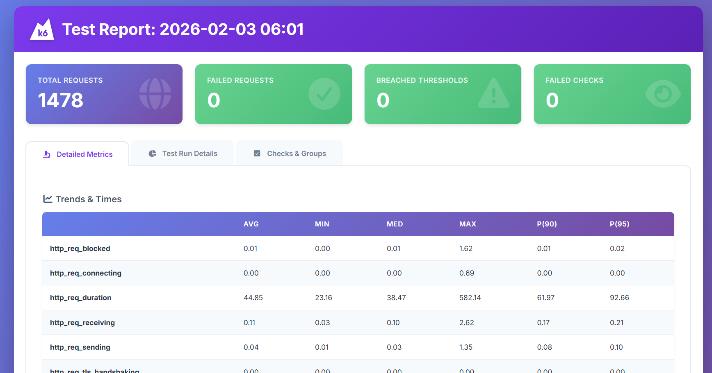
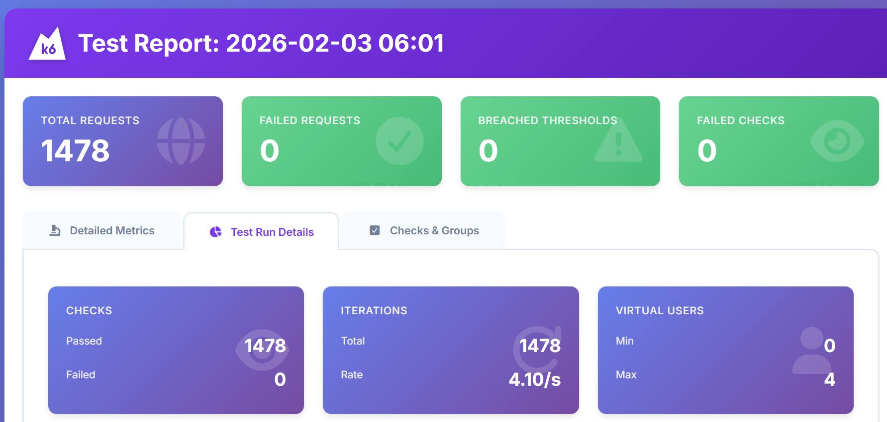
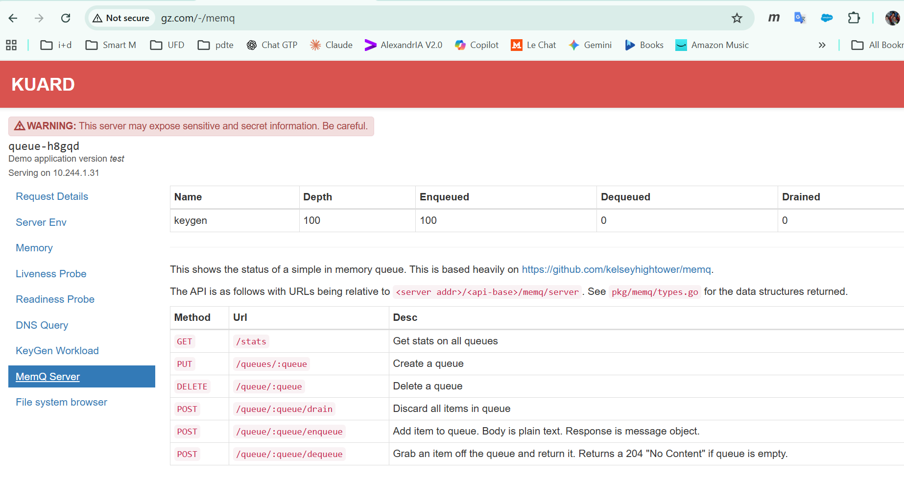
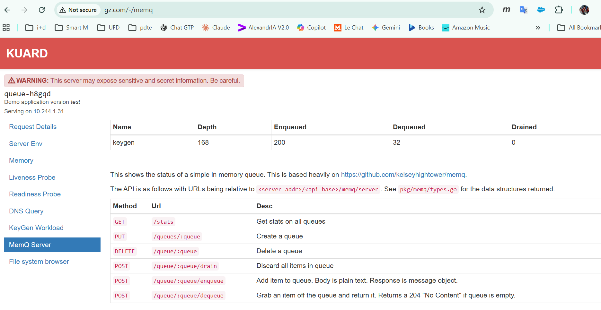
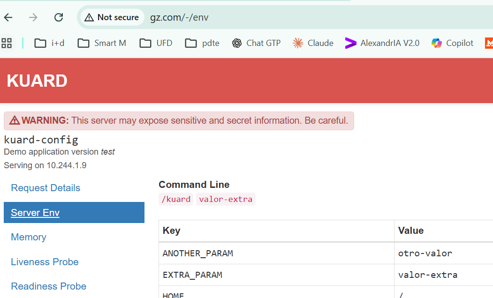
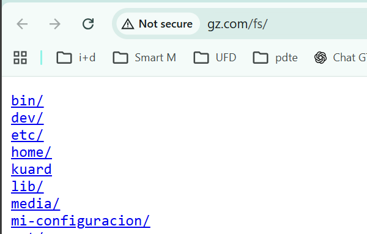
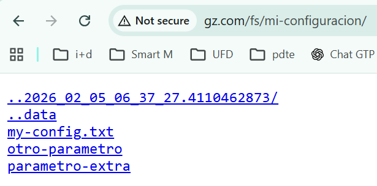
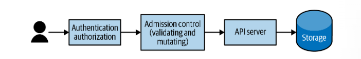

## Instalación

En primer lugar comprobamos que el cluster este ok:

```ps
kubectl cluster-info
```

### Contour/Envoy

```ps
kubectl apply -f https://projectcontour.io/quickstart/contour.yaml
```

### Metrics Server

Descargamos los componentes del metrics server:

```ps
kubectl apply -f https://github.com/kubernetes-sigs/metrics-server/releases/latest/download/components.yaml
```

Kind utiliza certificados autofirmados así que es necesario configurar el metrics server. Podemos hacerlo manualmente o con un comando. Manualmente sería así. Editamos la configuración del deployment:

```ps
kubectl edit deployment metrics-server -n kube-system
```

En el editor que se abre, busca la sección `spec.template.spec.containers[0].args` (bajo el contenedor metrics-server) hay que agregar el siguiente argumento `--kubelet-insecure-tls`. La configuración quedaría así:

```ps
spec:
  containers:
  - args:
    - --cert-dir=/tmp
    - --secure-port=10250
    - --kubelet-preferred-address-types=InternalIP,ExternalIP,Hostname
    - --kubelet-use-node-status-port
    - --metric-resolution=15s
    - --kubelet-insecure-tls
```

esto mismo lo podemos hacer con esta instrucción

```ps
kubectl patch deployment metrics-server -n kube-system --type='json' -p='[{"op": "add", "path": "/spec/template/spec/containers/0/args/-", "value": "--kubelet-insecure-tls"}]'
```

con esto quedaría configurado em servidor de métricas. Podemos confirmar que el pod esta operativo:

```ps
kubectl get pods -n kube-system | findstr metrics-server

metrics-server-5f54fb74d9-z7tl5                 1/1     Running   2 (16m ago)   14h
```

Ahora ya podemos ver el consumo de recursos de los pods, por ejemplo:

```ps
kubectl top nodes

NAME                    CPU(cores)   CPU(%)   MEMORY(bytes)   MEMORY(%)
desktop-control-plane   157m         1%       588Mi           7%
desktop-worker          28m          0%       264Mi           3%
```

nos muestra el consumo de cpu, y de memoria.

### K6

K6 es una herramienta open source de Grafana que nos permite ejecutar pruebas de rendimiento. K6 puede ejecutarse en la nube de Grafana (coste), en local, o de forma distribuida en un cluster kubernetes. Para ejecutar en un clister kubernetes necesitamos instalar el operador:

```ps
curl.exe https://raw.githubusercontent.com/grafana/k6-operator/main/bundle.yaml | kubectl apply -f -
```

para desinstalar:

```ps
curl https://raw.githubusercontent.com/grafana/k6-operator/main/bundle.yaml | kubectl delete -f -
```

## dockerfile

Antes de comentar el dockerfile, refrescar algunos comandos de go que pueden ser interesantes:

```ps
go install 
```

compila el programa y lo _instala_ en carpeta donde se guardan los ejecutables de go (`go build` tambien hace la compilación, pero el ejecutable se guarda en el propio directorio desde el que se ejecuta el _build_). La carpeta en la que se guarda el binario se determina con la variable de entorno `GOBIN`. Si esta variable no existiera, entonces el ejecutable se guarda en `$GOPATH/bin`, y sino tuvieramos variable _GOPATH_ se guardará en `$HOME/go/bin`.

Con `go vet` comprobamos si hay algun problema, o algun paquete deprecado. Con `go mod tidy` lo que se hace es revisar todos los paquetes que se usan y asegurar que esten presentes en `go.mod` y al tiempo se eliminan aquellas referencias que no se usen. Típicamente ejecutamos `go mod tidy` cuando actualizamos los paquetes que usamos.

Para construir la utilidad `kuard` usaremos un dockerfile multistage. Comentar algunas cosillas:

- Usamos como imagen base Alpine, que es una imagen mínima que ya contiene _golang_. Esta ditribucuión no incluye _apt_, es necesario usar _apk_. Con _apk_ tenemos acceso a menos paquetes de terceros, lo que puede ser una limitación para usar _alpine_. Esta primera imagen la usamos para construir la aplicación (nótese el `AS build`)

```dockerfile
FROM golang:alpine AS build
```

- Al hacer `RUN en una sola linea, creamos una sola capa en la imagen, en lugar de crear dos. En este script se realiza la compilación e instalación de _kuard_

```dockerfile
RUN dos2unix build/build.sh && \
    VERBOSE=0 PKG=kuard ARCH=amd64 VERSION=test bash build/build.sh
```

- Se copia el resultado de la compilación a partir de la imagen `build`. Nos aseguramos que el ejecutable no tenga permisos con el `chown`

```dockerfile
COPY --from=build --chown=nobody:nobody /go/bin/kuard /kuard
```

- se instala el paquete  `ca-certificates` npm (e indirectamente nodejs para instalar npm), pero lo hacemos ya en la imagen final

```dockerfile
RUN apk add --no-cache ca-certificates
```

- Ejecutamos con un usuario sin privilegios

```dockerfile
USER nobody:nobody
```

- Cuando la imagen se ejecuta en docker podemos crear un health check que es _análogo_ a los probes que podemos definir en un Pod de Kubernetes:

```dockerfile
HEALTHCHECK --interval=30s --timeout=3s --start-period=5s --retries=3 \
    CMD ["/kuard", "-v"] || exit 1
```

### Construcción

Construimos la imagen:

```ps
docker build -t kuard .
```

podemos ver las imagenes:

```ps
docker images
```

vamos a taggearla y a publicarla en Docker Hub:

```ps
docker login

docker tag kuard:latest egsmartin/kuarg:latest

docker push egsmartin/kuarg:latest
```

podemos ejecutar en docker:

```ps
docker run --rm -p 8080:8080 egsmartin/kuard:latest
```

```ps
docker run -d --name kuard \
  --publish 8080:8080 \
  --memory 200m \
  --memory-swap 1G \
  --cpu-shares 1024 \
  egsmartin/kuard:latest
```

finalmente liberamos recursos que ya no necesitamos:

```ps
docker system prune
```

## kubectl

```ps
kubectl version
```

### Estado del cluster

- Estado del control plane (API server, scheduler, controller-manager). Esto te da un diagnóstico real del API server y sus dependencias:

```ps
kubectl get --raw='/readyz?verbose'
```

- Estado de los nodos

```ps
kubectl get nodes
```

podemos a continuación ver la información detallada de un nodo:

```ps
kubectl describe node desktop-control-plane
```
Veremos: nombre, `Labels`, `Annotations`, `Taints`, `unschedulable` (true|false), `Conditions` (lista de mensajes con estados del nodo y su timestamp), IP, `Capacity` (cpu, almacenamiento, memoria, número de pods), `Allocatable` (que recursos estan libres para ser usados), `System Info` (información del sistema), `Memory Limits` de los pods asignados al nodo, `Allocated resources` (muestra los recursos asignados como `requests` y como `limits`; Es un agregado de los valores de los pods asignados al nodo), `Events`

- Estados de los pods del plano de control:

```ps
kubectl get pods -n kube-system

NAME                                            READY   STATUS    RESTARTS   AGE
coredns-7d764666f9-bqjm6                        1/1     Running   0          16m
coredns-7d764666f9-rjbtx                        1/1     Running   0          16m
etcd-desktop-control-plane                      1/1     Running   0          16m
kindnet-rft97                                   1/1     Running   0          16m
kindnet-ttnnw                                   1/1     Running   0          16m
kube-apiserver-desktop-control-plane            1/1     Running   0          16m
kube-controller-manager-desktop-control-plane   1/1     Running   0          16m
kube-proxy-4k9tv                                1/1     Running   0          16m
kube-proxy-qmxvq                                1/1     Running   0          16m
kube-scheduler-desktop-control-plane            1/1     Running   0          16m
```

podemos ver los siguientes elementos:
    - `dns`. En cada nodo corre un pod que proporciona los servcios DNS del cluster
    - `proxy`. En cada nodo corre un pod que proporciona un proxy que intercepta todas las comunicaciones del pod. Por ejemplo cuando accedemos a un servicio el proxy contiene información del los _endpoints_ de ese servicio y distribuye las llamadas hacia ellos
    - `apiserver`. Expones las apis de kubernetes
    - `etcd`. Capa en la que se almacena el estado
    - `controller`. Controlador de kubernetes que identifica los recursos que deben crearse
    - `scheduler`. Se encarga de identificar y solicitad de gestionar los recursos en los nodos del cluster

```ps
kubectl exec -n kube-system etcd-desktop-control-plane -- etcdctl endpoint health
```

Muchos de estos comandos admiten el flag `--watch` para monitorizar de forma continua cambios de valor/estado.

### Namespaces

Con kubectl hacemos referencia a un namespace con el tag `--namespace` o el abreviado `-n`.

Podemos fijar el namespace por defecto usando un contexto. Creamos un contexto:

```ps
kubectl config set-context my-context --namespace=mystuff
```

y lo usamos:

```ps
kubectl config use-context my-context
```

### Gestion de recursos

Podemos obtner información de los recursos creados. Por ejemplo para recuperar los pods y servicios:

```ps
kubectl get pods,services
```

podemos ver que opciones nos da la api de kubernetes con cada recurso. Por ejemplo, los atributos disponibles en los pods:

```ps
kubectl explain pods
```

por defecto se muestra el primer nivel de propiedades. Si queremos recuperar todas las propiedades:

```ps
kubectl explain pod --recursive=true
```

creamos y borramos recursos:

```ps
kubectl apply -f kuard-pod-full.yaml

kubectl delete -f kuard-pod-full.yaml
```

podemos también referirnos a los objetos por su nombre:

```ps
kubectl delete <resource-name> <obj-name>
```

podemos etiquetar los objetos:

```ps
kubectl label pods bar color=red
```

si queremos quitar la etiqueta usamos el `-`. Por ejemplo para eliminar la etiqueta `color` del pod `bar` haríamos:

```ps
kubectl label pods bar color-
```

### Depurar contenedores

Para ver los logs de un pod, por ejemplo del pod `kuard`:

```ps
kubectl logs kuard
```

podemos ver todos los eventos con:

```ps
kubectl describe pod kuard
``` 

nos podemos conectar en el contenedor ejecutando bash (siempre y cuando este presente en la imagen, que NO es el caso de _alpine_):

```ps
kubectl exec -it kuard -- bash
```

en el caso de _alpine_ tenemos el shell `ash`:

```ps
kubectl exec -it kuard -- ash
```

podemos ejecutar cualquier comando, no solo el shell:

```ps
kubectl exec -it kuard -- date
```

Si no tenemos bash disponible en la imagen nos podemos _enganchar_ a ella, y veremos la salida por consola - que veríamos si estuvieramos corriendo el programa en forma local:

```ps
kubectl attach -it kuard
```

podemos copiar archivos - subirlos - a un pod:

```ps
kubectl cp <pod-name>:</path/to/remote/file> </path/to/local/file>
```

Otra opción __muy interesante es el port forwarding__. Por ejemplo para que nuestro _localhost:9000_ se mapee con el puerto 8080 del pod:

```ps
kubectl port-forward kuard 9000:8080
```

**NOTA**: tambien podemos hacer un port forward a un servicio. Si hubieramos hecho `kubectl expose kuard`, podríamos hacer un port-forward al servicio con `kubectl port-forward svc\kuard 9000:8080`

Cuando tenemos Pods creados con deployments el nombre del pod se asigna automáticamente con un guid, pero podemos gestionar esto de forma automática, por ejemplo como sigue:

```ps
$MIPOD=kubectl get pods -l app=alpaca-prod -o jsonpath='{.items[0].metadata.name}'
kubectl port-forward $MIPOD 9000:8080
```

podemos ver los eventos del cluster:

```ps
kubectl get events
```

si queremos ver que recursos consumen más recursos (siempre y cuando el cluster tenga habilitadas las métricas):

```ps
kubectl top nodes

kubectl top pods
```

### Gestión del Cluster

Si queremos que el scheduler deje de programar recursos en un determinado nodo:

```ps
kubectl cordon desktop-worker
```

Para extraer los recursos que ya están corriendo en un nodo:

```ps
kubectl drain desktop-worker
```

para volver a permitir que un nodo que fue acordonado vuelva a recibir encargos por parte del scheduler:

```ps
kubectl uncordon desktop-worker
```

## Pods

Vamos a describir las características principales de un Pod. Vamos a tratar el pod kuard. Lo creamos:

```ps
kubectl apply -f .\kuard-pod-full.yaml
```

podemos ver información de detalle

```ps
kubectl describe pods kuard
```

podemos hacer port forwarding al contenedor:

```ps
kubectl port-forward kuard 8080:8080
```

```yaml
apiVersion: v1
kind: Pod
metadata:
  name: kuard
spec:
  volumes: # podemos definir volumenes que estarán disponibles para todos los contenedores del pod
    - name: "kuard-data" # nombre del volumen
      emptyDir: {} # en este caso vamos  crear un volumen temporal en memoria. Podriamos haber creato un ntfs, hostPath, persistentVolumeClaim, etc.
  containers:
    - image: docker.io/egsmartin/kuard:latest # tomamos una imagen en este caso de docker hub
      imagePullPolicy: IfNotPresent # política de pull de la imagen
      name: kuard
      ports:
        - containerPort: 8080 # puerto que expone el contenedor. Lo llamamos http
          name: http
          protocol: TCP
      resources:
        requests: # recursos que solicita el contenedor. El scheduler usará esta información para asignar el pod a un nodo que tenga estos recursos disponibles. El pod podria usar más cantidad de recursos si estuvieran disponibles en el nodo, pero nunca menos de lo solicitado, ni más de lo permitido por los límites
          cpu: "500m" # 0.5 cores
          memory: "128Mi" # 128 megabytes (las i significa que utilizamos potencias de 2, es decir 1Mi = 1024 * 1024 bytes)
        limits: # recursos máximos que puede usar el contenedor. Si llegara a superar este límite, el contenedor sería terminado
          cpu: "1000m"
          memory: "256Mi"
      volumeMounts: # vamos a montar en esta imagen uno de los volumnes que hemos definido en el pod, el que tiene nombre kuard-data. Lo montamos en la ruta /data del contenedor
        - mountPath: "/data"
          name: "kuard-data"
      livenessProbe: # esta probe se usa para comprobar si el contenedor está vivo. Si falla, el contenedor se reiniciará. Se hace una llamada a la ruta /healthy del contenedor en el puerto 8080, cada 10 segundos, con un timeout de 1 segundo. Si falla 3 veces consecutivas, se considera que el contenedor no está vivo y se reinicia. La primera comprobación se hace 5 segundos después de iniciar el contenedor
        httpGet:
          path: /healthy
          port: 8080
        initialDelaySeconds: 5
        timeoutSeconds: 1
        periodSeconds: 10
        failureThreshold: 3
      readinessProbe: # esta probe se usa para comprobar si el contenedor está listo para recibir tráfico. Si falla, el contenedor no recibirá tráfico (pero no se reinicia). Se hace una llamada a la ruta /ready del contenedor en el puerto 8080, cada 10 segundos, con un timeout de 1 segundo. Si falla 3 veces consecutivas, se considera que el contenedor no está listo y no recibirá tráfico. La primera comprobación se hace 30 segundos después de iniciar el contenedor
        httpGet:
          path: /ready
          port: 8080
        initialDelaySeconds: 30
        timeoutSeconds: 1
        periodSeconds: 10
        failureThreshold: 3
```

## Etiquetas

Las etiquetas son una forma de metadata que puede asociarse a diferentes objetos y que puede utilizarse para seleccionar objetos. Las etiquetas son un par key valor. La key debe ser un valor _valido DNS_. Podemos ver varios ejemplos de etiquetas:

|Key|Value|
|-----|-----|
|acme.com/app-version|1.0.0|
|appVersion|1.0.0|
|app.version|1.0.0|
|kubernetes.io/cluster-service|true|

Al recuperar los objetos podemos incluir etiquetas en la salida (`-L` es un shortcut de `--show-labels`):

```ps
kubectl get deployments -L canary
```

para actualizar el valor de una etiqueta usamos el comando `label`:

```ps
kubectl label deployments alpaca-test "canary=true"
```

para eliminar una etiqueta ponemos el sufijo `-` en el nombre de la etiqueta:

```ps
kubectl label deployments alpaca-test canary-
```

Podemos usar las etiquetas para _interrogar_ a Kubernetes a la hora de recuperar objetos. Por ejemplo aquí vamos a obtener deployments con la etiqueta _canary_

```ps
kubectl get pods --selector="ver=2"
```

si indicamos dos selectores separados por una coma se interpreta como un AND:

```ps
kubectl get pods --selector="ver=2,app=bandicoot"
```

podemos usar varios operadores:

|Operator|Description|
|--------|--------|
|key=value|key is set to value|
|key!=value|key is not set to value|
|key in (value1, value2)|key is one of value1 or value2|
|key notin (value1, value2)|key is not one of value1 or value2|
|key|key is set|
|!key|key is not set|

## Anotaciones

Son tambien metadata pero una metadata que no se utiliza para clasificar sino para registrar información con el contenedor que no tiene cabida en la api estandar de Kubernetes.

## Service Discovery

Con Service Discovery se resuelve la direccion de cada proceso. Típicamente se usa DNS para resolver este problema, pero en casos en los que un proceso cambia o puede cambiar de dirección con cierta frecuencia, el DNS no es un mecanismos adecuado, incluso cuando bajamos el _TTL_ para asegurar que los clientes _repitan_ la resolución de direcciones con cierta frecuencia. En un entorno como Kubernetes la frecuencia con la que la direccion de los procesos cambia (porque se destruye el proceso, se reubica, o se incrementa el número de instancias del servicio).

Para exponer un servicio se usa `kubectl expose`. Para entenderlo mejor vamos a crear un _deployment_

```ps
kubectl create deployment alpaca-prod --image=docker.io/egsmartin/kuard:latest --port=8080
```

aumentamos el número de replicas:

```ps
kubectl scale deployment alpaca-prod --replicas 3
```

exponemos el deployment como un servicio:

```ps
kubectl expose deployment alpaca-prod
```

Con este comando __Kubernetes intentará crear un Service, pero como no has especificado los puertos, fallará o usará valores por defecto (usara el mismo puero que hayamos elegido exponer en el pod o en el deployment)__ que probablemente no funcionen como esperamos. Al menos debemos indicar:

- __port__: el puerto por el que se accederá al servicio.
- __target-port__: el puerto interno del contenedor al que se redirige el tráfico (si es diferente).
- __type__: opcional, para definir si el servicio es `ClusterIP`, `NodePort`, `LoadBalancer`, etc.

__Si queremos exponer más de un puerto, con expose no se puede hacer, se necesitaria usar el objeto `Service` directamente__. Si exponemos directamente el servicio con `Service` directamente, en la especificacion __podemos incluir varias tuplas port `targetPort` name__, En caso de que el tipo de servicio fuerta `NodePort` se crearán automáticamente tantos puertos en los nodos como tuplas tengamos.

Recordar que cuando llamamos al servicio con el LoadBalancer los puertos que usaremos seran los mismos que si llamasemos al servicio usando la IP que le asigno Kubernetes para el cluster.

Creamos otro deployment, aumentamos las replicas y exponemos el servicio:

```ps
kubectl create deployment bandicoot-prod --image=docker.io/egsmartin/kuard:latest --port=8080

kubectl scale deployment bandicoot-prod --replicas 2

kubectl expose deployment bandicoot-prod
```

podemos ver los servicios que acabamos de crear:

```ps
kubectl get services -o wide

NAME             TYPE        CLUSTER-IP      EXTERNAL-IP   PORT(S)    AGE   SELECTOR
alpaca-prod      ClusterIP   10.96.107.253   <none>        8080/TCP   19m   app=alpaca-prod
bandicoot-prod   ClusterIP   10.96.37.174    <none>        8080/TCP   18m   app=bandicoot-prod
kubernetes       ClusterIP   10.96.0.1       <none>        443/TCP    63m   <none>
```

Kubernetes asigna a cada servicio una `Cluster IP`, que es una direccion virtual que representa el servicio. Si hay varias réplicas en el deployment al que apunta el servicio, cuando llamemos al servicio la petición puede dirigirse a cualquiera de esas réplicas. Tenemos tres tipos de servicio:

- `ClusterIP` (defecto)
- `NodePort`
- `LoadBalancer`

NodePort y LoadBalancer incluyen la funcionalidad de ClusterIP. Cuando defines un Service como LoadBalancer, Kubernetes:

- Crea un ClusterIP para comunicación interna.
- Crea un NodePort automáticamente (aunque no lo veas explícitamente).
- Solicita al proveedor cloud que cree un balanceador de carga externo que apunte al NodePort.

Cuando usas un Service de tipo LoadBalancer en Kubernetes, se crea un artefacto externo al clúster, que es un balanceador de carga proporcionado por el proveedor de infraestructura (como AWS ELB, Azure Load Balancer, GCP Load Balancer, etc.). 

Kubernetes crea un Service de tipo LoadBalancer, el proveedor cloud detecta esta solicitud y crea un balanceador de carga externo. Ese balanceador tiene como backends:

- Las IP de los nodos del clúster.
- Los puertos NodePort que Kubernetes asigna automáticamente.

El tráfico que llega al balanceador se enruta a los nodos, y de ahí al Service, que lo redirige a los Pods correspondientes.

### DNS

Kubernetes proporciona un servicio de DNS en cada nodo del cluster. Cuando creamos un servicio automáticamente se crea un _A record_ en el DNS:

`alpaca-prod.default.svc.cluster.local.`

tenemos el nombre del servicio, seguido del namespace, la etiqueta `svc`, y el dominio del cluster. Podemos referirnos desde cualquier pod a este servicio y el DNS resolverá este nombre a la `Cluster IP`. Si estamos en el mismo namespace que el servicio podremos referirnos al servicio simplemente como `alpaca-prod`.

En la aplicación `kuard` tenemos una opción para poder consultar el DNS.

El `Service` reconoce el readiness probe y de modo que solo se enviará tráfico a un determinado Pod cuando es listo. Podemos ver los endpoints de un servicio:

```ps
kubectl get endpoints alpaca-prod --watch

NAME          ENDPOINTS                                         AGE
alpaca-prod   10.244.1.3:8080,10.244.1.5:8080,10.244.1.6:8080   27m
```

las IPs que se muestran son las IPs de los Pods. Figuran tres porque el servicio está apuntando a un deployment que tiene tres IPs. Si hacemos con kuard que un pod falle su readiness probe, será sustituido por otro, que tendrá una IP diferente.

Nótese que asociado a cada servicio se crea un objeto `Endpoint` que dinámicamente se ajusta a las direcciones de los Pods que están detrás del servicio.

### Service discovery manual

Lo que viene a hacer Kubernetes para hacer el discovery es lo siguiente. En primer lugar identifica cuales son los Pods que se corresponden con un servicio/deployment, utilizando la etiqueta `app` (los pods que se crean con un deployment se etiquetan añadiendo con la key `app` y el valor con el nombre del deployment). Las IPs de los Pod serán las IPs de los endpoints del servicio:

```ps
kubectl get pods -o wide --show-labels

kubectl get pods -o wide --selector=app=alpaca-prod
```

### Kube-proxy y Cluster IPs

Las IP Virtuales funcionan porque en cada nodo tenemos un proxy - `kube-proxy` - que intercepta todas las peticiones y las resuelve, en el caso de una IP Virtual, a uno de los endpoints asociados al servicio.


El kube-proxy monitoriza el API server para detectar cuando se están creando nuevos servicios. Cuando se crea un nuevo servicio el Kube-proxy actualiza las reglas definidas en las `iptables` que gestiona el `kernel` de cada nodo, de modo que se re-escriban los destinos de los paquetes generados en el nodo y se redirijan a los endpoints del servicio. Cuando los endpoints de un servicio cambian (Pods que se añaden, Pods que se retiran, por ejemplo, por no superar el readiness check), las reglas en las iptables se actualizan. La cluster IP como que asigna el API server cuando se crea el servicio no cambia (habría que borrar y recrear el servicio).

El rango de IPs que se asignan a los servicios se configuran con el parámetro `--service-cluster-ip-range` en el binario del `kube-apiserver`. Este rango de IP no se tiene que solapar con las subredes y rangos asignados a los Pods/Nodos.

### Variables de Entorno

Además de actualizar el DNS y el Kube-proxy, despues que se crea un servicio, cuando se cree un Pod Kubernetes definirá una serie de variables de entorno para cada servicio creado (los Pods que ya estaban creado no tendrán estas variables de entorno). Por ejemplo para el servicio `alpaca-prod` que hemos creado, si lanzamos un Pod veremos en él las siguientes variables de entorno:

```ps
ALPACA_PROD_SERVICE_HOST	10.96.107.253
ALPACA_PROD_SERVICE_PORT	8080
ALPACA_PROD_PORT_8080_TCP_PROTO	tcp
ALPACA_PROD_PORT_8080_TCP_ADDR	10.96.107.253
ALPACA_PROD_PORT_8080_TCP_PORT	8080
ALPACA_PROD_PORT	tcp://10.96.107.253:8080
ALPACA_PROD_PORT_8080_TCP	tcp://10.96.107.253:8080
```

### Limpiamos

```ps
kubectl delete services,deployments -l app
```

## Ingress

El controlador de Ingress esta compuesto por dos partes. 

- __Proxy de Ingress__: se expone fuera del clúster utilizando un servicio de tipo: LoadBalancer. Este proxy envía solicitudes a servidores "upstream"

- __Reconciliador de Ingress u operador__. El operador de Ingress es responsable de leer y monitorizar objetos de Ingress en la API de Kubernetes y reconfigurar el proxy de Ingress para enrutar el tráfico como se especifica en el recurso de Ingress


No existe un controlador de Ingress "estándar" integrado en Kubernetes, por lo que el usuario debe instalar uno de entre las muchas implementaciones disponibles. Vamos a utilizar __Contour__.

Para instalarlo:

```ps
kubectl apply -f https://projectcontour.io/quickstart/contour.yaml
```

comprobamos 

```ps
kubectl get svc envoy -n projectcontour -o wide
```

Los recursos se crean en el namespace `projectcontour`. Podemos ver un deployment (con dos replicas) y un servicio de tipo `LoadBalancer`

```ps
kubectl get svc,deployments,pods -n projectcontour

NAME              TYPE           CLUSTER-IP      EXTERNAL-IP   PORT(S)                      AGE
service/contour   ClusterIP      10.96.222.28    <none>        8001/TCP                     3m41s
service/envoy     LoadBalancer   10.96.177.192   172.18.0.6    80:30796/TCP,443:32096/TCP   3m41s

NAME                      READY   UP-TO-DATE   AVAILABLE   AGE
deployment.apps/contour   2/2     2            2           3m41s

NAME                                READY   STATUS      RESTARTS   AGE
pod/contour-5cb8d455bc-pnrt5        1/1     Running     0          3m41s
pod/contour-5cb8d455bc-v5f9g        1/1     Running     0          3m41s
pod/contour-certgen-v1-33-1-dgqkw   0/1     Completed   0          3m41s
pod/envoy-2fj22                     2/2     Running     0          3m41s
```

Se crea tambien una `CustomResourceDefinition`. 

Al tratarse de una instalación global en el cluster, para poder crear este recurso tenemos que tener permisos de administrador para el cluster.

Para que Ingress funcione correctamente es necesario actualizar el DNS incluyendo la dirección externa del balanceador de carga. Si por ejemplo nuestro dominio fuera `example.com`. Tendremos que configurar dos entradas en el DNS: alpaca.example.com y bandicoot.example.com. 

Si tienes una dirección IP para tu balanceador de carga externo, querrás crear registros A (esto es, asignar la `EXTERNAL-IP` el dominio del balanceador - A record -, y crear alias que apunten al balanceador - CNAME records). Con esto las peticiones al balanceador, o a los alias se enrutaran hacia ingress (en local podemos actualizar el archivo _hosts_).

```ps
kubectl apply -f ejemplos.yaml

kubectl get deployment -o wide

kubectl get services -o wide
```

### Ingress

Al hacer `ejemplos.yaml` hemos creado tambien un objeto Ingress:

```ps
kubectl get ingress -o wide
```

la definición de Ingress es la siguiente:

```yaml
apiVersion: networking.k8s.io/v1
kind: Ingress
metadata:
  name: simple-ingress
  annotations:
    kubernetes.io/ingress.class: contour
spec:

[...]
```

que define varias reglas. Cada regla se activa cuando la petición se recibe de un determinado `host`. En la regla especificamos diferentes backends en función del `path` utilizado. Para indicar el backend se informa el nombre del servicio y el puerto que hay que utilizar. Por ejemplo para `gz.com` definimos tres rutas:

```yaml
  ingressClassName: contour
  rules:
    - host: gz.com
      http:
        paths:
          - path: /
            pathType: Prefix
            backend:
              service:
                name: mult3
                port:
                  number: 80
          - path: /multiplica
            pathType: Prefix
            backend:
              service:
                name: mult2
                port:
                  number: 80 # puerto donde se expone el servicio
          - path: /primos
            pathType: Prefix
            backend:
              service:
                name: primos
                port:
                  number: 80 # puerto donde se expone el servicio

[...]
```

### HTTPProxy

El objeto Ingress se incorporo en Kubernetes en la versión 1.1 para describir un reverse proxy de forma global dentro de un cluster. Desde entoces el objeto Ingress no ha evolucionado lo que ha hecho que profileferen anotaciones por medio de las cueles extender la funcionalidad de enrutado de Ingress (que es muy limitada). Con el objeto **HTTPProxy** Contour proporciona una *Custom Resource Definition (CRD)* que .

Hemos creado en `ejemplos.yaml` tambien algún ejemplo de HTTProxy. A continuación describimos las funcionalidades principales del HTTProxy.

A diferencia de Ingress, **HTTPProxy solo permite un root domain por objeto** - HTTPProxy. En Ingress podíamos hacer:

```yaml
apiVersion: extensions/v1beta1
kind: Ingress
metadata:
  name: name-example
spec:
  rules:
  - host: foo1.bar.com
    http:
      paths:
      - backend:
          serviceName: s1
          servicePort: 80
  - host: bar1.bar.com
    http:
      paths:
      - backend:
          serviceName: s2
          servicePort: 80
```

con HTTProxy hay que partirlo en dos:

```yaml
apiVersion: projectcontour.io/v1
kind: HTTPProxy
metadata:
  name: name-example-foo
  namespace: default
spec:
  virtualhost:
    fqdn: foo1.bar.com
  routes:
    - services:
      - name: s1
        port: 80
---
apiVersion: projectcontour.io/v1
kind: HTTPProxy
metadata:
  name: name-example-bar
  namespace: default
spec:
  virtualhost:
    fqdn: bar1.bar.com
  routes:
    - services:
        - name: s2
          port: 80
```

**Cada ruta en el HTTPProxy puede tener una o varias condiciones**. Las condiciones se combinan con `AND`. Las condiciones pueden ser un `prefix` o una `header`. Cuando se utilizan condiciones `prefix` tienen que empezar con `\`. Las condiciones `header` incluyen un nombre y un operador. Los operadores pueden ser `present`, `contains`, `notcontains`, `exact` o `notexact`. Por ejemplo, aqui definimos para el dominio tres posibles rutas a backends. Dos están condicionadas a la presencia de un header, la tercera actua por defecto (la rutas se procesan en orden de arriba a abajo, y cuando una cualifica se sale por esa ruta):

```yaml
apiVersion: projectcontour.io/v1
kind: HTTPProxy
metadata:
  name: multiple-paths
  namespace: default
spec:
  virtualhost:
    fqdn: multi-path.bar.com
  routes:
    - conditions:
      - header:
          name: x-os
          contains: ios
      services:
        - name: s1
          port: 80
    - conditions:
      - header:
          name: x-os
          contains: android
      services:
        - name: s2
          port: 80
    - services:
        - name: s3
          port: 80
```

**en una ruta podemos tener uno o varios servicios**:

```yaml
apiVersion: projectcontour.io/v1
kind: HTTPProxy
metadata:
  name: multiple-upstreams
  namespace: default
spec:
  virtualhost:
    fqdn: multi.bar.com
  routes:
    - services:
        - name: s1
          port: 80
        - name: s2
          port: 80
```

en este ejemplo cuando llamemos a `multi.bar.com` HTTProxy hará balanceo de carga distribuyendo las peticiones entre los dos servicios asociados a la ruta, s1 y s2. Podemos **aplicar un peso a cada servicio**:

```yaml
apiVersion: projectcontour.io/v1
kind: HTTPProxy
metadata:
  name: weight-shifting
  namespace: default
spec:
  virtualhost:
    fqdn: weights.bar.com
  routes:
    - services:
        - name: s1
          port: 80
          weight: 10
        - name: s2
          port: 80
          weight: 90
```

los pesos no tienen porque sumar 100, se tratan de forma relativa. Si unas rutas tienen peso y otras no, las rutas sin peso se asume que tienen un peso 0. Si ninguna ruta tiene pesos se distribuyen las peticiones de forma equitativa entre los servicios.

También es posible **manipular las cabeceras**, específicamente en cada servicio como hacemos en este ejemplo para añadir y quitar cabeceras:

```yaml
apiVersion: projectcontour.io/v1
kind: HTTPProxy
metadata:
  name: header-manipulation
  namespace: default
spec:
  virtualhost:
    fqdn: headers.bar.com
  routes:
    - services:
        - name: s1
          port: 80
          requestHeadersPolicy:
            set:
              - name: X-Foo
                value: bar
            remove:
              - X-Baz
          responseHeadersPolicy:
            set:
              - name: X-Service-Name
                value: s1
            remove:
              - X-Internal-Secret
```

o por ruta:

```yaml
apiVersion: projectcontour.io/v1
kind: HTTPProxy
metadata:
  name: header-manipulation
  namespace: default
spec:
  virtualhost:
    fqdn: headers.bar.com
  routes:
    - services:
        - name: s1
          port: 80
      requestHeadersPolicy:
        set:
          - name: X-Foo
            value: bar
        remove:
          - X-Baz
      responseHeadersPolicy:
        set:
          - name: X-Service-Name
            value: s1
        remove:
          - X-Internal-Secret
```

Una funcionalidad muy interesante es el **traffic mirroring**. A cada ruta se le puede asociar un espejo de modo que todo el tráfico que fluya por la ruta también fluya por el espejo:

```yaml
apiVersion: projectcontour.io/v1
kind: HTTPProxy
metadata:
  name: traffic-mirror
  namespace: default
spec:
  virtualhost:
    fqdn: www.example.com
  routes:
    - conditions:
      - prefix: /
      services:
        - name: www
          port: 80
        - name: www-mirror
          port: 80
          mirror: true
```

También se puede configurar un **timeout y reintentos**. En este ejemplo configuramos un timeout de 1 segundo

```yaml
apiVersion: projectcontour.io/v1
kind: HTTPProxy
metadata:
  name: response-timeout
  namespace: default
spec:
  virtualhost:
    fqdn: timeout.bar.com
  routes:
  - timeoutPolicy:
      response: 1s
      idle: 10s
    retryPolicy:
      count: 3
      perTryTimeout: 150ms
    services:
    - name: s1
      port: 80
```

- timeoutPolicy
  - **response**: The maximum time (1s) that the upstream service has to send a complete response back to the client. This includes the time to receive all response headers and body. If the response is not fully received within this time, the connection is terminated.
  - **idle**: The maximum time (10s) of inactivity on a connection before it is closed. This is useful for keeping long-lived connections alive by detecting stalled or hung connections.

  response timeout measures the total time for a complete response, idle timeout measures periods of inactivity/no data flow

- retryPolicy
  - **count**: The maximum number of retries (3) to attempt if the request fails
  - **perTryTimeout**: The timeout (150ms) for each individual retry attempt. This timeout applies to each retry independently.

  The **perTryTimeout** does NOT override the overall **response** timeout. Instead: **perTryTimeout** (150ms) = timeout for EACH single attempt/retry. **response** timeout (1s) = timeout for the ENTIRE request lifecycle (all retries combined must complete within 1s). Both timeouts work together: each retry attempt has 150ms, but all retries collectively cannot exceed 1 second total.

Tambien se soporta hacer **health checks** que Envoy ejecuta períodicamente. Estos checks son independientes de los que hayamos configurado en kubernetes:

```yaml
apiVersion: projectcontour.io/v1
kind: HTTPProxy
metadata:
  name: health-check
  namespace: default
spec:
  virtualhost:
    fqdn: health.bar.com
  routes:
  - conditions:
    - prefix: /
    healthCheckPolicy:
      path: /healthy
      intervalSeconds: 5
      timeoutSeconds: 2
      unhealthyThresholdCount: 3
      healthyThresholdCount: 5
    services:
      - name: s1-health
        port: 80
      - name: s2-health
        port: 80
```

HTTPProxy permite hacer **rewriting de la petición http ANTES de enviar al servicio en el backend**. El rewrintting se hace una vez se ha elegido una ruta, no influye por lo tanto en la elección de la ruta a seguir.

The pathRewritePolicy field specifies how the path prefix should be rewritten. The replacePrefix rewrite policy specifies a replacement string for a HTTP request path prefix match. When this field is present, the path prefix that the request matched is replaced by the text specified in the replacement field. If the HTTP request path is longer than the matched prefix, the remainder of the path is unchanged.

```yaml
apiVersion: projectcontour.io/v1
kind: HTTPProxy
metadata:
  name: rewrite-example
  namespace: default
spec:
  virtualhost:
    fqdn: rewrite.bar.com
  routes:
  - services:
    - name: s1
      port: 80
    pathRewritePolicy:
      replacePrefix:
      - replacement: /new/prefix
```

## Replicaset

Creamos el replicaset `kubectl apply -f kuard-rs.yaml`, y vemos que e ha creado: 

```ps
kubectl describe rs kuard
```

los pods esta relacionados con el replicaset indirectamente, a traves de la etiqueta. El control loop se encarga de que haya creadas el número de réplicas especificado. Podemos ver inspeccionando el Pod que esta vinculado al rs:

```ps
kubectl get pod kuard-grxxh -o=jsonpath='{.metadata.ownerReferences[0].name}'
```

podemos recuperar los pods usando las etiquetas:

```ps
kubectl get pods -l app=kuard,version=2
```

escalamos el rs:

```ps
kubectl scale replicasets kuard --replicas=4
```

### Autoscaling

- Escalado horizontal (HPA). Añadir o quitar replicas
- Escalado vertical. Aumentar o reducir los recursos asignados a un pod

para utilizar autoscaling necesitamos tener instalado el `metrics-server` (ver al apartado _instalación_). Hace un seguimiento de las métricas y las hace accesibles con una api que hace posible la función de autoescalado. Podemos ver si tenemos el pod de metrics mirando el namespace _kube-system_:

```ps
kubectl get pods --namespace=kube-system

kubectrl top nodes
```

ya podemos crear un autoescalar. Por ejemplo en para este replicaset vamos a fijar el umbral en 80% de cpu, contemplando entre 2 y 5 pods:

```ps
kubectl autoscale rs kuard --min=2 --max=5 --cpu-percent=80
```

```ps
get hpa

NAME    REFERENCE          TARGETS       MINPODS   MAXPODS   REPLICAS   AGE
kuard   ReplicaSet/kuard   cpu: 0%/80%   2         5         3          99s
```

para eliminar el replica set:

```ps
kubectl delete rs kuard

kubectl delete rs kuard --cascade=false
```

el segundo comando no elimina los pods

### Caso Práctico

Vamos a hacer un experimento con el balanceador utilizando un par de endpoints que he creado en los servicios multiplica y primos, y usando ****, un generador de carga de Grafana.

He creado un deployment, servicio y un hpa en `primos*.yaml`.

#### Script base

Creamos una plantilla con el script que vamos a usar para ejecutar la prueba:

```ps
docker run --rm -i -v ${PWD}:/app -w /app grafana/k6 new
```

podemos usar también _k6_ instalado en local para crear el archivo

```ps
# crea un script base
k6 run script.js

# crea/sobreescribe el script base
k6.exe new -f test.js
```

En la documentación podemos información [sobre como construir peticiones http](https://grafana.com/docs/k6/latest/using-k6/http-requests/).


#### Ejecutar el script

Podemos ejecutar el script con _k6_:

```ps
cat script.js | docker run --rm -i grafana/k6 run -
```

también podemos crear **usuarios virtuales (VUs)**, por ejemplo aquí ejecutamos el mismo test con diez usuarios virtuales, y ejecutamos el tets durante 30 segundos:

```ps
cat script.js | docker run --rm -i grafana/k6 run --vus 10 --duration 30s -
```

podemos indicar estas opciones en el objeto options, así no es necesario pasarlas como argumentos en cada ejecución:

```js
export const options = {
  vus: 10, // numero de usuarios virtuales
  duration: '30s', // duracion de la prueba
  iterations: 10, // número de iteraciones
};
```

Hay tres modos de ejecución:

- **Local**

```ps
k6 run script.js
```

- [**distribuido** en un cluster de kubernetes](https://grafana.com/docs/k6/latest/set-up/set-up-distributed-k6/). Tenemos que instalar primero el operador K6 (ver apartado instalación).

##### Ejecución distribuida (en un cluster de kubernetes)

Este es un manifiesto completo para hacer un test run.

```yaml
apiVersion: k6.io/v1alpha1
kind: TestRun # lanzamos un test
metadata:
  name: k6-sample
spec:
  parallelism: 4 # se ejecuta de forma concurrente desde cuatro pods
  script:
    configMap:
      name: k6-test
      file: test.js # se ejecuta este script (el contenido del script esta definido en el propio config map)
  separate: false # Si falso cada runner opera de forma independiente a los demas (por ejemplo si en la configiuraciín tuvieramos usar 10 VU, y tenemos false, se crerían un total de 40 VU, 10 en cada worker; Si ponemos true se coordinan los cuatro workers, y en total habrá 10 VU; Resultado de la prueba en el caso de false habrá cuatro, en el caso de true uno)

  runner: # obligatorio. Es necesario usar una imagen que conenga K6, y las options que deban usarse para definir la prueba. Opcionalmente podemos usar también la imagen para incluir el script en lugar de usar un ConfigMap
    image: <custom-image> # imagen en la que reside el script
    metadata:
      labels:
        cool-label: foo
      annotations:
        cool-annotation: bar
    securityContext: # restricciones de seguridad para ejecutar esta imagen (usuario, grupo y no como no root)
      runAsUser: 1000
      runAsGroup: 1000
      runAsNonRoot: true
    resources: # recursos que podrá consumir esta imagen
      limits:
        cpu: 200m
        memory: 1000Mi
      requests:
        cpu: 100m
        memory: 500Mi
  starter: # opcional. Esta imagen de indicarla se ejecuta al principio para prepara el test (preparación de datos, etc.)
    image: <custom-image>
    metadata:
      labels:
        cool-label: foo
      annotations:
        cool-annotation: bar
    securityContext:
      runAsUser: 2000
      runAsGroup: 2000
      runAsNonRoot: true
```

por defecto K6 monitoriza los recursos custom `TestRun` y `PrivateLoadZone` en todos los namespaces, pero podemos acotar a que namespaces vigilar con una variable de entorno **en el operador asociado a k6**:

`WATCH_NAMESPACE`: un solo namespace.
`WATCH_NAMESPACES`: una lista de namespaces separadospor coma.

hay que especificar una de las dos variables:

```yaml
apiVersion: apps/v1
kind: Deployment
metadata:
  name: k6-operator-controller-manager
  namespace: k6-operator-system
spec:
  template:
    spec:
      containers:
        - name: manager
          image: ghcr.io/grafana/k6-operator:controller-v0.0.22
          env:
            - name: WATCH_NAMESPACE
              value: "some-ns"
            # Only use one option, WATCH_NAMESPACE or WATCH_NAMESPACES
            # - name: WATCH_NAMESPACES
            #   value: "some-ns,some-other-namespace"
# ...
```

Para indicar el script que se tiene que ejecutar en la prueba con  `TestRun` se pueden utilizar varios mecanismos:

- `configMap`. Se crea un config map indicando el script a utilizar (el ConfigMap tendrá como contenido el propio script):

```ps
kubectl create configmap my-test --from-file /path/to/my/test.js
```

y ya podemos usar el script en el test:

```yaml
---
apiVersion: k6.io/v1alpha1
kind: TestRun
metadata:
  name: k6-sample
spec:
  parallelism: 4
  script:
    configMap:
      name: 'k6-test'
      file: 'script.js'
```

El tamaño del script que podemos injectar con un ConfigMap no puede superar los 1048576 bytes. Si necesitamos más espacio se puede utilizar un volumeClaim o un localFile.

- `volumeClaim`

```yaml
spec:
  script:
    volumeClaim:
      name: 'stress-test-volumeClaim'
      # test.js should exist inside /test/ folder.
      # All the js files and directories test.js is importing
      # should be inside the same directory as well.
      file: 'test.js'
```

- `localFile`. Si tenemos una imagen con el script podemos lanzar el script desde la imagen:

```yaml
spec:
  parallelism: 4
  script:
    localFile: /test/test.js
  runner:
    image: <custom-image>
```

#### Resultados

```ps
k6 run .\script.js

         /\      Grafana   /‾‾/
    /\  /  \     |\  __   /  /
   /  \/    \    | |/ /  /   ‾‾\
  /          \   |   (  |  (‾)  |
 / __________ \  |_|\_\  \_____/

     execution: local
        script: .\script.js
        output: -

     scenarios: (100.00%) 1 scenario, 20 max VUs, 2m50s max duration (incl. graceful stop):
              * default: Up to 20 looping VUs for 2m20s over 3 stages (gracefulRampDown: 30s, gracefulStop: 30s)


  █ TOTAL RESULTS

    checks_total.......: 1536    10.892462/s
    checks_succeeded...: 100.00% 1536 out of 1536
    checks_failed......: 0.00%   0 out of 1536

    ✓ status is 200

    HTTP
    http_req_duration..............: avg=178.97ms min=116.14ms med=188.18ms max=307.84ms p(90)=228.46ms p(95)=233.35ms
      { expected_response:true }...: avg=178.97ms min=116.14ms med=188.18ms max=307.84ms p(90)=228.46ms p(95)=233.35ms
    http_req_failed................: 0.00%  0 out of 1536
    http_reqs......................: 1536   10.892462/s

    EXECUTION
    iteration_duration.............: avg=1.18s    min=1.11s    med=1.19s    max=1.66s    p(90)=1.23s    p(95)=1.23s
    iterations.....................: 1536   10.892462/s
    vus............................: 1      min=1         max=20
    vus_max........................: 20     min=20        max=20

    NETWORK
    data_received..................: 5.1 MB 36 kB/s
    data_sent......................: 117 kB 830 B/s


running (2m21.0s), 00/20 VUs, 1536 complete and 0 interrupted iterations
default ✓ [======================================] 00/20 VUs  2m20s
```

- `http_req_duration`: mide el tiepo end-to-end de todas las peticiones. Se muestra el máximo, mínimo, la medida, medianda y los percentiles 90% y 95%
- `http_req_failed: núm de casos que han fallado
- `iterations`: número total de iteraciones
- `vus`: número de clientes virtuales (máximo y mínimo)

podemos configurar las métricas a calcular con el argumento `--summary-trend-stats`. Por ejemplo para calcular la mediana, y los percentiles 95% y 99.9%:

```ps
k6 run --iterations=100 --vus=10 --summary-trend-stats="med,p(95),p(99.9)" script.js
```

En la documentación podemos [ver más información acerca de las métricas](https://grafana.com/docs/k6/latest/using-k6/metrics/).

#### Checks y Assertions

Podemos usar diferentes [checks](https://grafana.com/docs/k6/latest/using-k6/checks/) y [assertions](https://grafana.com/docs/k6/latest/using-k6/assertions/) para comprobar que el test se está ejecutando dentro de los parámetros previstos.

#### Thresholds

Los [thresholds](https://grafana.com/docs/k6/latest/using-k6/thresholds/) definen los resultados esperados según los _NFRs_ definidos.

Entre las options del test indicamos los _thresholds_:

```js
import http from 'k6/http';

export const options = {
  thresholds: {
    http_req_failed: ['rate<0.01'], // http errors deben ser menores al 1% del total
    http_req_duration: ['p(95)<200'], // el percentil 95% debe estar por debajo de los 200ms
  },
};

export default function () {
  http.get('https://quickpizza.grafana.com');
}
```

#### Ejemplo

Voy a definir dos ejemplos que van a demostrar el funcionamiento del hpa. En este primero lanzamos una prueba de rendimiento usando la instalación k6 local de mi equipo, en el siguiente lanzaremos la misma prueba de rendimiento pero de forma distribuida desde el propio cluster. Todos los recursos que necesitaré para estos ejemplos están en `ejemplos.yaml`, así que empezamos haciendo `kubectl apply -f ./ejemplos.yaml`. El recurso que usaré para lanzar el test distribuido lo incluyo en otro yaml de modo que puedo decidir cuando lanzar la prueba distribuida.

Vamos a crear un test `test-primos.js` en el que cada usuario virtual hace una llamda a `http.get('http://gz.com/load/1/10');` con una pausa de 0.5 segundos entre llamadas. El experimento dura seis minutos, con un perfil de usuarios virtuales que sube hasta un pico de ocho usuarios:

```js
// configuramos una rampa de usuarios virtuales
export const options = {
  stages: [
    { duration: '1m30s', target: 8 }, // ramp-up a 8 usuarios en 2 minutos 
    { duration: '30s', target: 8 }, 
    { duration: '2m', target: 2 }, 
    { duration: '1m', target: 2 }, 
    { duration: '40s', target: 1 }, 
    { duration: '20s', target: 0 }, 
  ],
};

export default function() {
  let res = http.get('http://gz.com/load/1/10'); // 1M interaciones CPU, 10M memoria
  check(res, { "status is 200": (res) => res.status === 200 });
  sleep(0.5);
}

// customiza el informe generado por k6
export function handleSummary(data) {
  return {
    'resultados/k6/reports/replicasets_report.html': htmlReport(data), // crea el informe indicado en la key a partir del resultado (que se pasa en data)
    'resultados/k6/reports/replicasets_report.json': JSON.stringify(data),
  };
}
```

Hemos introducido una pequeña modificación al recurso `hpa` para que el experimento sea más _visual_, hemos introducido el **tag opcional `behavior`**, para definir como se hará el rampdown, y especificamente cambiar el comportamiento por defecto. Por defecto el rampdown es más conservador, de modo que antes de reducir el número de pods se espera cinco minutos (el comportamiento por defecto de hpa añade con más facilidad pods que los reduce; Para reducir se espera cinco minutos para asegurar que la metrica se mantenga por debajo del umbral de forma estable): 

```yaml
apiVersion: autoscaling/v2
kind: HorizontalPodAutoscaler
metadata:
  name: primos-hpa
spec:
  scaleTargetRef:
    apiVersion: apps/v1
    kind: Deployment # Vamos a escalar un deployment (podria haber sido una replicaset)
    name: primos-deployment
  minReplicas: 1 # número mínimo de réplicas
  maxReplicas: 10 # número máximo de réplicas
  metrics:
  - type: Resource
    resource:
      name: cpu #vigilamos la cpu
      target:
        type: Utilization
        averageUtilization: 50 # no puede superar el 50% de uso de cpu
  behavior:
    scaleDown:
      stabilizationWindowSeconds: 10  # Ventana de estabilización (5 minutos)
      policies:
      - type: Percent
        value: 50  # Reduce hasta un 50% de las réplicas actuales por minuto
        periodSeconds: 60
      - type: Pods
        value: 1  # O reduce 1 réplica por minuto, lo que sea mayor
        periodSeconds: 60
      selectPolicy: Max  # Usa la política que reduzca más
```

definimos dos politicas de `scaleDown`, usamos la que sea más agresiva (reduzca más pods). Lo primero reducimos la `stabilizationWindowSeconds` de los 300 segundos por defecto a 10 (para que en los seis minutos que dura el experimiento veamos que el hpa también baja el número de pods). Hemos expresado la tasa de reducción de dos formas, eb valor absoluto y en porcentaje.

para lanzar el test hacemos:

```ps
k6 run .\test-primos.js


         /\      Grafana   /‾‾/
    /\  /  \     |\  __   /  /
   /  \/    \    | |/ /  /   ‾‾\
  /          \   |   (  |  (‾)  |
 / __________ \  |_|\_\  \_____/

     execution: local
        script: .\test-primos.js
        output: -

     scenarios: (100.00%) 1 scenario, 8 max VUs, 6m30s max duration (incl. graceful stop):
              * default: Up to 8 looping VUs for 6m0s over 6 stages (gracefulRampDown: 30s, gracefulStop: 30s)

INFO[0360] [k6-reporter v3.0.3] Generating HTML summary report, with theme: default  source=console

running (6m00.2s), 0/8 VUs, 2485 complete and 0 interrupted iterations
default ✓ [======================================] 0/8 VUs  6m0s
```

usamos `--watch` para ir viendo como el hpa evoluciona:

```ps
kubectl get hpa primos-hpa --watch

NAME         REFERENCE                      TARGETS         MINPODS   MAXPODS   REPLICAS   AGE
primos-hpa   Deployment/primos-deployment   cpu: 3%/50%     1         10        1          26h
primos-hpa   Deployment/primos-deployment   cpu: 1%/50%     1         10        1          26h
primos-hpa   Deployment/primos-deployment   cpu: 63%/50%    1         10        1          26h
primos-hpa   Deployment/primos-deployment   cpu: 245%/50%   1         10        2          26h
primos-hpa   Deployment/primos-deployment   cpu: 379%/50%   1         10        5          26h
primos-hpa   Deployment/primos-deployment   cpu: 131%/50%   1         10        8          26h
primos-hpa   Deployment/primos-deployment   cpu: 101%/50%   1         10        8          26h
primos-hpa   Deployment/primos-deployment   cpu: 94%/50%    1         10        10         26h
primos-hpa   Deployment/primos-deployment   cpu: 116%/50%   1         10        10         26h
primos-hpa   Deployment/primos-deployment   cpu: 92%/50%    1         10        10         26h
primos-hpa   Deployment/primos-deployment   cpu: 91%/50%    1         10        10         26h
primos-hpa   Deployment/primos-deployment   cpu: 80%/50%    1         10        10         26h
primos-hpa   Deployment/primos-deployment   cpu: 67%/50%    1         10        10         26h
primos-hpa   Deployment/primos-deployment   cpu: 64%/50%    1         10        10         26h
primos-hpa   Deployment/primos-deployment   cpu: 54%/50%    1         10        10         26h
primos-hpa   Deployment/primos-deployment   cpu: 49%/50%    1         10        10         26h
primos-hpa   Deployment/primos-deployment   cpu: 46%/50%    1         10        10         26h
primos-hpa   Deployment/primos-deployment   cpu: 38%/50%    1         10        10         26h
primos-hpa   Deployment/primos-deployment   cpu: 28%/50%    1         10        8          26h
primos-hpa   Deployment/primos-deployment   cpu: 51%/50%    1         10        5          26h
primos-hpa   Deployment/primos-deployment   cpu: 50%/50%    1         10        5          26h
primos-hpa   Deployment/primos-deployment   cpu: 45%/50%    1         10        5          26h
primos-hpa   Deployment/primos-deployment   cpu: 46%/50%    1         10        5          26h
primos-hpa   Deployment/primos-deployment   cpu: 32%/50%    1         10        5          26h
primos-hpa   Deployment/primos-deployment   cpu: 28%/50%    1         10        4          26h
primos-hpa   Deployment/primos-deployment   cpu: 1%/50%     1         10        3          26h
primos-hpa   Deployment/primos-deployment   cpu: 1%/50%     1         10        2          26h
primos-hpa   Deployment/primos-deployment   cpu: 1%/50%     1         10        2          26h
primos-hpa   Deployment/primos-deployment   cpu: 4%/50%     1         10        1          26h
primos-hpa   Deployment/primos-deployment   cpu: 1%/50%     1         10        1          26h
```

notese la métrica de CPU y el como evoluciona el número de réplicas a lo largo del tiempo.

#### Ejemplo II. Ejecución en cluster

Podemos ejecutar el mismo test pero usando pods dentro del propio cluster que hacen de _runners_. Esto nos ofrece la posibilidad de lanzar la prueba de forma distribuida desde varios Pods. Lo primero que necesitamos es crear la imagen con el runner. Esta imagen es obligatoria para incluir las _options_ donde se define la prueba, y opcionalmente podemos también incluir el propio script (en lugar de definirlo en un _ConfigMap_):

La imagen tiene que incluir k6, así que usamos como base una imagen que grafana nos proporciona `grafana/k6:latest `. Construimos la imagen:

```ps
docker build -f Dockerfile.k6 -t egsmartin/test-primos:latest .
```

una vez construida la imagen con el runner ya podemos lanzar nuestro test con nuestro recurso `TestRun`:

```yaml
apiVersion: k6.io/v1alpha1
kind: TestRun
metadata:
  name: test-primos-run
spec:
  parallelism: 2 # se ejecutaran dos runners en paralelo
  script:
    localFile: /test.js # no usamos un configmap para definir el script sino que lo incluimos en la imagen del runner
  runner:
    image: docker.io/egsmartin/test-primos:latest # imagen del runner que contiene el script de test
    env:
    - name: HOSTNAME_API
      value: primos-service
    - name: REPORTS_PATH
      value: /reports
    volumeMounts: # montamos un volumen en el que dejar el resultado de los tests
    - name: k6-reports # nombre del volumen que montamos
      mountPath: /reports
    volumes: # volumen
    - name: k6-reports 
      persistentVolumeClaim: # queremos que el volumen sea persistente, así que usamos un PVC
        claimName: k6-reports-pvc
  separate: false # los dos runners se ejecutan de forma coordinada. Los VUs a crear se reparten entre los dos pods
```

comentar algunas cosas:
- lanzamos dos runners en paralelo
- la imagen del runner es la que hemos creado en el paso anterior
- usamos el runner **también** para incluir el escript de prueba (esto porque hemos usado el atributo `localFile`)
- creamos un volumen donde guardar el informe de la prueba, y usamos un persistent volume claim para ello. Asi incluso si borramos el pod del runner podremos acceder a los datos

la definición del PV y del PVC:

```yaml
apiVersion: v1
kind: PersistentVolume
metadata:
  name: k6-reports-pv
spec:
  capacity:
    storage: 20Mi # tamaño del volumen
  accessModes:
    - ReadWriteOnce # modo de acceso. Solo puede ser montado en modo lectura/escritura por un nodo
  hostPath:
    path: /data/k6-reports # ruta en el nodo donde se almacena el volumen
    type: DirectoryOrCreate
  persistentVolumeReclaimPolicy: Retain # política de retención del volumen. Retain: conservar el volumen aunque se borre el PVC. Otras opciones: Recycle, Delete
---
apiVersion: v1
kind: PersistentVolumeClaim
metadata:
  name: k6-reports-pvc
spec:
  accessModes:
    - ReadWriteOnce # modo de acceso. Debe coincidir con el del PV que kubernetes asigne
  resources:
    requests:
      storage: 20Mi # tamaño solicitado al PV
```

y lanzamos el test:

```ps
kubectl apply -f .\test-primos-testrun.yaml
```

podemos ver las fases por las que pasa el test de k6:

```ps
kubectl get testrun -w

NAME              STAGE     AGE    TESTRUNID
test-primos-run   initialization   0s
test-primos-run   initialization   10s
test-primos-run   initialized      10s
test-primos-run   created          10s
test-primos-run   started          15s
test-primos-run   stopped          6m21s
test-primos-run   finished         6m21s
```

cuando se lanza el test se crean varios Pods:

```ps
kubectl get pods

NAME                                READY   STATUS      RESTARTS   AGE
test-primos-run-1-lkm6r             0/1     Completed   0          25m
test-primos-run-2-bs9cp             0/1     Completed   0          25m
test-primos-run-initializer-85445   0/1     Completed   0          26m
test-primos-run-starter-s2fcg       0/1     Completed   0          25m
```

el initializer y el starter se crean al principio para preparar y lanzar la prueba, y a continuación se crean los runners. En este caso tenemos dos porque hemos definido `parallelism: 2`. Cuando he capturado los datos anteriores el test ya habia terminado de ahi que figuren los pods como `Completed`.

Para ver el resultado del test vamos a usar una imagen de **busybox** que se caracteriza por ser muy ligera y proporcionarnos un bash. Usaremos esta imagen para montar el mismo volumen en el que hemos dejado los resultados
podemos ver el estado del test

```yaml
apiVersion: v1
kind: Pod
metadata:
  name: pvc-debug
spec:
  containers:
  - name: sh
    image: docker.io/library/busybox:stable
    imagePullPolicy: IfNotPresent
    command: ["sh","-c","sleep 3600"]
    volumeMounts: # montamos el volumen en el path /mnt/reports
    - name: reports # nombre del volumen que montamos
      mountPath: /mnt/reports
  volumes:
  - name: reports # datos del volumen
    persistentVolumeClaim:
      claimName: k6-reports-pvc # usamos el mismo pvc que uso el runner de k6 para guardar los reportes
  restartPolicy: Never
```


```ps
kubectl describe testrun test-primos-run
```

hacer `--watch`:

```ps
kubectl get testrun test-primos-run -w
```

Para ver los resultados de la prueba nos conectamos al pod `pvc-debug` que hemos creado antes para montar el mismo pvc que hemos usado en la prueba:

```ps
kubectl exec -it pvc-debug -- sh 
```

```bash
ls -la /mnt/reports

total 36
drwxrwxrwx    2 root     root          4096 Feb  3 06:01 .
drwxr-xr-x    3 root     root          4096 Feb  3 06:07 ..
-rw-r--r--    1 12345    12345        23621 Feb  3 06:01 replicasets_report.html
-rw-r--r--    1 12345    12345         2825 Feb  3 06:01 replicasets_report.json
```

podemos copiar los resultados:

```ps
kubectl cp default/pvc-debug:/mnt/reports ./local-reports
```

el resumen de la prueba:



podemos **observar como el máximo número de VUs creadas fue cuatro, en lugar de ocho**. Esto es debido a que configuramos el `TestRun` como `separate: false`:



## Deployments

El objeto Deployment permite la gestión del ciclo de vida de software. Tiene ciertas similitudes con el replicaset en el sentido de que define una spec en la que se indican los pods a crear, y el número de replicas de cada uno. Bajo bambalinas el Deployment crea un replicaset. La relación entre estos objetos se establece con las etiquetas.

```ps
kubectl get deployments kuard -o jsonpath --template {.spec.selector.matchLabels}
```

y el replicaset que se ha creado:

```ps
kubectl get replicasets --selector=run=kuard
```

podemos escalar de forma inperativa:

```ps
kubectl scale deployments kuard --replicas=2
```

cuando hacemos esto el replicaset subyacente se actualiza al número de replicas que hemos indicado. Si estuvieramos tentados a escalar directamente el replicaset no lo lograríamos porque el _loop de control_ del Deployment detectaría el mismatch en el número de replicas definido y volvería a actualizar el replicaset para que este alineado con el Deployment.

La especificación es similar a la del replica set, pero se incluye la propiedad `strategy` que define como se realizarán las actualizaciones de versiones.

Cuando actualizamos un deployment, por ejemplo con `kubectl apply -f kuard-deployment.yaml` se lanza automáticamente un rollout. Podemos vigilar el rollout:

```ps
kubectl rollout status deployments kuard

kubectl rollout pause deployments kuard

kubectl rollout resume deployments kuard
```

otra funcionalidad asociada al deployment es el historial de despliegues.

```ps
kubectl rollout history deployment kuard
```

podemos consultar los detalles de una de las versiones:

```ps
kubectl rollout history deployment kuard --revision=2
```

hacer un rollback a la versión previa:

```ps
kubectl rollout undo deployments kuard
```

cuando se hace un `undo` lo que sucede es que se crea una nueva versión que es igual a la previa, pero si mirasemos el historial de versiones lo que veremos no es una versión _menos_ sino una versión _más_.

Podemos revertir el despliegue a una versión concreta, por ejemplo a la tres:

```ps
kubectl rollout undo deployments kuard --to-revision=3
```

sucederá como en el caso del undo, se creará una versión nueva en el historial que será igual a la versión a la que estamos haciendo el rollback.

Podemos limitar el número de versiones a trazar añadiendo en la spec de la Deployment la propiedad `revisionHistoryLimit: 14` (por ejemplo para limitar a 14 versiones).

### Estrategias

- `Recreate`. Sustituye unos pods por otros. Durante este proceso habrá perdida de disponibilidad, aunque es el que tiene el ciclo de despliegue más rápido
- `RollingUpdate`. Va creando las nuevas versiones progresivamente mientras mantiene corriendo las versiones antiguas. Se persigue evitar la falta de disponibilidad, pero durante el período transitorio tenemos dos versiones diferentes del servicio corriendo. Controlamos esta estrategia con las propiedades `maxUnavailable` y `maxSurge`. El `maxUnavailable` es el número de replicas - de la versión vieja - que se destruyen nada más empezar - y por lo tanto que el controlador empezará a sustituir por versiones nuevas. Nunca habrá un número inferior de replicas disponibles. Con `maxSurge` indicamos cuantas replicas por encima de las definidas para el despliegue - en regimen estable - admitimos. Por ejemplo, con `maxUnavailable a 0, y maxSurge a 20%` empezaríamos manteniendo todas las replicas y creando un 20% de replicas nuevas, que una vez creadas irían desplazando réplicas viejas.

## DaemonSets

Con los DaemonSets podemos podemos _schedulear_ un Pod en cada nodo (salvo que se utilice algún selector para excluir alguno de los nodos).

## Jobs

Los jobs sirven para ejecutar pods que realizan una tarea y terminan. Si el pod que ejecuta el job falla antes de tiempo, antes de que termine la tarea, el controlador programará otro job en su lugar. No debemos descartar la posibilidad de que durante una fracción de tiempo pueda etar ejecutandose el pod dos veces.

Podemos clasificar los jobs de esta forma:


|Type|Use case|Behavior|completions|parallelism|
|------|------|------|------|------|
|One shot|Migraciones de base de datos|Un único Pod que se ejecuta una sola vez hasta finalizar correctamente|1|1|
|Número fijo/predeterminado de ejecuciones en paralelo|Varios Pods trabajando simultaneamente para procesar una determinada tarea|Uno o varios Pods se ejecutan una o más veces hasta completar el trabajo|1+|1+|
|Procesamiento en paralelo de una cola|Varios Pods procesando una cola de tareas|Uno o más Pods en ejecución hasta vaciar la cola|1|2+|

Igual que sucede en docker, podemos arrancar un Pod con kubectl desde la consola e iterar con él:

```ps
 kubectl run -i oneshot \
  --image=gcr.io/kuar-demo/kuard-amd64:blue \
  --restart=OnFailure \
  --command /kuard \
  -- --keygen-enable \
     --keygen-exit-on-complete \
     --keygen-num-to-gen 10
```

### One Shot

La definición de un job que se ejecuta una sola vez es muy sencilla, apenas indicamos el _template_ con la definición del pod, y el nombre del job. Internamente se creara un _matchselector_ y unas _labels_ para relacionar el Job con sus pods. Observar que en la plantilla del Pod hemos tenido que indicar explicitamente la `restartPolicy` porque el valor por defecto para Pods - `Always` - no es compatible con un Pod que se utilice en un Job:

```yaml
apiVersion: batch/v1
kind: Job # Se trata de un Job de Kubernetes
metadata:
  name: oneshot # nombre del Job
spec:
  template: # Plantilla con la definición del Pod que va a crear el Job
    spec:
      containers:
      - name: kuard
        image: docker.io/egsmartin/kuard:latest
        imagePullPolicy: Always
        command:
        - "/kuard"
        args:
        - "--keygen-enable"
        - "--keygen-exit-on-complete"
        - "--keygen-num-to-gen=10"
      restartPolicy: OnFailure # Política de reinicio del Pod. En este caso, se reiniciará solo si falla. Otros valores posibles son 'Never' o 'Always'. Always sinifica que el Pod se reiniciará siempre que termine, independientemente de si ha terminado correctamente o con error. Never significa que el Pod no se reiniciará nunca, independientemente de cómo termine. Always no es válido para Jobs. El valor por defecto es Always, pero para Jobs es obligatorio especificar OnFailure o Never.
```

Podemos crear el job como siempre:

```ps
kubectl apply -f .\oneshot-ok.yaml
```

consultar los jobs:

```ps
kubectl get jobs

kubectl describe jobs oneshot
```

para ver la salida del job tendremos que ver los logs de los pods que el job creara:

```ps
kubectl logs oneshot-5w6pj

cuando borramos un job se borran también sus pods:

```ps
kubectl delete jobs oneshot
```

Veamos que sucede cuando el pod asociado a un job falla

```ps
kubectl apply -f .\oneshot-fallo.yaml
```

podemos ver como el job esta incompleto, _running_, mientras que el Pod esta en error, y se ha reintentado ya un par de veces:

```ps
kubectl get jobs
NAME      STATUS    COMPLETIONS   DURATION   AGE
oneshot   Running   0/1           37s        37s

kubectl get pods
NAME            READY   STATUS   RESTARTS      AGE
oneshot-cqm9t   0/1     Error    2 (34s ago)   42s
```

eventualmente se alcanzarán cuatro reintentos, y trás un cierto tiempo:

```ps
kubectl get pods -w
NAME            READY   STATUS   RESTARTS      AGE
oneshot-cqm9t   0/1     Error    4 (86s ago)   2m24s
oneshot-cqm9t   0/1     CrashLoopBackOff   4 (66s ago)   2m47s
oneshot-cqm9t   1/1     Running            5 (90s ago)   3m11s
oneshot-cqm9t   0/1     Error              5 (92s ago)   3m13s
```

durante todo este proceso el Job sigue corriendo, desde su punto de vista el Pod no ha terminado. Si cambiamos la restart policy a `Never` lo que va a suceder es que cuando el Pod falle no se reintentará su creacion, y el controlador del Job tratará de crear **otro** Pod:

```ps
get pods -w

NAME            READY   STATUS   RESTARTS   AGE
oneshot-p8zwm   0/1     Error    0          10s
oneshot-gfw9j   0/1     Pending   0          0s
oneshot-gfw9j   0/1     Pending   0          0s
oneshot-gfw9j   0/1     ContainerCreating   0          0s
oneshot-gfw9j   1/1     Running             0          2s
oneshot-gfw9j   0/1     Error               0          4s
oneshot-gfw9j   0/1     Error               0          5s
oneshot-gfw9j   0/1     Error               0          6s
```

podemos observar como efectivamente el número de reintentos en cada Pod es cero, y que **diferentes** pods son creados por el job

### Ejecución en Paralelo

En la especificación del job podemos controlar la ejecucion paralela del job:

- **parallelism**: número máximo de Pods ejecutándose concurrentemente. Ej: parallelism: 5 permite hasta 5 Pods al mismo tiempo.
- **completions**: número total de ejecuciones exitosas que el Job debe completar. Ej: completions: 10 fuerza 10 ejecuciones exitosas en total.
- **completionMode**: "NonIndexed" (por defecto) o "Indexed". Con Indexed, cada ejecución recibe un índice (JOB_COMPLETION_INDEX) accesible dentro del Pod. Útil para dividir trabajo por índice.
- **backoffLimit**: número de reintentos permitidos por Pod antes de marcar el Job como fallido (por defecto 6). Controla reintentos de Pods fallidos.
- **activeDeadlineSeconds**: tiempo máximo (en segundos) que puede estar activo el Job en total; al llegar a ese tiempo Kubernetes cancela Pods restantes.
- **restartPolicy** (en spec.template.spec): OnFailure o Never para Jobs; influye en cómo se reinician los contenedores dentro de cada Pod (OnFailure permite reintentos dentro del Pod).
- **ttlSecondsAfterFinished**: (si está habilitado en el clúster) tiempo en segundos tras completar el Job para que se borre el objeto Job automáticamente.
- **concurrencyPolicy** (solo CronJob): Allow, Forbid, Replace — controla si múltiples ejecuciones del CronJob pueden solaparse

parallelism vs completions: si **completions > parallelism**, Kubernetes lanzará tandas de Pods (hasta parallelism) hasta alcanzar completions. Si **completions ≤ parallelism**, puede lanzar todos a la vez. 

Podemos ver como se crean cinco Pods que están ejecutandose de forma simultanea:

```ps
kubectl apply -f .\job-parallel.yaml
job.batch/parallel created

kubectl get pods
NAME             READY   STATUS              RESTARTS   AGE
parallel-74lbl   0/1     ContainerCreating   0          6s
parallel-9jmff   1/1     Running             0          6s
parallel-dngjw   1/1     Running             0          6s
parallel-wrmz5   1/1     Running             0          6s
parallel-xsjtq   0/1     ContainerCreating   0          6s
```

hasta totalizar diez ejecuciones:

```ps
kubectl get pods

NAME             READY   STATUS      RESTARTS   AGE
parallel-2twdc   0/1     Completed   0          10s
parallel-74lbl   0/1     Completed   0          30s
parallel-7f8s8   0/1     Completed   0          21s
parallel-9jmff   0/1     Completed   0          30s
parallel-blsxv   1/1     Running     0          12s
parallel-dngjw   0/1     Completed   0          30s
parallel-wrmz5   0/1     Completed   0          30s
parallel-x7jw6   0/1     Completed   0          16s
parallel-xsjtq   0/1     Completed   0          30s
parallel-zxrmp   0/1     Completed   0          16s
```

### Procesamiento de una Cola

En este caso vamos a lanzar el job con `parallelism: 5` lo que significa que se lanzaran cinco Pods en paralelo, y no vamos a indicar `completions`, lo que significa que una vez esos Pods terminen, al no haber una cuota de ejecuciones que cubrir, no serán sustituidos por otros Pods.

Para lanzar el ejemplo creamos los recursos `kubectl apply -f .\ejemplo.yaml`. Con el script `load-queue.ps1` creamos mensajes en la cola. Podemos abrir [`kuard`](http://gz.com/-/memq):



Podemos ver todos los mensajes que están encolados

Lanzamos un job que crea cinco Pods que consumirán los mensajes de la cola e irán terminando a medida que no haya más mensajes que procesar. Iremos viendo como los mensajes son consumidos: 



### Cron Jobs

Siguiendo el ejemplo que hemos visto en el caso antetior, podemos definir un job que se ejecute períodicamente con una expresión cron.

```ps
kubectl apply -f ./job-cron.yaml
```

## ConfigMaps

Si tenemos un arvhico de configuración, `my-config.txt`, podemos crear un ConfigMap a partir de él:

```ps
kubectl create configmap mi-configuracion `
  --from-file=my-config.txt `
  --from-literal=parametro-extra=valor-extra `
  --from-literal=otro-parametro=otro-valor
```

en este comando hemos creado un ConfigMap con el contendio del archivo de configuracion usando el argumento `from-file` y le hemos añadido además un par de parametros más usando el argumento `from-literal` en la linea de comando. Podemos ver que se ha creado:

```ps
kubectl get configmap

NAME               DATA   AGE
kube-root-ca.crt   1      8m13s
mi-configuracion   3      3m


kubectl get configmap mi-configuracion -o yaml

apiVersion: v1
data:
  my-config.txt: "# Ejemplo de archivo de configuracion\r\nparametro1 = valor1\r\nparametro2
    = valor2\r\n"
  otro-parametro: otro-valor
  parametro-extra: valor-extra
kind: ConfigMap
metadata:
  creationTimestamp: "2026-02-05T05:56:37Z"
  name: mi-configuracion
  namespace: default
  resourceVersion: "1395"
  uid: f1ba3e6f-5fff-4f7b-9ba5-18b88630eeb2
```

observese como en el config map tenemos tres key-values, el primero tiene como key el nombre del archivo y como valor su contenido, y los otros dos son los key-values que pasamos por la línea de comandos. En el `ejemplo.yaml` he incluido esta definición del config map, el único problema es que declarando el recurso de esta manera no puedo hacer referencia al archivo, como he hecho con `kubectl create configmap my-config --from-file=my-config.txt`, tendría que "pegar" directamente el contenido.

Podemos usar el config map de tres formas:
- montarlo como un volumen. En la imagen tendriamos acceso al contenido del config map como si fuera un archivo disponible en el volumen
- variables de entorno. Definiendo una variable de entorno que tenga como contenido alguno de los parametros del config map
- definiendo una variable de entorno y pasandola como argumento al programa que se arranca en la imagen 

Si arrancamos `kubectl apply -f .\ejemplo.yaml` podemos observar, que se han creado las dos variables de entorno que esperabamos:



y en el filesystem veremos el volumen que hemos montado en el directorio mi-configuracion: 



y dentro hay **tres archivos, un por cada parámetro definido en el ConfigMap**



y el contenido de cada archivo es el valor del parametro.

## Secrets

Secrets permiten que los contenedores se creen sin guardar información sensible y sin ninguna dependencia con el entorno en el que se han de desplegar. Por defecto Kubernetes Secrets se guardan en texto sin cifrar en `etcd`, de modo que cualquiera con permisos en el cluster podria verlos. Los cloud providers suelen propocionar funcionalidades de encriptación por medio de una key gestionada por el usuario

Adicionalmente la mayoría de cloud key stores incorporan una integración con volumenes Kubernetes Secrets Store CSI, de modo que toda la gestión de los secrets se hace puede hacer en el key store del proveedor cloud en lugar de utilizar Kubernetes Secrets.

Con Kubernetes Secrets Store lo que hacemos es
a) guardamos los secretos en un Key Store, no en el cluster de Kubernetes
b) el driver permite mapear en un pod secrets gestionados en el Key Store como archivos en el file system

En este sentido desde el punto de vista del pod funciona similar a un secret, pero el secret no esta gestionado en Kubernetes

Lo que se hace es asociar a la Service Account de Kubernetes una Indentidad federada con el Key Store que es la que permite a una determinada Service Account acceder a unos secretos y no acceder a otros

En nuestro ejemplo vamos a guardar en el key store un certificado y su private key.


**Aclaración**: Vamos a recordar el significado de los archivos que utilizamos cuando trabajamos con certificados:

- `*.key` (**clave privada**): Archivo que contiene la clave privada del par (secreto, no compartir). Ejemplo: `openssl genrsa -out user.key 2048`.

- `*.csr` (**Certificate Signing Request**): Petición que incluye la clave pública y el Subject; se envía a la CA para solicitar un certificado. Ver: `openssl req -in user.csr -noout -subject -pubkey`.

- `*.crt` (**certificado X.509**): Certificado **emitido por una CA** que vincula una identidad con una clave pública. Suele ser PEM-encodado; ver: `openssl x509 -in cert.crt -noout -issuer -subject -dates`.

- `*.pem` (**formato/contenedor PEM**): **Codificación Base64** con encabezados -----BEGIN ...-----. **Puede contener certificados, claves privadas o CSRs** (p.ej. myCA.pem puede ser el certificado autocreado de la CA). `.pem` **es un formato, no un tipo de contenido exclusivo**.

- `*.pfx`/`*.p12` (**formato/contenedor PFX**): Contenedor binario que permite guardar en un solo archivo la clave privada, certificados y la cadena CA en un solo fichero. PEM es texto base64, y separa key, certificado y ca en archivos diferentes. Es típico su uso en windows

- `*.srl` (serial): Archivo que guarda el último número de serie usado por la CA (creado por -CAcreateserial) para asegurar que cada certificado firmado tenga un serial único. Contiene el serial (hex/plain).

Una vez hecha esta aclaración, generamos el certificado (abro una sesión de **git bash**). Vamos a hacerlo ordenado:

Creamos la clave privada para nuestra CA, `myCA.key`, y un certificado en formato `pem`, `myCA.pem`, para la clave privada:

```ps
openssl genrsa -out myCA.key 4096

openssl req -x509 -new -nodes -key myCA.key -sha256 -days 3650 -out myCA.pem -subj "//CN=My Local Dev CA"
```

Ahora podemos importar este `myCA.pem` en nuestro almacen de certificados, y así todos los certificados emitidos por esta autoridad serán válidos correctamente. A continuación creamos un clave privada para kuard, `kuard.key`, y creamos una solicitud para que se cree un certificado, `kuard.csr`. A partir del `kuard.csr` creamos un certificado en formato x509 utilizando el certificado de la CA: `kuard.crt`:

certificado y lo firmamos con esa CA:

```ps
openssl genrsa -out kuard.key 2048

openssl req -new -key kuard.key -out kuard.csr -config openssl.cnf -subj "//CN=gz.com"

openssl x509 -req -in kuard.csr -CA myCA.pem -CAkey myCA.key -CAcreateserial -out kuard.crt -days 365 -sha256 -extfile openssl.cnf -extensions v3_req
```

este certificado es válido para estos dos DNSs:

```cnf
DNS.1 = kuard.gz.com
DNS.2 = gz.com
```

podemos crear el secret. Vamos a necesitar dos secrets. El secret que asociemos al Ingress (tanto si el Ingress hace la _termination_ como si hace pass-thorugh y se termina en el Pod). Para asociar al Pod es un `generic`:

```ps
kubectl create secret generic kuard-tls `
  --from-file=kuard.crt `
  --from-file=kuard.key
```

sin embargo para usar en el Ingress necesitamos un tipo `tls`:

```ps
kubectl create secret tls kuard-tls-ingress -n default --cert=./kuard.crt --key=./kuard.key
```

```ps
kubectl get secrets

NAME                TYPE                DATA   AGE
kuard-tls           Opaque              2      12h
kuard-tls-ingress   kubernetes.io/tls   2      12s
```

Vamos ahora a crear un pod con un volumen que mapea el secret en una ruta de disco. El secret se guardará en un disco en memoria para evitar que se guarde en disco dentro del nodo.

he incluido en `ejemplo.yaml` un pod que monta el secret

## Seguridad (RBAC)

Toda solicitud que se hace a Kubernetes se autentica primero. La autenticación proporciona la **identidad del principal** que emite la solicitud. **Kubernetes no tiene un almacén de identidades integrado**, enfocándose en cambio en integrar otras fuentes de identidad dentro de sí mismo. Una vez que tenemos el principal autenticado, la fase de autorización determina si están autorizados para realizar la solicitud. La **autorización es una combinación de** la **identidad** del principal, el **recurso** (efectivamente la ruta HTTP) y el **verbo** o acción que el usuario intenta realizar. Si la petición no esta autorizada se devuelve un error HTTP 403.


Toda solicitud a Kubernetes está asociada con alguna identidad. Incluso una solicitud sin identidad está asociada con el grupo `system:unauthenticated`. Kubernetes hace una distinción entre **identidades de usuario e identidades de cuenta de servicio**. Las cuentas de servicio son creadas y administradas por Kubernetes y generalmente están asociadas con componentes que se ejecutan dentro del clúster. Las cuentas de usuario son todas las otras cuentas asociadas con usuarios reales del clúster e incluyen automatización como servicios de entrega continua que
se ejecutan fuera del clúster.

Kubernetes utiliza una interfaz genérica para **proveedores de autenticación**. Cada proveedor suministra un nombre de usuario y, opcionalmente, el conjunto de grupos a los que pertenece el usuario. Kubernetes soporta varios proveedores de autenticación:

- Autenticación Básica
- Certificados de cliente x509
- Archivos de token estáticos en el host
- Proveedores de autenticación en la nube (Azure Active Directory, AWS IAM)
- Webhooks de autenticación

### Role y Role Bindings

Dos parajas de objetos constituyen la base de la autorización. Por un lado `Role` and `RoleBinding` que se definen a nivel de namespace, y `ClusterRole` y `ClusterRoleBinding` a nivel de cluster.

`Role` resources representan las diferentes capacidades disponibles en un namespace.

```yaml
kind: Role
apiVersion: rbac.authorization.k8s.io/v1
metadata:
  namespace: default
  name: pod-and-services
rules:
- apiGroups: [""]
  resources: ["pods", "services"]
  verbs: ["create", "delete", "get", "list", "patch", "update", "watch"]
```

este role se refiere a los recursos `pods` y `services` y una serie de acciones concretas. Con `RoleBinding` asignamos estos recursos (`roleRef`) a un usuario, a un grupo (`subjects`):

```yaml
apiVersion: rbac.authorization.k8s.io/v1
kind: RoleBinding
metadata:
  namespace: default
  name: pods-and-services
subjects:
- apiGroup: rbac.authorization.k8s.io
  kind: User
  name: alice
- apiGroup: rbac.authorization.k8s.io
  kind: Group
  name: mydevs
roleRef:
  apiGroup: rbac.authorization.k8s.io
  kind: Role
  name: pod-and-services
```

Supongamos que queremos crear un Pod que usa un secret, un configMap, y un par de imagenes procedentes de sendos repositorios privados. El pod tiene especificada una `serviceAccountName` (cuando no se especifica una tiene la service account por defecto del namespace). Esto es lo que sucede:

- El usuario que hace el apply para crear el Pod se autentica con el IAM, y se recupera su identidad y sus grupos.

- La identidad/grupo tiene que tener bindeado un rol que incluya el recurso "pod" y el verb "create". Esto hara posible que enviemos la creación del Pod al api server

- Una vez recibida la petición en el api server y comprobado que el usuario puede crear pods, este se registra en etcd, y de ahí el scheduler identifica el nodo en el que ejecutar el pod

- el kubelet del nodo elegido procede a crear el Pod, para ello utiliza la service account del pod, y comprueba que tenga permisos para usar el secret indicado en el "imagePullSecret" del pod. Con las credenciales de ese secreto se descargan las imagenes. Se comprueba que el service account tenga permisos para usar el secret y el configMap que debe montarse con el pod:

- Descargar las imágenes del contenedor
- Montar los volúmenes (ConfigMap, Secret)
- Crear el pod

**Notese que para poder crear el Pod con la service account xxxxx, el usuario tiene que tener permisos para usar el recurso "serviceaccount", nombre de recurso "xxxxx", y verbo "use"**.

Los verbos disponibles son los siguientes:

|Verb|HTTP method|Description|
|-----|-----|-----|
|create|POST|Crear un recurso|
|delete|DELETE|Borrar un recurso|
|get|GET|Recuperar un recurso|
|list|GET|Listar recursos|
|patch|PATCH|modificar un recurso|
|update|PUT|Actualizar un recurso|
|watch|GET|Observar (Watch) streaming updates de un recurso|
|proxy|GET|Conectarse con un recurso via streaming WebSocket proxy.|

Además de los roles que podemos crear existen una serie de roles predefinidos que están asignados a principales del cluster (scheduler, etcd, apiserver, etc.)

```ps
kubectl get clusterroles
```

Por defecto el API Server de Kubernetes instala un role que permite el acceso al principal `system:unauthenticated` a la api de _discovery_ del API Server. Esta es una configuración por defecto que supone una vulnerabilidad que debe evitarse en casi todos los escenarios. Para cambiar esta configuración usar el flag `--anonymous-auth=false` del API Server

### Ejercicio

#### Recursos

Los objetos de este ejercicio los tenemos en `ejemplos.yaml`. Vamos a crear varias cuentas de servicio:

```yaml
apiVersion: v1
kind: ServiceAccount # cuenta de servicio para el pod
metadata:
  name: ppod-multiplicador-sa
  namespace: default
```

que asociamos a los Pods:

```yaml
apiVersion: apps/v1
kind: Deployment
metadata:
  name: mult3
spec:
  replicas: 2
  selector:
    matchLabels:
      app: mult3
  template:
    metadata:
      labels:
        app: mult3
    spec:
      serviceAccountName: pod-multiplicador-sa # indicamos cual es la cuenta de servicio que va a usar el pod
      containers:
      - name: multiplica
        image: docker.io/egsmartin/multiplica:latest
        imagePullPolicy: Always
        ports:
        - containerPort: 8080
        env:
        - name: MULTIPLIER
          value: "3"
```

En `rbac.yaml` tenemos más recursos que forman parte de este ejercicio. Por un lador tenemos roles, por ejemplo, este rol hace referencia al servicio primos:

```yaml
apiVersion: rbac.authorization.k8s.io/v1
kind: Role
metadata:
  name: access-primos
  namespace: default
rules:
  - apiGroups: [""]
    resources: ["services"]
    resourceNames: ["primos"]
    verbs: ["get"]
---
```

a continuación creamos los RoleBinding de estos roles con los subjects que están autorizados a utilizarlos, por ejemplo:

```yaml
apiVersion: rbac.authorization.k8s.io/v1
kind: RoleBinding
metadata:
  name: bind-access-primos-to-user
  namespace: default
subjects:
  - kind: User
    name: user-primos
    apiGroup: rbac.authorization.k8s.io
roleRef:
  kind: Role
  name: access-primos
  apiGroup: rbac.authorization.k8s.io
```

```ps
kubectl get roles

NAME               CREATED AT
access-mult        2026-02-07T12:22:49Z
access-primos      2026-02-07T12:22:49Z
pod-and-services   2026-02-07T12:22:49Z

kubectl get rolebindings

NAME                         ROLE                    AGE
bind-access-mult-to-group    Role/access-mult        28s
bind-access-mult-to-user     Role/access-mult        28s
bind-access-primos-to-user   Role/access-primos      28s
pods-and-services            Role/pod-and-services   28s

kubectl get serviceaccounts

NAME                   AGE
default                178m
pod-multiplicador-sa   65m
pod-primos-sa          65m
```

#### Creación de usuarios

Vamos a crear usuarios mediante CSR (ejemplo para `user-primos`). Utilizamos el bash que viene con la instalación de git porque ya incluye openssl. La variable de entorno `MSYS_NO_PATHCONV` a 1 hace que no se interprete la barra del subject como un directorio en windows.

Creamos una _key privada_ para nuestro usuario, `user-primos.key`:

```bash
openssl genrsa -out user-primos.key 2048
```

hacemos una solicitud para que se firme nuestra clave privada, `user-primos.csr`:

```bash
export MSYS_NO_PATHCONV=1
openssl req -new -key user-primos.key -out user-primos.csr -subj "/CN=user-primos/O=mult-group"

unset MSYS_NO_PATHCONV
```

Habitualmente, como hemos hecho cuando hemos securizado con https un servicio en el capitulo anterior, la CA firma la solicitud y crea el certificado `user-primos.crt`:

```bash
export MSYS_NO_PATHCONV=1

openssl x509 -req -in user-primos.csr -CA "..\13 configMap y secrets\myCA.pem" -CAkey "..\13 configMap y secrets\myCA.key" -CAcreateserial -out user-primos.crt -days 365 -sha256

unset MSYS_NO_PATHCONV
```

Haciendolo así **este certificado estaría firmado por nuestra CA**, pero no es esto lo que queremos, nosotros necesitamos que el certificado lo firme la **CA de nuestro cluster**, de modo que pueda ser utilizado en él. Por lo tanto lo que vamos a hacer es retormar el `csr` y firmarla en el cluster. Para hacer esto lo primero es convertir la csr a formato base64:

```bash
CSR_B64=$(cat user-primos.csr | base64 | tr -d '\n')
```

con el `csr` en formato 64 creamos la solicitud de firma para el cluster de kubernete. Creamos el `CertificateSigningRequest` para el usuario a partir de la plantilla y del certificado:

```bash
sed "s|<CSR_BASE64>|${CSR_B64}|; s|<NAME>|user-primos|" "./csr-template.yaml" > user-primos-csr.yaml
```

creamos la solicitud de firmado del certificado:

```ps
kubectl apply -f user-primos-csr.yaml

certificatesigningrequest.certificates.k8s.io/user-primos created
```

podemos ver que se ha creado una solicitud de firmado de un certificado:

```ps
kubectl get certificatesigningrequest

NAME          AGE   SIGNERNAME                            REQUESTOR          REQUESTEDDURATION   CONDITION
user-primos   60s   kubernetes.io/kube-apiserver-client   kubernetes-admin   <none>              Pending
```

ahora un administrador puede proceder a aprovarla (podria también podría denegarla con _deny_):

```ps
kubectl certificate approve user-primos

certificatesigningrequest.certificates.k8s.io/user-primos approved
```

efectivamente podemos ver que se ha aprovado y que ya no quedan solicitudes pendientes:

```ps
kubectl get certificatesigningrequest

NAME          AGE   SIGNERNAME                            REQUESTOR          REQUESTEDDURATION   CONDITION
user-primos   98s   kubernetes.io/kube-apiserver-client   kubernetes-admin   <none>              Approved,Issued
```

con esto el certificado se habrá creado y lo podemos extraer de la solicitud `csr` que hicimos, y condificarla en base64:

```bash
kubectl get csr user-primos -o jsonpath='{.status.certificate}' | base64 -d > user-primos.crt
```

#### Actualizar el contexto (para que use el usuario)

Cuando hemos instalado el cluster kind se ha creado un contexto en nuestro equipo (la configuración que tenemos en local la podemos ver en `C:\Users\egsma\.kube\config`), que se usa por defecto al hacer kubectl:

```ps
kubectl config view


apiVersion: v1
clusters:
- cluster:
    certificate-authority-data: DATA+OMITTED
    server: https://127.0.0.1:59589
  name: docker-desktop
contexts:
- context:
    cluster: docker-desktop
    user: docker-desktop
  name: docker-desktop
current-context: docker-desktop
kind: Config
users:
- name: docker-desktop
  user:
    client-certificate-data: DATA+OMITTED
    client-key-data: DATA+OMITTED
```

Vamos a crear un contexto utilizando el usuario que hemos acabado de crear. Antes de hacerlo comprobemos si tenemos permiso para recuperar los recursos correspondientes a los dos servicios que hemos creado:

```ps
kubectl auth can-i get services/primos
yes

kubectl auth can-i get services/multiplica
yes
```

podemos ver que con el contexto por defecto, que usa el usuario `docker-desktop` si tenemos acceso. Creamos el usuario

```ps
kubectl config set-credentials user-primos --client-certificate=user-primos.crt --client-key=user-primos.key
```

creamos el contexto con el usuario que acabamos de crear:

```ps
CLUSTER_NAME=$(kubectl config view -o jsonpath='{.clusters[0].name}')
kubectl config set-context user-primos-context --cluster=${CLUSTER_NAME} --user=user-primos --namespace=default
```

si ahora repetimos la comprobación vemos que ya no tenemos acceso al recurso `services/multiplica`:

```ps
kubectl auth can-i get services/primos
yes

kubectl auth can-i get services/multiplica
no
```

efectivamente no podemos recuperar los datos del servicio multiplica:

```ps
kubectl get services/multiplica

Error from server (Forbidden): services "multiplica" is forbidden: User "user-primos" cannot get resource "services" in API group "" in the namespace "default"
```

sin embargo al servicio primos si tenemos acceso:

```ps
kubectl get services/primos

NAME     TYPE        CLUSTER-IP      EXTERNAL-IP   PORT(S)   AGE
primos   ClusterIP   10.96.143.152   <none>        80/TCP    4h41m
```

como no hemos asignado permisos para gestionar otros recursos en el rol que le hemos asignado al usuario, tampoco tenenmos permisos por ejemplo para ver los pods que corren:

```ps
kubectl get pods

Error from server (Forbidden): pods is forbidden: User "user-primos" cannot list resource "pods" in API group "" in the namespace "default"
```

#### API Server

Vamos a tener que convertir el certificado a formato `pfx` para poder usarlo con la utilidad _curl_ que viene con windows. Si nos fijamos en el certificado:

```bash
openssl x509 -in user-primos.crt -noout -issuer -subject -serial -dates

issuer=CN=kubernetes
subject=O=mult-group, CN=user-primos
serial=0999C39C340BAA339A046068C035C07E
notBefore=Feb  7 15:19:07 2026 GMT
notAfter=Feb  7 15:19:07 2027 GMT
```

recordamos que el certificado fue firmado por la CA de nuestro cluster. Necesitamos el certificado de la CA para convertir nuestro certificado de usuario+clave privada+certificado de CA a formato `pfx`, asi que vamos a extraer el certificado de la CA:

```bash
kubectl config view --raw --minify -o jsonpath='{.clusters[0].cluster.certificate-authority-data}' | base64 -d > ca.crt
```

ahora ya podemos crear un PFX que contenga el certificado y clave privada del usuario asi como el certificado de la CA:

```bash
openssl pkcs12 -export -out user-primos.pfx \
  -inkey user-primos.key -in user-primos.crt -certfile ca.crt 
```

ahora hacemos la llamada al api server:

```ps
$pfxPath = Resolve-Path ".\user-primos.pfx"

$cert = New-Object System.Security.Cryptography.X509Certificates.X509Certificate2($pfxPath, "CONTRASEÑA")

$response = Invoke-WebRequest -Uri "https://127.0.0.1:59589/api/v1/namespaces/default/services/primos" `
                              -Certificate $cert `
                               -UseBasicParsing
$response.Content
```

sin embargo esto fallará por falta de permisos:

```ps
$response = Invoke-WebRequest -Uri "https://127.0.0.1:59589/api/v1/namespaces/default/services/multiplica" `
                              -Certificate $cert `
                               -UseBasicParsing
```

#### Permisos desde el Pod

El contenedor se ha creado con un principal que determinará los permisos de lo que el Pod puede hacer. Si nos conectams al Pod podemos ver estas credeneciales:

```ps
kubectl exec -it primos-85d79f965c-kjl2r -- sh
```

```
cat /var/run/secrets/kubernetes.io/serviceaccount/token

eyJhbGciOiJSUzI1NiIsImtpZCI6IlkydHc3bTZoNkpLYmVKdmhnQm9RT2RuNjV0VnJGbmNNMXJqNmJ5bS1sQlEifQ.eyJhdWQiOlsiaHR0cHM6Ly9rdWJlcm5ldGVzLmRlZmF1bHQuc3ZjLmNsdXN0ZXIubG9jYWwiXSwiZXhwIjoxODAyMDE3NTYyLCJpYXQiOjE3NzA0ODE1NjIsImlzcyI6Imh0dHBzOi8va3ViZXJuZXRlcy5kZWZhdWx0LnN2Yy5jbHVzdGVyLmxvY2FsIiwianRpIjoiOWVlZmJjZTMtZjRmYi00OTE1LWE1ZGItZGE4YjQ0OWVjZmU5Iiwia3ViZXJuZXRlcy5pbyI6eyJuYW1lc3BhY2UiOiJkZWZhdWx0Iiwibm9kZSI6eyJuYW1lIjoiZGVza3RvcC13b3JrZXIiLCJ1aWQiOiJmY2UwOWIwNC00NDRkLTRiMDQtYmEzZS1lM2I4NTM5NThjOWYifSwicG9kIjp7Im5hbWUiOiJwcmltb3MtODVkNzlmOTY1Yy1ramwyciIsInVpZCI6ImMxOTJlNzQ4LWExNDMtNDFiZS1hODg0LTZhNGYzYmU1MjhhYiJ9LCJzZXJ2aWNlYWNjb3VudCI6eyJuYW1lIjoicG9kLXByaW1vcy1zYSIsInVpZCI6ImIwOTM0NzMyLWJmNGUtNDUxZS04NDMyLTNjNGNiZDQ5Y2ZkMiJ9LCJ3YXJuYWZ0ZXIiOjE3NzA0ODUxNjl9LCJuYmYiOjE3NzA0ODE1NjIsInN1YiI6InN5c3RlbTpzZXJ2aWNlYWNjb3VudDpkZWZhdWx0OnBvZC1wcmltb3Mtc2EifQ.Qwmy4DOi-Ky6SzVlSivJCO32n9utwxTdJNmE7vNWm68aESVuFXMeehFoqpQM3bqwcECXp6M6bG8vIs3dWsH5SUzotuujertPMgHfO8wjlfBmZqMOm5WrStsJFV8kjOrkzeSJP1fjqeSIKKuIBBt-WvPijGTBCZvgBxJq-f7x0WH3zYNWMAsfS6Szpzg91ItqVcCnypCby6iwbHDYRa0Iq1zWVz-BIWqs6TLH5Mp2fHhwI99vzneEkgUUt7WsNjHU97fs41r_ClAa6vyT4RRz8PsKIyE_dTAoZS4w5Sr_9XbJ_Ef3GUvlkULfGcc-MwPA3DY-cYx5frtMrRbvP8T6bQ/app
```

**si tuvieramos que mapear un ConfigMap o un Secret a este contenedor, este principal necesitaría tener los permisos correspondientes para ese servicio**.

#### Limpiar

Podemos volver a usar el contexto inicial:

```ps
kubectl config use-context docker-desktop
```

otros comandos relativos al contexto son:

```ps
kubectl config current-context

kubectl config delete-context user-primos-context
```

```ps
kubectl delete -f .\ejemplos.yaml

kubectl delete -f .\rbac.yaml
```

## External Services

Cuando se crea un servicio típico de Kubernetes, también se crea una dirección IP, y el servicio DNS de kubernetes se puebla con un registro A que apunta a esa dirección IP (`service-name.namespace.svc.cluster.local` con la IP Virtual).

Cuando creas un servicio de __tipo `ExternalName`__, el servicio DNS de Kubernetes se puebla en su lugar con un registro CNAME que apunta al nombre externo que especificaste (`database.company.com` en este caso; se creará un registro CNAME apuntando `service-name.namespace.svc.cluster.local` a `database.company.com`)

```yaml
kind: Service
apiVersion: v1
metadata:
  name: external-database
spec:
  type: ExternalName
  externalName: database.company.com
```

El servicio se considera externo porque **no tiene selector, y por lo tanto no coincidirá con ningún Pod**. Como resultado, **no se crean EndPoints para el servicio**. Cuando accedes a `service-name.namespace.svc.cluster.local` dirigirá la solicitud a `database.company.com`

Sin embargo, a veces no tienes una dirección DNS para un servicio de base de datos externo, solo una dirección IP. En tales casos, aún es posible importar este servicio como un servicio de Kubernetes, pero la operación es un poco diferente. Primero, creas un Service sin selector de etiquetas, pero también __sin el tipo `ExternalName`__ que usamos en el _servicio externo dns_.

El servicio **se considera externo porque no tiene selector, y por lo tanto no coincidirá con ningún Pod**. Como resultado, **no se crean EndPoints para el servicio**. El servicio tendrá la IP Virtual, y como con cualquier servicio, **se creará un registro A en el dns apuntando `service-name.namespace.svc.cluster.local` a la IP Virtual**.

En este caso **tendremos que crear manualmente el recurso EndPoints** —dándole el nombre del servicio, de modo que los dos estén relacionados, Service y EndPoints— e indicando en el recurso EndPoints la IP o IPs del servicio externo.

```yaml
kind: Service
apiVersion: v1
metadata:
  name: external-ip-database
spec:
  ports:
  - port: 3306
```

```yaml
kind: Endpoints
apiVersion: v1
metadata:
  name: external-ip-database
subsets:
  - addresses:
    - ip: 192.168.0.1
    ports:
    - port: 3306
```

- El EndPoint y el Service estan relacionados con el nombre: ambos tienen el mismo nombre. 

- El selector se usa en el Service para identificar los Pods. El Endpoint tendra las IPs de los Pods asociados al service con sus selectores

- Si el Service no tiene un selector no se crean EndPoints. En este ejemplo es el caso puesto que se trata de un servicio externo. El EndPoint lo tenemos que crear manualmente poniendo la ip o ips del servicio externo

En este tipo de servicios externos en los que referenciamos la IP utilizando un EndPoint manualmente, tenemos que asumir la responsabilidad de mantener la IP actualizada.

## Volumenes persistentes

Queremos tener un Pod con un MySQL Server. Necesitamos que la solución sea confiable, de modo que si el Pod falla (liveness probe KO) se cree otra instancia del Pod. La nueva instancia debe utilizar el mismo almacenamiento que usaba la primera.

Creamos varios elementos:
- `PersistentVolume`. Indicamos que el almacenamiento es un servidor `NFS`, indicamos en que ruta esta, y el tamaño disponible. El `PersistentVolume` tiene definida la etiqueta `volume: my-volume`. 

```yaml
apiVersion: v1
kind: PersistentVolume
metadata:
  name: database
  labels:
    volume: my-volume
spec:
  accessModes:
  - ReadWriteMany
  capacity:
    storage: 1Gi
  nfs:
    server: 192.168.0.1
    path: "/exports"
```

- `PersistentVolumeClaim`. Es el elemento que asociaremos al Pod. Esto introduce una abstracción en el sentido de que a el Pod le resulta transparente la naturaleza del volumen (vendor, tecnología, etc). Con la `PersistentVolumeClaim` estamos solicitando `1Gi` de almacenamiento que permita `ReadWriteMany` a un volumen con etiquetas `volume: my-volume`: 

```yaml
kind: PersistentVolumeClaim
apiVersion: v1
metadata:
  name: database
spec:
  accessModes:
  - ReadWriteMany
  resources:
    requests:
      storage: 1Gi
  selector:
    matchLabels:
      volume: my-volume
```

- `ReplicaSet`. Creamos un replica set para asegurar que si el Pod muere se cree otro. El número de replicas es 1. En la especificación hacemos referencia `persistentVolumeClaim` con `claimName: database`:

```yaml
apiVersion: apps/v1
kind: ReplicaSet
metadata:
  name: mysql
  # labels so that we can bind a Service to this Pod
  labels:
    app: mysql
spec:
  replicas: 1
  selector:
    matchLabels:
      app: mysql
  template:
    metadata:
      labels:
        app: mysql
    spec:
      containers:
      - name: database
        image: mysql
        resources:
          requests:
            cpu: 1
            memory: 2Gi
        env:
        - name: MYSQL_ROOT_PASSWORD
          value: some-password-here
        livenessProbe:
          tcpSocket:
            port: 3306
        ports:
        - containerPort: 3306
        volumeMounts:
          - name: database
            # /var/lib/mysql is where MySQL stores its databases
            mountPath: "/var/lib/mysql"
      volumes:
      - name: database
        persistentVolumeClaim:
          claimName: database
```

- Creamos un servicio para exponer el MySQL Server:

```yaml
apiVersion: v1
kind: Service
metadata:
  name: mysql
spec:
  ports:
  - port: 3306
    protocol: TCP
  selector:
    app: mysql
```

## Volumenes Persistentes Dinámicos

La `PersistentVolumeClaim` **ahora no tiene un selector** para identificar el `PersistentVolume` pero **utiliza una anotación**, `volume.beta.kubernetes.io/storage-class`, que hace referencia a la `StorageClass` a utilizar.

```yaml
kind: PersistentVolumeClaim
apiVersion: v1
metadata:
  name: my-claim
  annotations:
    volume.beta.kubernetes.io/storage-class: default
spec:
  accessModes:
  - ReadWriteOnce
  resources:
    requests:
      storage: 10Gi
```

la `StorageClass`:

```yaml
apiVersion: storage.k8s.io/v1
kind: StorageClass
metadata:
  name: default
  annotations:
    storageclass.beta.kubernetes.io/is-default-class: "true"
  labels:
    kubernetes.io/cluster-service: "true"
provisioner: kubernetes.io/azure-disk
```

Las `StorageClass` las crea el administrador del cluster y hacen referencia a clases de almacenamiento típicamente proporcionadas por cloud providers (S3, dynamo, azure-disk, etc).

El Pod seguirá haciendo referencia a la `PersistentVolumeClaim`, y esta solicitará el almacenamiento.

La duración de los Persistent Volumes la fija la _reclamation policy_ del PersistentVolumeClaim, y por defecto coincide con la vida del Pod que crea el volumen. Esto significa que si hacemos un scale down, por ejemplo, también se borra el volumen.

## StatefulSets

Persistent volumes funcionan muy bien para aplicaciones tradicionales, pero si queremos tener alta disponibilidad y persistencia en Kubernetes los StatefulSet funcionan muy bien. Podemos ver como utilizar StatefulSets con este ejemplo con mongo.

StatefulSets definen un grupo de Pods que se replican, similar a una ReplicaSets, pero con una serie de propiedades que los hacen diferentes del ReplicaSet:

- Cada replica tiene un hostname predefinido, que se mantiene incluso si el Pod se tiene que recrear. En el hostname se usa un índice que representa la secuencia del Pod dentro del StatefulSet
- Cada replica se crear secuencialmente siguiendo el orden de este índice. No se creará un Pod hasta que el previo se haya creado con éxito (este _healthy_ y _available_)
- Cuando se borra un StatefulSet cada Pod es borrado también en orden (del índice más alto al más bajo)

## Extensión de Kubernetes

Cuando se hace una petición al api server:



- la peticion se autentica y se verifica que se disponga de los permisos
- la petición se valida, y si aplica, transforma
- la petición se registra en el almancenamiento etcd

La validación y transformación se hace con los _admission controllers_, y estos constituyen un primer punto de extensibilidad del kubernetes.

La segunda forma de extensibilidad son los _CustomResourceDefinitions_. Los _CustomResourceDefinitions_ permiten definir nuevos tipos de objetos en el cluster. Estos objetos, como cualquier otro objeto standar se organizan en namespaces, estan sujetos al mismo mecanismo de securización RBAC, y pueden gestionarse con `kubectl` o con la api de Kubernetes.

### Ejemplo: Operador Multiplicador

Vamos a crear un CustomResource (CRD) llamado `Multiplicador`. Este recurso implementa un ciclo de reconciliación que se encarga de crear objetos con la imagen `docker.io/egsmartin/multiplica:latest`.

#### Aplicamos el CRD

He incluido los comentarios en el propio objeto. Se indica el grupo (`gz.com`) y version (`v1`) en la que se ubica el recurso, así como su nombre (`multiplicador` y `multiplicadores`), como referenciarnos a él con _Kind/kubectl_ y su abreviatura (`Multiplicador` y `mult`):

```yaml
apiVersion: apiextensions.k8s.io/v1
kind: CustomResourceDefinition # definimos un nuevo recurso a medida
metadata:
  name: multiplicadores.gz.com #nombre del recurso, debe ser plural.nombre-del-grupo (en la seccion nombres abajo se indica el valor correspondiente al plural; En la secciñon group abajo se indica el valor correspondiente al grupo)
spec:
  group: gz.com # el grupo de la API al que pertenece el recurso, se usará en la URL de la API y en el campo apiVersion de los objetos que creemos de este tipo
  versions:
    - name: v1
      served: true # esta versión del recurso estará disponible en la API
      storage: true # esta versión se usará para almacenar los datos en etcd

[...]

  scope: Namespaced # el recurso se crea dentro de un namespace
  names: # definimos los nombres del recurso para la API
    plural: multiplicadores # nombre plural del recurso, se usará en la URL de la API
    singular: multiplicador # nombre singular del recurso, se usará en los comandos kubectl
    kind: Multiplicador # nombre del tipo de recurso, se usará en el campo kind de los objetos
    shortNames: # nombres cortos para el recurso, se pueden usar en los comandos kubectl
      - mult
```

se define el esquema - en formato OpenAPI v3. El esquema tiene dos atributos enteros, `replicas` y `multiplicador`:

```yaml
      schema: # definimos el esquema de validación del recurso usando OpenAPI v3
        openAPIV3Schema:
          type: object # el recurso es un objeto JSON
          properties:
            spec:
              type: object
              properties:
                replicas: # prpiedad que indica el número de réplicas a crear del multiplicador
                  type: integer 
                  minimum: 0
                multiplicador: # propiedad que indica el factor de multiplicación
                  type: integer
      subresources: # habilitamos la subrecurso de estado para poder actualizar el estado del recurso desde el operador
        status: {}
```

creamos el recurso:

```ps
kubectl apply -f multiplicador-crd.yaml
```

### Construimos el operador y lo cargamos en el registry local del Cluster

Construimos la imagen del operador:

```ps
docker build -t multiplicador-operator:local .
```

cargamos la imagen que hemos crearo dentro del runtime del cluster Kind para que los pods puedan usarla sin necesidad de subirla a un registry. Este comando copia la imagen `multiplicador-operator:local` desde nuestro Docker local a **todos los nodos del cluster Kind** (o al cluster indicado con --name), instalándola en **containerd/CRI del nodo**. Esto hace posible que kubernetes instacie un contenedor con esta imagen. Si cambiamos la imagen tendremos que repetir este comando para volver a cargarla en el cluster:

```ps
kind load docker-image multiplicador-operator:local --name desktop

Image: "multiplicador-operator:local" with ID "sha256:dd585bded32c1f4ea684805642f1b70c0c6095319bfea3754f9fd345afd729e1" not yet present on node "desktop-worker", loading...
Image: "multiplicador-operator:local" with ID "sha256:dd585bded32c1f4ea684805642f1b70c0c6095319bfea3754f9fd345afd729e1" not yet present on node "desktop-control-plane", loading...
```

el parámetro `--name` indica el nombre del cluster en el que se cargará la imagen. El nombre del cluster lo podemos recuperar con `kind get clusters`.

Se podría haber utilizado la imagen como cualquier otra imagen que usamos en un Pod porque a fin de cuentas el operador se despliega como un Deployment.

#### Depurar

Para depurar usaremos Delve, el depurardor de GO. Delve hace de proxy entre el programa GO y VSCode. Expone el puerto 40000 y permite la depuración remota del programa. Hemos creado un dockerfile para crear esta imagen `Dockerfile_depura`. Creamos la imagen:

```ps
docker build -t multiplicador-operator:debug -f .\Dockerfile_depura .
```

```yaml
FROM golang:1.25-alpine AS build 
RUN apk add --no-cache git build-base

# creamos el directorio de trabajo y copiamos el código fuente
WORKDIR /src
COPY . .

# instalamos las dependencias
RUN go mod download  

# instalamos delve para depurar el operador. Instala git y build-base en build (necesario para Delve)
RUN go install github.com/go-delve/delve/cmd/dlv@latest

# compilamos -gcflags="all=-N -l":
# -N: Deshabilita optimizaciones, permitiendo que Delve acceda a variables y funciones sin interferencias.
# -l: Deshabilita inlining (expansión de funciones en línea), lo que facilita el stepping durante el debug.
RUN go build -gcflags="all=-N -l" -o /out/multiplicador-operator ./

FROM alpine:latest

# instala ca-certificates en runtime (útil para conexiones HTTPS si el operador las usa), y libc6-compat para compatibilidad con binarios compilados en Go (que pueden requerir glibc). Esto es especialmente importante para Delve, que a veces puede requerir librerías de compatibilidad en Alpine.
RUN apk add --no-cache ca-certificates libc6-compat

# CRÍTICO: Crear el directorio /src y copiar TODO el código fuente para que al depurar desde VSCode se reconozcan los simbolos
WORKDIR /src
COPY --from=build /src/ /src/

# Copiar delve y el binario compilado
COPY --from=build /go/bin/dlv /usr/local/bin/dlv
COPY --from=build /out/multiplicador-operator /usr/local/bin/multiplicador-operator

# Indicamos explicitamente que el puerto 40000 es el que usaremos para la depuración remota con Delve. Esto es importante para que Docker sepa que este puerto estará en uso y pueda mapearlo correctamente cuando ejecutemos el contenedor.
EXPOSE 40000

# El ENTRYPOINT inicia Delve en modo headless (--headless=true), escuchando en el puerto 40000 (--listen=:40000), y ejecuta el binario con exec. Esto permite que hagamos conexiones remotas desde VS Code.
# Ejecutar con API version 2 y accept-multiclient para mejor compatibilidad con VSCode. Con multiclient lo que hacemos es permitir que múltiples sesiones de debug se conecten al mismo contenedor, lo cual es útil si quieres tener varias instancias del operador corriendo o si quieres reconectar sin reiniciar el contenedor.
ENTRYPOINT ["/usr/local/bin/dlv", \
    "--listen=:40000", \
    "--headless=true", \
    "--api-version=2", \
    "--accept-multiclient", \
    "--log", \
    "exec", \
    "/usr/local/bin/multiplicador-operator"]
```

la cargamos en kind:

```ps
kind load docker-image --name desktop multiplicador-operator:debug
```

el deployment lo adecuamos para que use esta imagen: `operator-deployment-depura.yaml`

Podemos hacer las siguientes comprobaciones. La primera que en la carpeta `/src` de la imagen este nuestro fuente:

```ps
kubectl exec deployment/multiplicador-operator -- ls -la /src/
```

podemos incluso echar un vistazo al contenido de los archivos, por ejemplo de `main.go`:

```ps
kubectl exec deployment/multiplicador-operator -- head -20 /src/main.go
```

podemos comprobar que delve este escuchando efectivamente en el puerto 40000:

```ps
kubectl logs deployment/multiplicador-operator | findstr "API server"
```

recordar que tenemos que hacer port-forward al pod:

```ps
netstat -an | findstr "40000"
```

### Desplegar el operador

```ps
kubectl apply -f .\operator-deployment.yaml
```

estamos creando varios objetos. En primer lugar creamos la service account con la que va a ejecutarse el operador, y definimos los roles que son necesarios para que funcione el operador:

```yaml
apiVersion: v1
kind: ServiceAccount # cuenta que vamos a usar específicamente con el operador
metadata:
  name: multiplicador-operator
  namespace: default
---
apiVersion: rbac.authorization.k8s.io/v1
kind: ClusterRole # permisos a nivel de cluster que son necesario para trabajar con el operador
metadata:
  name: multiplicador-operator
rules:
  - apiGroups: ["apps"] # necesitamos poder trabajar con Deployments. El operador crea un Deployment por cada CR petición que se haga para instanciar un multiplicador
    resources: ["deployments"]
    verbs: ["get","list","watch","create","update","patch","delete"]
  - apiGroups: [""] # también necesitamos poder trabajar con Pods, porque el deployment que crea el operador a fin de cuentas esta conformado por Pods, y el operador los necesita para verificar que el número de réplicas en el Deployment se corresponde con el número de réplicas en el CR
    resources: ["pods"]
    verbs: ["get","list","watch"]
  - apiGroups: ["gz.com"] # finalmente necesitamos permisos para trabajar con el recurso personalizado que hemos creado, porque el operador necesita poder leer los CR para saber qué es lo que tiene que crear, y también necesita poder actualizar el status de los CR para reflejar si el multiplicador es válido o no
    resources: ["multiplicadores"]
    verbs: ["get","list","watch","create","update","patch","delete"]
```

para crear los permisos observamos que especificamos el `apiGroups`, el `resource` y los `verbs`. Podemos ver como hacemos referencia a objetos estandard de kubernetes, y también al objeto custom que hemos creado en el primer punto. Los permisos se definen a nivel de cluster en un `ClusterRole`. Con esto asociamos el rol a la service account:

```yaml
apiVersion: rbac.authorization.k8s.io/v1
kind: ClusterRoleBinding
metadata:
  name: multiplicador-operator-binding
roleRef:
  apiGroup: rbac.authorization.k8s.io
  kind: ClusterRole
  name: multiplicador-operator # hacemos referencia al ClusterRole que acabamos de crear
subjects:
  - kind: ServiceAccount
    name: multiplicador-operator # asignamos el role a nuestra cuenta de servicio
    namespace: default
```

y ya podemos proceder a crear el deployment:

```yaml
apiVersion: apps/v1
kind: Deployment # creamos un deployment para desplegar nuestro operador
metadata:
  name: multiplicador-operator
  namespace: default
  labels:
    app: multiplicador-operator # selector que identifica los pods del deployment
spec:
  replicas: 1 # una replica
  selector:
    matchLabels:
      app: multiplicador-operator
  template:
    metadata:
      labels:
        app: multiplicador-operator
    spec:
      serviceAccountName: multiplicador-operator # el contenedor del operador se ejecuta con la cuenta de servicio que hemos definido antes, que tiene los permisos necesarios para trabajar con los recursos que el operador necesita gestionar
      containers:
        - name: operator
          image: multiplicador-operator:local # la imagen del operador que hemos construido y cargado en el cluster con kind load docker-image
          imagePullPolicy: IfNotPresent
          args: []
          resources: # recuros asignados y máximos que podrá usar el operador
            limits:
              cpu: "100m"
              memory: "128Mi"
            requests:
              cpu: "50m"
              memory: "64Mi"
```

podemos observar:
- Se trata de un deployment normal y corriente. Lo hemos creado con una réplica
- Hemos indicado para el contenedor la imagen del operador que hemos construido anteriormente, y que cargamos en el cluster con `kind load docker-image`
- Especificamos que el contenedor se ejecute con la service account que hemos creado antes
- Como a cualquier pod, indicamos los recursos que pueden consumirse

### Lanzamos un ejemplo de multiplicador

Vamos a crear un multiplicador:

```ps
kubectl apply -f .\multiplicador-ejemplo.yaml
```

```ps
kubectl get deployments
kubectl get pods
kubectl get mult -A
kubectl logs deployment/multiplicador-operator -n default
```

###

- A simple controller (polling reconciler) implemented in Go using the dynamic client and the core clientset.
- The operator ensures a Deployment exists with `replicas` and `MULTIPLIER` (env) taken from the CR spec.
- Basic validation: if `spec.multiplier` <= 0 we annotate the CR and skip creating/updating the Deployment.


- repasar el controlador
- crear un admission control
- depurar
- depurar sin tocar la imagen, con un pod
- depurar codigo js, python
- test automation

3. Cómo depurar desde VS Code
Una vez que el Dockerfile esté listo y la imagen construida/ejecutada, sigue estos pasos para conectar VS Code al contenedor en ejecución. Asumo que tienes la extensión "Go" de Microsoft instalada en VS Code.

Construir y ejecutar el contenedor:

Construye la imagen: docker build -t multiplicador-debug . (desde el directorio del Dockerfile).
Ejecuta el contenedor mapeando el puerto: docker run -p 40000:40000 multiplicador-debug.
Esto expone el puerto 40000 del contenedor al host (localhost:40000).
El contenedor se quedará "colgado" esperando conexiones de debug (debido al ENTRYPOINT con Delve).
Configurar VS Code para debugging remoto:

Abre main.go en VS Code (tu fuente local debe coincidir con el binario compilado en el contenedor; como usas COPY . ., las rutas relativas deberían alinearse).
Crea o edita launch.json en la raíz de tu proyecto (el directorio con main.go):
remotePath: Debe coincidir con el WORKDIR en el Dockerfile (/src). Si tu código está en subdirectorios, ajústalo (e.g., /src/operator-multiplicador).
Coloca breakpoints en main.go (clic en el margen izquierdo).
Ejecuta el debug: Ve a la pestaña "Run and Debug" en VS Code, selecciona "Connect to Delve" y presiona play. VS Code se conectará a Delve en el contenedor y podrás depurar como si fuera local (step in/out, inspeccionar variables, etc.).
Notas importantes:

El fuente en VS Code debe ser idéntico al compilado en el contenedor (incluyendo rutas). Si hay discrepancias, Delve no podrá mapear breakpoints correctamente.
Si el contenedor corre en Kubernetes (como sugiere el contexto del proyecto), expone el puerto en el Deployment/Pod y configura port-forwarding: kubectl port-forward <pod-name> 40000:40000.
Si encuentras errores como "connection refused", verifica que el contenedor esté corriendo y el puerto mapeado.
Para detener el debug, mata el contenedor o usa Ctrl+C en la terminal de VS Code.
Si aplicas los cambios sugeridos y sigues estos pasos, deberías poder depurar sin problemas. Si encuentras errores específicos (e.g., al construir o conectar), comparte los logs o mensajes de error para ayudarte a depurarlos. ¿Quieres que edite el Dockerfile directamente o te ayude con el launch.json?


"showLog": true – Muestra logs de Delve en la consola de debug de VS Code. Útil para ver mensajes como "connected" o errores. Correcto, déjalo activado para troubleshooting.
"trace": "verbose" – Agrega trazas detalladas durante la conexión. Ayuda a diagnosticar problemas (e.g., si la conexión falla). Correcto para debug inicial; puedes quitarlo una vez que funcione.
"stopOnEntry": true – Detiene la ejecución automáticamente al inicio del programa (en main). Útil para inspeccionar desde el principio. Sugerencia: En un operador como el tuyo (que corre en un loop infinito con ticker), esto detendrá en main() y podrás steppear. Pero si prefieres empezar con breakpoints específicos (e.g., en reconcileAll), cámbialo a false para que no se detenga al attach, y coloca breakpoints manuales en el código.
"substitutePath": Mapea rutas entre el contenedor y tu máquina local.
"from": "/src" – Ruta en el contenedor (donde se copió el código).
"to": "c:/Users/egsma/Downloads/kubernetes_up_running/ejemplos/17 Extending Kubernetes/operator-multiplicador" – Ruta local exacta de tu código (basada en el workspace). Esto asegura que VS Code traduzca correctamente los breakpoints del fuente local al binario remoto. Correcto y preciso.